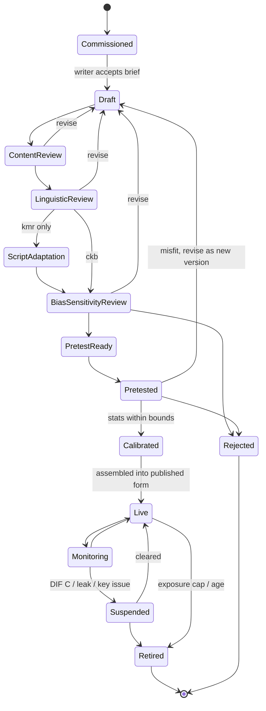

# KBS — D2 · Assessment Framework & Test Specifications (ADD)

> **Covers:** `KLB_v3.md` §4–§8 · **Depends on:** D0/D1 (all defaults accepted 2026-10-08)
> **Feeds:** D3 (PRD), D6 (scoring/results), D8 (psychometric plan), D14–D17 (curriculum + series)
> Kurdish content and examples are drafts for the Standards Committees. Linguistic examples are tagged `[VERIFY SC]`.

---

## 0. Decision register (adopted from D0, plus new decisions in this document)

| ID | Decision | Status | Section |
|---|---|---|---|
| AD-001 | Separate Sorani and Kurmanji tests, each independently linked to CEFR. Cross-variety comprehension endorsement in Phase 3. | Adopted (DN-04) | §3.5 |
| AD-002 | Kurmanji delivered in Latin and Arabic script from MVP. Sorani in Arabic script only. | Adopted (DN-05) | §3.6 |
| AD-003 | Two-tier KBS General: Foundation (A1–B1) and Advanced (B1–C2). Free placement test. | Adopted (DN-06) | §4.1 |
| AD-004 | Hybrid speaking. The interlocutor does not score; rating is blind and done from recordings. | Adopted (DN-07) | §4.5 |
| AD-005 | Per-skill CEFR level + KBS scale 0–120 (piecewise-linear on θ). Overall = mean, rounded half-up. No per-skill minimum. | Adopted (DN-08) | §4.7 |
| AD-006 | "General academic competencies" excluded from KBS. | Adopted (DN-09) | §1.4 |
| AD-007 | Permanent certificate; recommended recency of 2 years. | Adopted (DN-10) | D6 |
| AD-008 | Bilingual certificate; Arabic page on request. | Adopted (DN-11) | D6 |
| AD-009 | No remote proctoring before Phase 3. | Adopted (DN-13) | §5.6 |
| **AD-010** | Measurement model: Rasch (dichotomous + partial credit) for receptive skills; MFRM for productive skills. | **New** | §5.3 |
| **AD-011** | One Kurmanji item bank across both scripts, *conditional on* script invariance. | **New** | §5.4.2 |
| **AD-012** | Equating: common-item non-equivalent groups, fixed-parameter anchoring, ≥ 25 % anchors. | **New** | §5.4.1 |
| **AD-013** | Standard setting: Bookmark (receptive) and Body-of-Work (productive), with replication. | **New** | §5.5 |
| **AD-014** | Listening play-count policy depends on tier and task. | **New** | §4.2 |
| **AD-015** | No read-aloud task in the scored speaking test. | **New** | §4.5 |
| **AD-016** | DIF procedure: Mantel-Haenszel (ETS A/B/C), with Rasch DIF contrast for small groups. | **New** | §5.8 |
| **AD-017** | Mediation: deferred to KBS Academic and Professional. Not in KBS General. | **New** | §3.1 |
| **AD-018** | Typed-answer key matching runs through the shared normalization layer (NORM-v1) plus per-item accepted-variant lists. | **New** | §4.8 |

Each new AD below follows the format: options → trade-offs → decision → what would change it.

---

## 1. Purposes, score uses and unsupported uses (§4)

### 1.1 Product family

| Product | Intended decisions | Levels reported | Phase | Stakes |
|---|---|---|---|---|
| KBS General Foundation | Employment screening, civil-service entry where A2–B1 is required, residence and integration programmes, personal goals, placement into courses | Pre-A1 – B1 | 1 | Medium |
| KBS General Advanced | Employment in Kurdish-medium roles, civil service at B2+, further study, professional registration input | A2 – C2 (A2 = "below target") | 1 | Medium–high |
| KBS Academic | University admission, Kurdish-medium teaching, teacher-licensing input | B1 – C2 | 3 | High |
| KBS Professional | Translation and interpreting, media, legal and medical register | B2 – C2 | 4 | High |
| KBS Junior | Mother-tongue programmes, school placement | Pre-A1 – B1 | 4 | Low–medium |
| *Learning Series* | Not a test. Shares the descriptors (§3) and the RLD (§3.4). | A1 – C1 | 1+ | — |

### 1.2 Unsupported uses (published in the handbook)

KBS results **must not** be used:
- as evidence of ethnicity, nationality, citizenship or origin;
- for political, loyalty or security screening;
- to rank schools, teachers or regions without adjusting for intake;
- to compare Sorani and Kurmanji results as "better or worse Kurdish";
- as evidence of general academic ability or intelligence (AD-006);
- for any decision about a minor without guardian consent (Junior).

The Institute will publicly correct known misuse, under a misuse-response policy owned by Legal & Ethics (D9).

### 1.3 Score-use statements

| Use ID | User | Decision | Minimum evidence before KBS is endorsed for this use |
|---|---|---|---|
| U-01 | Employers, NGOs, UN agencies | Hire or assign to a Kurdish-language role | Standard setting report + job-relevant can-do review |
| U-02 | KRG ministries | Civil-service or teacher language requirement | U-01 + classification accuracy ≥ 0.85 at the cut used |
| U-03 | Universities | Admission (General Advanced at Phase 1; Academic from Phase 3) | Predictive study within 2 cohorts `[Phase 2–3]` |
| U-04 | Diaspora education authorities | Mother-tongue credit, teacher qualification | Recognition dossier (D9), CEFR linking report |
| U-05 | Candidates | Self-knowledge, course placement | Per-skill diagnostic feedback |

### 1.4 AD-006: General academic competencies

| Option | Trade-off |
|---|---|
| Include it in the language score | Blends two constructs, undermines the CEFR claim, and creates fairness issues for L2 learners. **Rejected.** |
| Separate module | Needs its own construct definition, item bank and validity argument. Doubles the Phase 1 scope. |
| **Exclude (decision)** | Keeps the language claim clean. |

**What would change it:** a funded university partner and a ministry requirement. If so, scope it as a separate product, "KBS Academic Skills", with its own ADD.

### 1.5 Validity argument outline — KBS General (Kane's interpretation/use argument + Bachman & Palmer's AUA)

| Inference | Claim | Warrant | Key assumptions | Evidence plan | Phase |
|---|---|---|---|---|---|
| **Domain description** | Tasks represent Kurdish language use in the target domains | Tasks are derived from the Kurdish RLD and from needs analysis | Domains are the same across KRI, diaspora and L2 contexts | Needs survey (n ≥ 300 across populations); expert task review; descriptor mapping (§3) | 0–1 |
| **Evaluation** | Scores reflect the quality of performance | Rubrics are clear; keys are correct; raters are consistent; scoring is variety-fair | The acceptable-variation policy (§3.7) is applied consistently | Key checks; rater certification; MFRM fit; seeded scripts; sub-variety audits | 1 |
| **Generalization** | Scores are consistent across forms, raters, occasions and scripts | Parallel forms; anchoring; enough tasks | Script does not change difficulty (AD-011) | Reliability, G-study, equating error, script-DIF | 1 |
| **Explanation** | Scores reflect the L/R/W/S constructs as defined | Internal structure matches a four-skill model | Literacy-weak heritage speakers show the expected spiky profiles | CFA/Rasch dimensionality; think-aloud studies; profile analysis by population | 1–2 |
| **Extrapolation** | Scores predict real-world Kurdish performance | Can-do alignment | Test tasks resemble target tasks | Can-do self- and supervisor-ratings vs scores; employer follow-up | 2 |
| **Decision / utilization** | Cut scores support the intended decisions | Standard setting follows the CoE Manual | Panels represent the varieties | Standard-setting reports; classification accuracy; replication | 1–2 |
| **Consequences** | Use benefits candidates and does not harm groups | Fair access; safe data | Fees and centres do not exclude groups | Equity KPIs; DIF; washback studies on the Series; candidate safety review | 2–3 |

---

## 2. Guiding principles → evidence (§5)

| Principle | Operational check | Evidence artefact | Owner |
|---|---|---|---|
| Validity first | Every task maps to a descriptor ID and a use ID | Task–descriptor matrix (§4 "Desc." columns) | Assessment lead |
| Variety equity | Independent standard setting + comparability study | SS reports ×2; comparability report (§5.4.3) | Psychometrics |
| Script fairness | Script-DIF on identical content; equal distributions after matching | Script-invariance report per window (§5.4.2) | Psychometrics |
| Fairness | DIF each window; bias and sensitivity review for every item | DIF log; review records in M5 | Psychometrics, Review board |
| Proportional security | Controls tiered by stakes (§1.1) | Control matrix (D7) | Security lead |
| Privacy & safety | DPIA before launch; every metadata field justified | DPIA; data inventory | DPO |
| Accessibility | WCAG 2.2 AA; accommodations policy (§4.9) | Audit report; accommodations log | Candidate services |
| Resilience | Full offline session in a dry run before each window | Dry-run checklist results | Operations |
| Transparency | Handbook, specs, rubrics, samples, annual technical report | Public site (M1) | Director |
| Openness | Descriptors, rubrics and samples released under CC BY 4.0 | Licence register | Legal |

---

## 3. Construct, levels and descriptors (§6)

### 3.1 Skill constructs

| Skill | Sorani / Kurmanji | Construct definition (General) | Excluded as construct-irrelevant |
|---|---|---|---|
| Listening | گوێگرتن / Guhdarîkirin | Understanding spoken Kurdish of the candidate's variety from several sub-varieties, at natural speed for the level, in everyday, public, work and (Advanced) academic-lite domains. Covers gist, detail, inference, speaker attitude. | Reading speed (questions are short, with preview time); knowledge of other varieties at Phase 1 |
| Reading | خوێندنەوە / Xwendin | Understanding written texts in the chosen script: decoding, lexis, grammar, discourse, inference, writer's purpose. | Familiarity with the other script; specialist knowledge |
| Writing | نووسین / Nivîsîn | Producing coherent written text in the chosen script, appropriate to task, register and audience, with control of grammar, vocabulary and orthography per the acceptable-variation policy (§3.7). | Typing speed; keyboard-layout familiarity (§4.4); choice between orthographic conventions that are internally consistent |
| Speaking | قسەکردن / Axaftin | Producing spoken Kurdish in monologue and interaction: fluency, range, accuracy, pronunciation intelligibility, interactional competence. | Accent or sub-variety as such; reading-aloud ability (AD-015) |

**AD-017 Mediation.** Options: include in General now, or defer to Academic/Professional. Including it now adds tasks, rater training and a new descriptor area before core skills are validated. **Decision: defer.** Mediation (CEFR CV 2020) becomes a scored component of KBS Academic (Phase 3) and Professional (Phase 4). In General, cross-variety mediation is covered by the Bridge endorsement (AD-001). *What would change it:* recognition bodies, e.g. teacher licensing, require mediation earlier.

**Integrated tasks** (read–listen–write) are reserved for KBS Academic. They are scored on Writing with a source-use criterion.

### 3.2 Levels and descriptor scheme

- **Scale:** CEFR CV 2020 Pre-A1, A1–C2. Plus levels (A2+, B1+, B2+) are used **internally** in item targeting and rubrics, and are not reported at Phase 1.
- **Descriptor IDs:** `DESC-<Skill>-<Level>-<nn>[-<variety>]`, for example `DESC-S-A2-03` or `DESC-W-B1-05-kmr`. A variety suffix is used only where the descriptor's content differs by variety (e.g., grammatical gender for Kurmanji).
- **Each descriptor record holds:** ID, CEFR source scale and descriptor reference, Kurdish adaptation (Sorani + Kurmanji wording), variety notes, exemplar (text, audio or performance), linked RLD inventory items, linked tasks, linked Series units.
- **Shared use:** descriptors are the join key for item metadata (§5.1), rubrics (§4) and the Series minimum curriculum (D14).

### 3.3 Seed descriptor set (one anchor per skill × level; the full set is built in Phase 0 by the descriptor working group)

Kurdish exemplars are illustrative drafts. `[VERIFY SC]`

| ID | Can-do (adapted) | Exemplar (Sorani · Kurmanji) |
|---|---|---|
| DESC-L-A1-01 | Can understand slowly spoken personal details, numbers, prices and times | Price at a bazaar stall: «بە دوو هەزار دینارە» · «Bi du hezar dînarî ye» |
| DESC-L-A2-01 | Can understand the main point of short, clear announcements and messages | Bus-station announcement; voicemail from a colleague |
| DESC-L-B1-01 | Can follow the main points of extended everyday talk on familiar topics in a standard sub-variety | Radio interview about Newroz preparations |
| DESC-L-B2-01 | Can understand extended speech and lines of argument at normal speed, including some sub-varietal features | Panel discussion with Hewlêrî and Silêmanî speakers (Sorani) / Badînî and Botanî speakers (Kurmanji) |
| DESC-L-C1-01 | Can understand extended speech when relationships are implicit; can follow idiom and register shifts | Lecture with digressions; satirical broadcast |
| DESC-L-C2-01 | Can understand any spoken Kurdish of the variety, including fast colloquial speech and unfamiliar sub-varieties | Dengbêj performance with commentary; fast debate |
| DESC-R-A1-01 | Can recognise familiar names, words and very basic phrases on signs and forms | Shop sign, name on a form |
| DESC-R-A2-01 | Can find specific predictable information in simple everyday material | Menu, timetable, SMS |
| DESC-R-B1-01 | Can understand straightforward factual texts on familiar subjects | Municipal notice; short news report |
| DESC-R-B2-01 | Can read articles and reports on contemporary issues and identify the writer's viewpoint | Opinion column |
| DESC-R-C1-01 | Can understand long, complex factual and literary texts, appreciating distinctions of style | Literary essay; policy document |
| DESC-R-C2-01 | Can read with ease virtually all forms of the written variety, including abstract and classical texts | Classical poetry with modern commentary (e.g., Nalî · Ehmedê Xanî) |
| DESC-W-A1-01 | Can write simple isolated phrases and personal details | Form: name, city, phone |
| DESC-W-A2-01 | Can write short, simple notes and messages | Note to a neighbour |
| DESC-W-B1-01 | Can write straightforward connected text on familiar topics | Email to a landlord about a repair |
| DESC-W-B2-01 | Can write clear, detailed text giving reasons for or against a point of view | Letter to a newspaper |
| DESC-W-C1-01 | Can write well-structured, extended text on complex subjects, adapting register | Formal report with recommendations |
| DESC-W-C2-01 | Can write complex, stylistically appropriate text in any register | Review or article for a cultural journal |
| DESC-S-A1-01 | Can introduce self and others; ask and answer simple personal questions | «ناوم ئاراسە. خەڵکی هەولێرم.» · «Navê min Ronî ye. Ez ji Duhokê me.» |
| DESC-S-A2-01 | Can describe family, living conditions, routine in simple terms | Describe a typical day |
| DESC-S-B1-01 | Can narrate events and give brief reasons and explanations for plans and opinions | Tell about a trip; justify a choice |
| DESC-S-B2-01 | Can interact with fluency and spontaneity, presenting and defending views | Discuss pros and cons of city vs village life |
| DESC-S-C1-01 | Can express self fluently and spontaneously, using language flexibly for social, academic and professional purposes | Structured presentation + Q&A |
| DESC-S-C2-01 | Can take part effortlessly in any discussion, conveying fine shades of meaning | Debate with nuance, irony, register shifts |

### 3.4 Kurdish Reference Level Description (RLD) workstream

| Element | Specification |
|---|---|
| Output | Per variety and per level: vocabulary (headwords + frequency band + register tag), grammar inventory (form–function, aligned to the D14 grammar progression), functions/notions, text types, sociocultural points |
| Corpus sources (start) | Pewan (Sorani + Kurmanji text), AsoSoft corpus (Sorani), Kurdish Textbooks Corpus (KTC), Kurdish Wikipedia and news, KRI school textbooks. **Licence for each source `[VERIFY]`.** |
| Gaps | Spoken data (both varieties); Kurmanji Arabic-script (Badînî) written data; learner language (no Kurdish learner corpus exists `[VERIFY]`) |
| Gap filling | (1) Spoken corpus: 100–200 h transcribed speech per variety, balanced across sub-variety, age and gender, recorded with consent under CC BY-NC `[ASSUMPTION]`. (2) Badînî text collection with Duhok university partners. (3) Learner corpus seeded from KBS pilot writing scripts. This requires opt-in consent and de-identification, and is held under the D7 retention schedule. |
| Method | Frequency + dispersion lists → expert-judged level assignment → triangulated with pilot item difficulties (from Phase 1) |
| Governance | Standards Committee per variety approves each release; versioned (`RLD-ckb-v0.9`); open licence (DN-21) |
| Timeline | v0.5 (A1–B1 vocabulary + grammar) by end of Phase 0; v1.0 (A1–C1) by end of Phase 1 |

### 3.5 Variety policy (AD-001, adopted)

- The candidate selects a **track** at booking: `ckb`, `kmr-Latn` or `kmr-Arab`. The track is immutable after the session starts.
- Each variety has its **own forms, keys, rubrics, rater pool, standard setting and CEFR linking report**.
- **Comparability across varieties** is shown by (a) one shared descriptor framework, (b) independent standard setting with **cross-variety moderators**: two bilingual panellists sit on both panels, (c) a **cross-variety benchmark exercise** in which bilingual judges place Sorani and Kurmanji productive performances on the CEFR, and (d) a **bilingual-candidate study** (Phase 2, n ≥ 100 bilingual Sorani–Kurmanji speakers taking both tests in counterbalanced order). DIF is **not** used as evidence for this.
- The certificate names the variety and script (D6).

### 3.6 Script policy (AD-002, adopted)

| Step | `kmr-Latn` ↔ `kmr-Arab` production |
|---|---|
| 1 | Author in the variety's master script, Latin (Hawar). Latin is chosen as master because it is unambiguous for vowels. |
| 2 | Automatic transliteration (rule-based, versioned `TRANSLIT-kmr-v1`) to Badînî Arabic-based orthography |
| 3 | Human review by two Badînî-literate reviewers. They check orthographic conventions, word division and naturalness. |
| 4 | Equivalence checks: same word count ± 5 %; same answer location; same distractor logic; layout parity (RTL) |
| 5 | Audio is shared; it does not depend on script |
| 6 | Statistical check: script-DIF on identical items each window (§5.4.2) |

Writing is accepted in the booked script only. Mixed-script answers are treated as an orthography issue under §3.7, not as invalid. The certificate records `kmr-Latn` or `kmr-Arab`.

### 3.7 Acceptable-variation policy (AVP v1 — Standards Committee to ratify)

| Area | Rule | Example `[VERIFY SC]` |
|---|---|---|
| **Sub-variety forms** | A form attested in a recognised sub-variety and used consistently is **not an error**. It is scored for range and accuracy like any other form. | Sorani present prefix: Silêmanî «ئەچم» = standard/Hewlêrî «دەچم» ("I go"). Kurmanji future: Badînî «ez dê çim» = Botanî/standard «ez ê biçim». |
| **Orthography** | **Internal consistency** is the criterion, not one prescribed norm. Systematic use of an older convention (e.g., ه for ە) is not penalised. Inconsistency within a text is penalised once per type, under the accuracy criterion. | «کوردی» vs «كوردي» (Arabic code points): normalised and never penalised. |
| **Loanwords vs neologisms** | Both are acceptable. Register-appropriateness is scored: purist neologisms are not required, and Arabic/Persian/Turkish loans are not penalised unless the task demands formal register and a well-established Kurdish equivalent exists (Standards Committee list). | «پەروەردە» vs «تەربیە» (education) |
| **Code-switching** | At A1–B1, a single-word switch that does not block communication is tolerated, with a range penalty only. At B2+, switches count against range unless pragmatically motivated (quotation, a term with no Kurdish equivalent). | — |
| **Pronunciation** | Intelligibility to a listener of the variety is the criterion. Regional accent is never penalised. | — |
| **Digits** | Eastern Arabic-Indic, Persian and Western digits are all accepted and normalised. | ٣ / ۳ / 3 |
| **Kurmanji gender/case** | Scored under the grammar criterion. Sub-varietal case-marking patterns listed by the Standards Committee are accepted. | Oblique `-ê`/`-î` variation |

Raters receive AVP-annotated benchmark scripts per sub-variety (D6).

---

## 4. Test blueprint (§7)

### 4.1 Format overview (AD-003)

| | Foundation (A1–B1) | Advanced (B1–C2) |
|---|---|---|
| Sections | L · R · W · S | L · R · W · S |
| Total time | ≈ 2 h 40 min + breaks | ≈ 3 h 20 min + breaks |
| Delivery | Centre CBT (primary); paper (fallback); speaking interaction in centre or by video (diaspora) | Same |
| Routing | Placement test (M15, free, ~25 min, unproctored, not reported) → recommended tier | Same |
| Order | Listening → Reading → (break 10 min) → Writing → Speaking | Same |

Unscored **pretest items** are embedded in receptive sections and counted in the time. They are indistinguishable from scored items.

### 4.2 Listening

| Tier | Task | Item type | No. | Desc. focus | Plays | Scoring | Weight |
|---|---|---|---|---|---|---|---|
| F | L1 Short exchanges (pictures) | 3-option picture MCQ | 8 | DESC-L-A1/A2 | 2 | Dichotomous | — |
| F | L2 Announcements & messages | Gap-fill (1–3 words, normalised) | 7 | A2 | 2 | Dichotomous | — |
| F | L3 Conversation | MCQ (3-option) | 7 | A2/B1 | 2 | Dichotomous | — |
| F | L4 Monologue (radio/talk) | Multiple matching | 6 | B1 | 1 | Dichotomous | — |
| F | Pretest | mixed | 4 | — | — | Unscored | — |
| | **F total** | | **28 + 4** | | | | **25 % of overall** |
| A | L1 Short extracts | MCQ (3-option) | 8 | B1/B2 | 2 | Dichotomous | — |
| A | L2 Interview | Sentence completion (normalised) | 8 | B2 | 1 | Dichotomous | — |
| A | L3 Multi-speaker discussion (≥ 2 sub-varieties) | Speaker–opinion matching | 8 | B2/C1 | 1 | Dichotomous | — |
| A | L4 Lecture/talk | MCQ (4-option) + note completion | 10 | C1/C2 | 1 | Dichotomous | — |
| A | Pretest | mixed | 4 | — | — | Unscored | — |
| | **A total** | | **34 + 4** | | | | **25 %** |

**Time:** F ≈ 35 min, A ≈ 45 min (fixed by the audio timeline, plus 5 min to check answers).

**Speaker policy:** every form has ≥ 3 sub-varieties, ≥ 40 % female voices, at least one speaker over 50 and one under 25, and **no** synthetic speech. Speech rate targets (syllables/sec) are set per level from the spoken corpus `[ASSUMPTION — calibrate in Phase 0]`. Sorani forms draw from Hewlêrî, Silêmanî, Mukriyanî and others. Kurmanji forms draw from Badînî, Botanî, Serhedî and others.

**AD-014 Play-count.** Options: always twice (more accessible, less authentic), always once (authentic, harsh at low levels), or tiered. **Decision: tiered.** Foundation L1–L3 twice and L4 once. Advanced L1 twice and L2–L4 once. Play counts are enforced by the delivery client, and survive a power-loss resume (no extra play granted unless the interruption occurred mid-clip, in which case the clip restarts once — rule detailed in D3). *What would change it:* pilot facility and fit data showing once-play tasks malfunction at B1.

### 4.3 Reading

| Tier | Task | Item type | No. | Desc. | Scoring |
|---|---|---|---|---|---|
| F | R1 Signs, notices, messages | 3-option MCQ | 8 | A1/A2 | Dichotomous |
| F | R2 Short texts → people | Multiple matching | 7 | A2 | Dichotomous |
| F | R3 Factual text | Gap-fill cloze (word bank, drag-and-drop) | 7 | A2/B1 | Dichotomous |
| F | R4 Longer text | MCQ + sentence ordering (partial credit) | 6 | B1 | Dichotomous / PCM |
| F | Pretest | mixed | 4 | — | Unscored |
| | **F total: 28 + 4 · 45 min · 25 %** | | | | |
| A | R1 Short texts | 4-option MCQ | 8 | B1/B2 | Dichotomous |
| A | R2 Gapped text (missing sentences) | Drag-and-drop | 7 | B2 | Dichotomous |
| A | R3 Multiple texts | Multiple matching | 9 | B2/C1 | Dichotomous |
| A | R4 Long text (opinion/literary) | 4-option MCQ | 10 | C1/C2 | Dichotomous |
| A | Pretest | mixed | 4 | — | Unscored |
| | **A total: 34 + 4 · 60 min · 25 %** | | | | |

Text length targets per level (words) are set from the RLD: roughly A1 ≤ 50, A2 ≤ 150, B1 ≤ 350, B2 ≤ 600, C1 ≤ 800, C2 ≤ 1,000 `[ASSUMPTION]`. Texts are adapted, never sourced from published coursebooks (Series firewall).

### 4.4 Writing

| Tier | Task | Desc. | Length | Time | Rubric criteria (each 0–5) |
|---|---|---|---|---|---|
| F | W1 Form / short message | A1/A2 | 25–40 words | 10 min | Task fulfilment · Language control |
| F | W2 Note/email (3 content points) | A2 | 50–80 words | 15 min | Task · Organisation · Vocabulary · Grammar & orthography |
| F | W3 Narrative or opinion (picture/prompt) | B1 | 100–150 words | 25 min | Same 4 criteria |
| | **F total: 50 min · 25 %** | | | | |
| A | W1 Transactional (formal email/letter) | B2 | 150–200 words | 30 min | Task · Organisation · Range · Accuracy (grammar & orthography) · Register |
| A | W2 Essay/report/review (choice of 2 prompts) | C1/C2 | 250–350 words | 45 min | Same 5 criteria |
| | **A total: 75 min · 25 %** | | | | |

**Input support (construct-irrelevance controls):**
- Physical keyboards with **Sorani layout** (the dominant KRI layout `[VERIFY which layouts are standard: e.g., Kurdish (Sorani) Windows layout, KurdIT]`), Kurmanji Latin (Turkish-Q base + ê î û ç ş) and Kurmanji Arabic.
- An **on-screen keyboard** is always available. Candidates can choose their layout at a **10-minute untimed practice** before the test.
- Spell-check and autocorrect are off. Word count is shown.
- **Paper/handwritten option** for any candidate on request at booking, with scan-to-rate workflow (D6). Pilot checks for mode effect (§5.8).

### 4.5 Speaking (AD-004)

| Tier | Part | Mode | Task | Desc. | Time |
|---|---|---|---|---|---|
| F | S1 | Computer | Personal questions (5 short answers, 20 s each) | A1/A2 | 3 min |
| F | S2 | Computer | Picture description (60 s, 30 s prep) | A2 | 2 min |
| F | S3 | **Examiner** | Guided conversation: role-play (e.g., booking, asking directions) + follow-ups | A2/B1 | 5 min |
| F | S4 | Computer | Narrate from picture sequence / give opinion (90 s, 60 s prep) | B1 | 3 min |
| | **F total ≈ 13 min · 25 %** | | | | |
| A | S1 | Computer | Respond to situation / voicemail (60 s) | B1/B2 | 3 min |
| A | S2 | Computer | Long turn: compare and justify (2 min, 1 min prep) | B2 | 4 min |
| A | S3 | **Examiner** | Discussion: develop and defend views, respond to challenge | B2–C2 | 7 min |
| A | S4 | Computer | Summarise and react to a short audio clip (90 s) | C1 | 3 min |
| | **A total ≈ 17 min · 25 %** | | | | |

- **Interlocutor (examiner):** follows a scripted frame with prompt cards. Trained and certified as interlocutor (not as rater). Never scores. Fully recorded. In the diaspora, joins via video from a hub; the candidate is still in a centre.
- **Rating:** analytic criteria: Fluency & coherence · Range · Accuracy · Pronunciation (intelligibility) · Interaction (S3 only), each 0–5. Rated **blind** by certified raters of the variety. 100 % double-rated in Phase 1 (D6 has the discrepancy rules).
- **Recording integrity:** each response is stored locally (encrypted) and upload is verified by checksum before the session is closed (detail in D3/D5).
- **AD-015 No read-aloud.** Options: include (cheap, reliable, enables future ASR), or exclude. Read-aloud mainly measures decoding and pronunciation, and penalises candidates who are literacy-weak but orally strong (heritage, L1 schooled in other languages). That conflicts with the construct (§3.1). **Decision: exclude it from scored tests.** It may be collected as an unscored research task, with consent, for future ASR work. *What would change it:* a Professional (interpreting/broadcast) construct that requires reading aloud.

### 4.6 Placement test (M15)
About 25 min adaptive-lite (two-stage): reading and listening plus 5 self-assessment can-do items. Unproctored and unreported. Its only output is a tier recommendation and a Series level recommendation. It uses **retired or never-live items only**, keeping the Series firewall.

### 4.7 Reporting scale (AD-005)

| Rule | Specification |
|---|---|
| Per-skill result | Rasch θ → KBS scale 0–120 by piecewise-linear transform anchored at the standard-set cut scores: Pre-A1 0–19 · A1 20–39 · A2 40–59 · B1 60–79 · B2 80–99 · C1 100–109 · C2 110–120. CEFR level follows from the scale band. |
| Tier floors and ceilings | **Foundation** reports 0–79. Candidates at the ceiling (≥ 76) receive "B1 — consider Advanced". **Advanced** reports 40–120. Below 40 is reported as "below A2". 40–59 (A2) is reported but flagged "below the Advanced target range". |
| Overall | Mean of the four skill scale scores, **rounded half-up** to an integer. Overall CEFR follows from the band. |
| Per-skill minimum | **None** on the certificate. Receiving institutions set their own profile requirements. The verification API exposes per-skill results. |
| Precision | Reported per skill as **± SEM in scale points** (conditional SEM at the candidate's θ). Handbook explains it in plain language. |
| Primary result | **Per-skill levels are the primary result.** The certificate leads with the skill profile; the overall is secondary. |
| Exemptions | Listening exemption (deaf/hard of hearing): overall = mean of 3 skills, annotated "calculated on 3 skills" (§4.9). |

### 4.8 Typed-answer key matching (AD-018)

Gap-fill and short-answer responses are matched after **NORM-v1** (the shared normalization layer, spec owned in D4):

1. Unicode NFC; remove tatweel and directional marks; trim and collapse whitespace.
2. Arabic-script: ك→ک, ي/ى→ی, ة→ە (where used for ە), ه→ە at **word-final position only** when the item key specifies Sorani vowel `e` `[VERIFY SC]`. ZWNJ is removed for matching only, never for storage.
3. Digits: Eastern Arabic-Indic and Persian → Western.
4. Latin: case-fold; precomposed and decomposed ê î û ç ş unified.
5. **Diacritics are not stripped in Latin.** e/ê, i/î and u/û are phonemic. Their omission is accepted only if the item's accepted-variant list includes it.

Each item key carries an **accepted-variant list** (sub-variety forms, spelling variants) maintained by item writers and approved in linguistic review. Unmatched responses that are close (edit distance ≤ 1 after NORM-v1) are routed to a **post-administration key check** before results release (D6).

### 4.9 Accommodations

| Accommodation | Eligibility evidence | Implementation | Report annotation |
|---|---|---|---|
| Extra time (25 % / 50 %) | Professional statement | Per-section timers adjusted | None |
| Enlarged text / zoom / high contrast / colour overlay | Self-declared | Client settings (M4); enlarged paper version | None |
| Separate room | Professional statement or medical | Ops scheduling | None |
| Rest breaks | Professional statement | Paused timer, supervised | None |
| Reader | Visual impairment | Human reader for the **Listening and Writing** instructions only. Reading-section texts are not read aloud, because that would change the construct. Kurdish TTS is not reliable enough `[VERIFY current Kurdish TTS/screen-reader quality]`. | None |
| Scribe / speech-to-text | Motor impairment | Human scribe in the candidate's script | "Scribe used" (internal only, not on certificate) |
| Braille | Visual impairment | Phase 2+. Kurdish braille codes need verification. `[VERIFY]` | — |
| Listening exemption | Audiological evidence | Section omitted | Certificate: "Listening not assessed"; overall on 3 skills |
| Paper-based / handwriting | On request | Paper form (equated) | None |

Kurdish screen-reader support is limited. The compensation is human readers, accessible paper, and a full Phase 2 accessibility study. The policy is published and decided by Candidate Services, with appeal to the Ethics panel.

---

## 5. Item bank and psychometrics (§8)

### 5.1 Item metadata schema (summary; full JSON Schema in D4)

```yaml
item:
  id: KBS-I-ckb-R-000412        # non-semantic sequence within track+skill
  version: 3
  product: [GEN-F]              # GEN-F | GEN-A | ACAD | PROF | JUN
  skill: R                      # L | R | W | S
  target_cefr: A2+
  descriptors: [DESC-R-A2-01]
  variety: ckb                  # BCP 47: ckb | kmr-Latn | kmr-Arab
  script: Arab
  stimulus_subvariety: null     # e.g., ckb-silemani (audio/written dialect marking)
  topic: transport
  register: neutral             # informal | neutral | formal | literary
  text_type: notice
  cognitive_process: locate-specific-info
  item_type: mcq3
  stimulus_assets: [{asset: A-000981, licence: KBS-owned, source: commissioned}]
  word_count: 74
  speaker_profile: null         # audio: {sex, age_band, subvariety}
  author: staff-0231
  reviews: [{stage: content, by: staff-0110, outcome: pass, date: 2027-03-02}]
  sensitivity_flags: []
  status: live                  # see 5.2
  stats: {p: 0.64, rpb: 0.41, rasch_b: -0.32, se: 0.11, infit: 0.97, outfit: 1.02, n: 412}
  exposure_count: 380
  form_history: [GEN-F-ckb-F01]
  dif_flags: [{group: script, class: A, window: 2027-W1}]
  retirement_reason: null
  provenance: human             # human | ai-assisted
  linked_items: {kmr_script_twin: null}
```

Values above are synthetic examples. **Candidate safety:** item metadata holds **no** candidate data. Response-level data links by pseudonymous `response_id` only (D7).

### 5.2 Item lifecycle



| Stage | Role (R) / Approver (A) | SLA | Exit criteria |
|---|---|---|---|
| Commission | Item development manager | — | Brief: descriptor, level, topic, type |
| Draft | Item writer (certified) | 10 working days | Spec-compliant; assets licensed |
| Content review | Senior item writer | 5 d | Key correct and unique; distractors plausible; descriptor match |
| Linguistic review | 2 reviewers of the variety (≥ 1 from a different sub-variety than the author) | 5 d | AVP-compliant; natural; level-appropriate per RLD |
| Script adaptation (kmr) | Transliteration + 2 Badînî reviewers | 5 d | §3.6 checks pass |
| Bias & sensitivity review | Panel of 3 (regional, religious and gender balance) | 5 d | No political, partisan, religious-sectarian, regional-stereotype, trauma or ethnic-identity triggers; neutral framing of contested topics |
| Pretest | Psychometrics | Next window | n ≥ 150 responses |
| Calibration | Psychometrician (A: Head of Psychometrics) | 10 d after window | Fit 0.7–1.3 (MCQ); r_pb ≥ 0.20; SE ≤ 0.30 |
| Live / monitoring | Psychometrics | Each window | DIF, drift (\|Δb\| ≤ 0.3 logits), exposure |
| Retirement | Head of Assessment | — | Reason logged; retired items may go to the placement or practice pool only after **24 months** and a security review |

**Override rights:** the Head of Assessment can override a review outcome with written rationale, logged in the audit trail. Bias & sensitivity "reject" can only be overridden by the Ethics panel.

### 5.3 Measurement model (AD-010)

| Option | Trade-off |
|---|---|
| **Rasch (1PL) + Partial Credit** | Small-sample stable (≈ 100–150 per item); sufficient statistics; clear person–item map for standard setting. Assumes equal discrimination. |
| 2PL / 3PL | Better fit for heterogeneous MCQs, but needs ≈ 500–1,000 responses per item (2PL) and more (3PL). Impossible for Kurmanji in the near term. |
| CTT only | Easy, but sample-dependent and no linking. |

**Decision:** Rasch dichotomous + PCM for receptive skills; **MFRM** (candidate × task × rater × criterion) for Writing and Speaking. Item discrimination is monitored, and items with outlying discrimination (r_pb < 0.20, or infit outside 0.7–1.3) are revised, not modelled. **2PL is justified** only if (a) a track exceeds ~1,000 responses per item, and (b) Rasch misfit is systematic across a task type and harms classification accuracy. Revisit in Phase 3.

**Calibration samples:** pretest n ≥ 150 per item (target 200). Pilot forms with ≥ 25 % common items. Linacre's guidance on sample size vs SE is the working rule `[VERIFY citation]`.

**Pretest embedding:** 4 unscored items per receptive section, rotated across ≥ 4 pretest blocks per window. Blocks are randomly assigned at seat level.

**Pilot plan (Phase 1, before first live window):**

| Track | Pilot participants | Recruitment | Purpose |
|---|---|---|---|
| `ckb` | 600 (300 per tier) | Universities, KRG ministries' staff, L2 programmes | Calibration, form equating, SS performance samples |
| `kmr-Arab` | 300 | Duhok university, schools, public sector | Calibration + script-DIF |
| `kmr-Latn` | 300 | Diaspora universities and associations, L2 learners | Calibration + script-DIF |

Participants are paid. Recruitment follows candidate-safety rules: **no ethnicity or origin fields**; country of schooling is collected only as a coarse fairness variable (§5.8) with opt-out.

### 5.4 Equating and linking

**5.4.1 Within a track, across forms and time (AD-012).**
- Options: random-groups (needs large samples and simultaneous administration), common-item non-equivalent groups (CINEG), or single-group (too long). **Decision: CINEG.**
- Each form carries **≥ 25 % anchor items** (receptive), spread across levels and task types, positioned similarly in both forms.
- **Fixed-parameter calibration**: new items are calibrated with anchor difficulties fixed to bank values. Anchors are checked for drift (displacement > 0.3 logits → drop as anchor).
- **Productive skills:** link through common benchmark scripts and recordings rated in each window (MFRM anchoring of rater severity and task difficulty) and a stable rubric.
- **Equating error target:** standard error of linking ≤ 0.10 logits per window.

**5.4.2 Across scripts within Kurmanji (AD-011).**
- Options: separate `kmr-Latn` and `kmr-Arab` banks (cleanest, but halves the samples), or **one Kurmanji bank** with script twins (doubles the samples, but assumes invariance).
- **Decision: one bank, conditional.** Each window, run **script-DIF on twin items** (same content). If ≥ 90 % of twins are ETS class A and none are class C, calibrate concurrently as one bank. Otherwise split the affected item types into script-specific parameters.
- *What would change it:* a consistent script effect on a task type, such as Arabic-script reading being harder because of orthographic differences. In that case, score that task type with script-specific parameters, and investigate whether the cause is a construct difference or a production problem.

**5.4.3 Across varieties (Sorani ↔ Kurmanji).** These are different item sets, so no statistical equating is possible. Comparability is established through the four-part design in §3.5: shared descriptors, independent standard setting with cross-moderators, a cross-variety benchmark exercise, and the bilingual-candidate study. **DIF is not evidence of variety equivalence.** Results of the comparability study go in the annual technical report.

### 5.5 Standard setting (AD-013)

Process: Council of Europe *Relating Language Examinations to the CEFR* Manual (2009). Familiarisation → Specification → Standardisation → Empirical validation.

| Skill | Method | Why | Alternatives considered |
|---|---|---|---|
| Listening, Reading | **Bookmark** on Rasch-ordered item booklets (RP67) | Works directly with the Rasch scale; efficient for multiple cuts | Modified Angoff: slower for 5 cuts; judges struggle with probability estimates |
| Writing, Speaking | **Body-of-Work** with CEFR-benchmarked performances | Holistic, uses real performances, fits analytic rubrics | Benchmarking/contrasting groups: used for validation |
| Validation | Contrasting groups (teacher CEFR judgements of candidates) + can-do self-assessment regression | Empirical external evidence | — |

- **Panels:** ≥ 12 panellists per variety (≥ 15 preferred), spanning sub-varieties and regions (KRI and diaspora), teachers, university staff, employers. ≥ 30 % women. Two bilingual cross-moderators sit on both panels. Panellists with item-writing or Series-authoring roles are excluded.
- **Rounds:** 3 rounds with impact data shown before Round 3.
- **Outputs:** cut θ per level and skill; SE of cuts (panel variance); procedural, internal and external validity evidence.
- **Replication:** an independent panel after the first two live windows (Phase 2). Cuts are revised only if the difference exceeds 2 × SE of the cut.

### 5.6 Administration model roadmap and readiness gates

| Model | When | Readiness gate (all must hold, per track × skill) |
|---|---|---|
| Fixed linear forms (two tiers) | Phase 1 | ≥ 2 equated parallel forms per tier; each scored item SE ≤ 0.30; reliability targets (§5.7) met in pilot |
| **MST** (L/R; replaces tiers) | Phase 3 | ≥ 3 calibrated testlets per module per level (≥ 60 calibrated items per CEFR level per skill); ≥ 1,500 live candidates/year on the track; simulation shows classification accuracy ≥ tiered forms with ≤ 80 % of test length; no module item exposure > 0.30 |
| **CAT** (L/R) | Phase 4 | ≥ 400 calibrated items per skill per track (≥ 50 per level); ≥ 3,000 candidates/year/track; max item exposure ≤ 0.20 (Sympson–Hetter or randomesque) with simulated overlap ≤ 15 %; drift monitoring in place; testlet dependency handled; content-balancing constraints satisfied in ≥ 99 % of simulees |
| Automated scoring (W/S) | Research from Phase 3 | Defined in D6/D8: human–machine QWK ≥ human–human QWK on held-out data; subgroup gaps (variety, script, sub-variety, gender) ≤ 0.10 SD; human-in-the-loop |
| Remote proctoring (AD-009) | Pilot Phase 3 | Lower-stakes uses only; in-centre alternative; human review of all flags; DPIA update |

Gates are reviewed annually in the technical report. A gate is a minimum, not a trigger.

### 5.7 Quality targets

| Metric | Target | Justification |
|---|---|---|
| Reliability (receptive, per skill) | Rasch person reliability / α **≥ 0.85** (Foundation), **≥ 0.88** (Advanced) | Medium–high stakes per-skill reporting. 0.85 is a common floor for individual decisions with ~30 items. |
| Reliability (productive, per skill) | G-coefficient **≥ 0.80** (2 raters, all tasks) | Few tasks; achievable with double rating and 3–4 tasks. |
| Overall composite | **≥ 0.92** | Composite of four skills. |
| SEM | ≤ 5 scale points per skill (≈ ¼ of a CEFR band) | Keeps the 68 % band within one CEFR level for most candidates. |
| Classification accuracy at each reported cut | **≥ 0.85** (Rudner / Livingston–Lewis); consistency ≥ 0.80 | Supports U-02. |
| Rater agreement (per criterion) | Exact ≥ 60 %, exact + adjacent ≥ 95 %, QWK ≥ 0.75 (target 0.80) | 0–5 scale; benchmarks from comparable language tests. |
| MFRM rater fit | Infit MnSq 0.7–1.3 (warning 0.5–1.5) | Linacre's productive-measurement guidance. |
| Rater severity | Within ± 1.0 logit of the pool mean; outliers are retrained or suspended | Severity is adjusted in MFRM, but extreme severity signals misuse of the rubric. |
| Equating SE | ≤ 0.10 logits | §5.4.1 |

If a target is missed in a window, the response is to withhold results for that track and skill and convene the Psychometric Review Board, which decides whether to release, rescore or re-administer.

### 5.8 Fairness (AD-016)

- **Groups:** gender · region of residence (coarse: KRI / other Iraq / Europe / other) · **schooling language** (Kurdish / Arabic / Turkish / Persian / other) · heritage vs L1-schooled vs L2 (self-declared) · **script** (Kurmanji) · device and mode (CBT / paper; centre) · sub-variety of the candidate (optional, self-declared).
- **No ethnicity, religion, political or nationality fields.** All fairness variables are optional, stored separately and pseudonymised, and used only for aggregate analysis (D7).
- **Procedure:**
  1. Mantel–Haenszel with ETS classification (A / B / C) when the focal group n ≥ 100.
  2. Rasch DIF contrast (|Δb| ≥ 0.43 = moderate, ≥ 0.64 = large, with p < .05) when n is 30–99.
  3. n < 30: monitor and pool across windows.
- **Flag handling:** class C or large → item **suspended** within the window, results computed without it (if pre-release), and sent to the bias panel for a substantive review. The panel decides revise, retire or retain with rationale. Class B → monitor, and review after two windows.
- **Mode-effect study** (paper vs CBT; typed vs handwritten) in Phase 1 pilot.
- **Script-DIF** (AD-011) and **heritage-profile analysis** (expected spiky profiles) are reported every window.

### 5.9 AI-assisted item drafting

- **Allowed:** generating draft stimulus texts, distractor suggestions and paraphrase variants as a writer's aid.
- **Required:** provenance flag `ai-assisted` on the item; full human review through every lifecycle stage; never auto-published; checked for factual fabrication, cultural errors, and translation artefacts (calques from English/Arabic).
- **Prohibited:** sending live, pretest or anchor items, or candidate responses, to any external AI service. Only self-hosted or contractually zero-retention models are allowed, with a DPA in place. `[DECISION NEEDED for D5: approved model list]`
- **Monitoring:** compare AI-assisted vs human items on review rejection rate, fit and DIF. Suspend the practice if AI-assisted items underperform.

### 5.10 Item bank size targets (Phase 1, per track)

Per tier, receptive: 2 live forms × 28–34 scored items, 25 % shared anchors → ≈ 50–60 unique scored items per skill per tier. A reserve of 50 % for replacements, plus pretest attrition (~30 %) → **commission ≈ 110–130 items per skill per tier per track**. Productive: ≥ 3 prompts per task per form, plus 50 % reserve → **≈ 10–14 prompts per task**.

| | Per variety | Total |
|---|---|---|
| Receptive items to commission | ≈ 480 (2 skills × 2 tiers × ~120) | `ckb` 480 + `kmr` 480 (+ 480 transliterated `kmr-Arab` twins) |
| Productive prompts | ≈ 90 | `ckb` 90 + `kmr` 90 (+ twins) |

This drives the item-writer staffing in D10.

---

## 6. Traceability hooks (for D13)

| From | To | Key |
|---|---|---|
| Use (U-01…U-05) | Validity inference rows (§1.5) | Use ID |
| Descriptor | Task (§4 "Desc." columns), item metadata, rubric band, Series unit (D14) | `DESC-*` |
| AD-001…AD-018 | FRs in D3 (e.g., booking captures track; M4 play-count enforcement; NORM-v1) | AD ID |
| Quality targets (§5.7) | KPIs (D12) | Metric name |

---

## Changes to prior deliverables
- **D0:** DN-01…DN-22 marked **accepted**. AD-001…AD-009 are now formal (§0). New IDs: AD-010…AD-018, U-01…U-05, NORM-v1, TRANSLIT-kmr-v1, AVP v1.
- **D1:** no change. Note that the Foundation tier caps at B1 (scale 79), which the MVP scope already assumed.

## §19 self-check
- ✅ Variety and script are handled throughout: separate tracks, AVP, script twins and script-DIF, keyboards, speaker policy. Offline matters here through delivery constraints (play-count enforcement across power loss, local recording integrity), which go into the D3 FRs.
- ✅ Every new choice is recorded as an AD with alternatives (AD-010…AD-018). MST, CAT, automated scoring and remote proctoring all carry numeric gates (§5.6).
- ✅ Candidate safety: no ethnicity, religion or nationality fields; fairness variables optional and pseudonymised; no live items to external AI services.
- ⚠️ Citations (Linacre sample sizes, Rasch DIF thresholds), keyboard layouts, corpus licences, Kurdish TTS and braille status, and all Kurdish examples are tagged `[VERIFY]` or `[VERIFY SC]`.
- ⏳ FR/NFR acceptance criteria start in D3. The descriptor → Series unit mapping is completed in D14.

**Next deliverable: D3 — Product requirements: personas, journeys, FRs, NFRs (§10–§11).**
