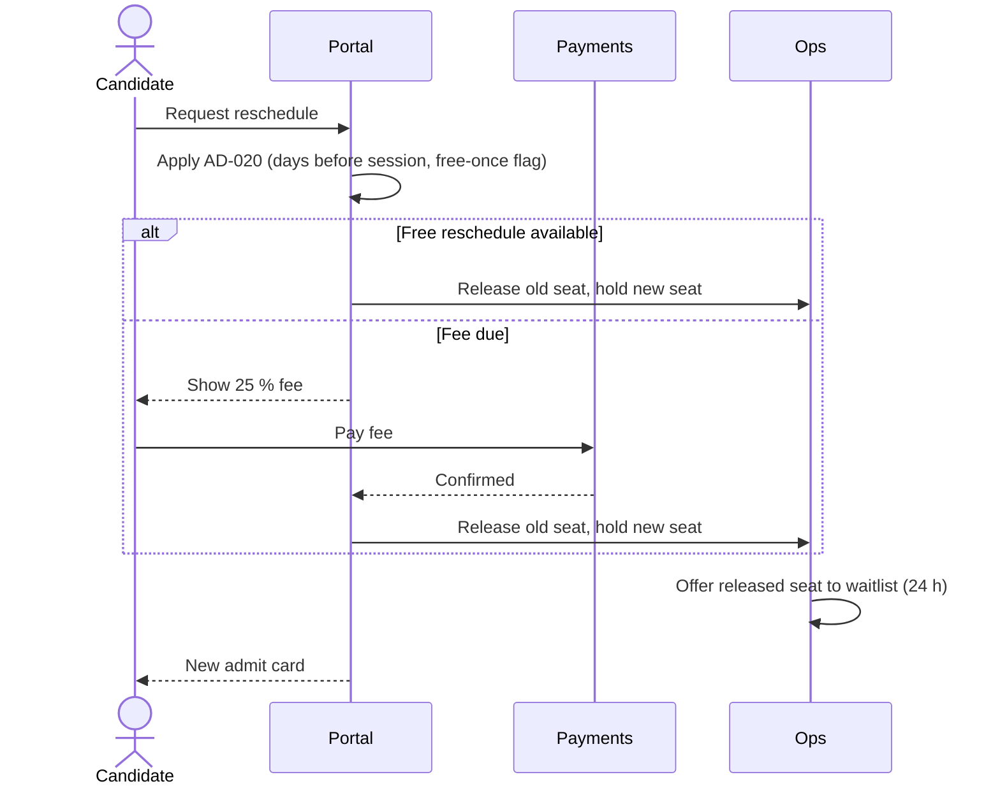
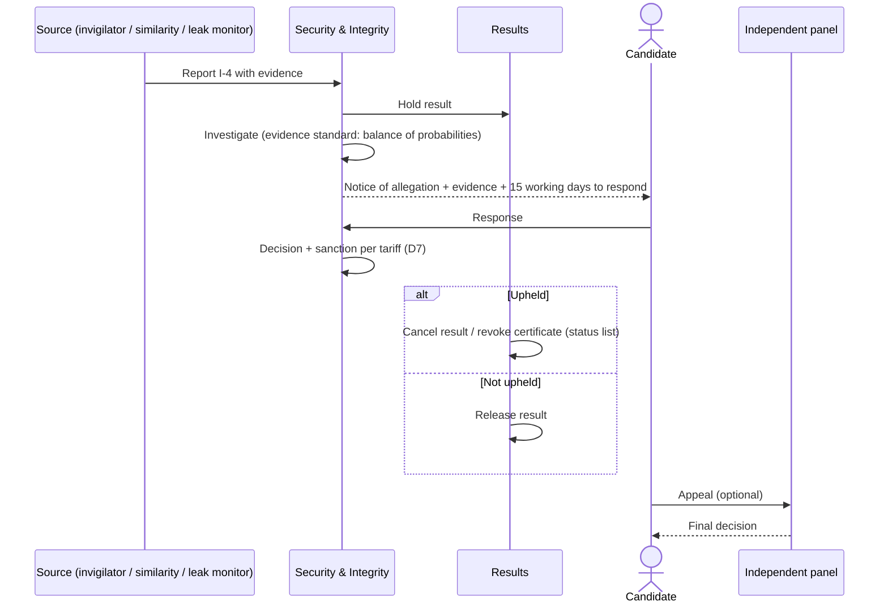

# KBS — D3 · Product Requirements (PRD)

> **Covers:** `KLB_v3.md` §10–§11 · **Depends on:** D0/D1, D2 (AD-001…AD-018)
> **Feeds:** D4 (SRD), D5 (SDD), D7 (security), D13 (traceability)
> **Priority (MoSCoW) is for Phase 1 (MVP)** unless a phase is stated. `W(P2)` = Won't in Phase 1, planned for Phase 2.
> **Acceptance criteria** use Given / When / Then. NFR numbers are firm targets here; D4 adds measurement methods.

---

## 0. Conventions

| Prefix | Domain | Module |
|---|---|---|
| FR-PUB | Public site & CMS | M1 |
| FR-CAND | Candidate portal | M2 |
| FR-PAY | Payments | M3 |
| FR-DEL | Exam delivery client + centre server | M4 |
| FR-ITEM | Item authoring & bank | M5 |
| FR-ASM | Test assembly & publishing | M6 |
| FR-OPS | Operations console & invigilator app | M7 |
| FR-RATE | Rating portal | M8 |
| FR-RES | Results & certification | M9 |
| FR-VER | Verification portal & API | M10 |
| FR-INST | Institutional portal | M11 |
| FR-PSY | Psychometrics workbench | M12 |
| FR-SUP | Support & helpdesk | M13 |
| FR-IAM | IAM, admin & audit | M14 |
| FR-HUB | Learning Hub | M15 |
| FR-SCHED, FR-INC, FR-NOTIF, FR-L10N, FR-PROC | Cross-cutting: scheduling rules, incidents, notifications, localization, remote proctoring | — |

NFR prefixes: `NFR-PERF`, `NFR-AVAIL`, `NFR-RES`, `NFR-SEC`, `NFR-PRIV`, `NFR-A11Y`, `NFR-L10N`, `NFR-OBS`, `NFR-PORT`, `NFR-SCAL`.

**New decisions in this document**

| ID | Decision | Section |
|---|---|---|
| AD-019 | Minimum age for KBS General is 16. Candidates aged 16–17 need guardian consent. | §3 (FR-CAND-014) |
| AD-020 | Scheduling, reschedule, refund and retake policy | §2.3 |
| AD-021 | Incident severity classes and decision rights | §2.4 |
| AD-022 | Alternative identity pathway (stateless or undocumented candidates) | §3 (FR-CAND-004) |
| ADR-011 | Centre workstations are **laptops** (built-in battery), not desktops | §2.2 |
| ADR-012 | Hub accounts are separate from candidate accounts (no shared identity) | §3 M15 |

---

## 1. Personas

| # | Persona | Goals | Context & constraints | Top risks to design against |
|---|---|---|---|---|
| P01 | **Candidate, KRI** (L1, Kurdish-schooled) | Certificate for a job or civil service | Mobile-first; pays with a local wallet or cash; prefers SMS or WhatsApp; Sorani or Badînî | Payment friction; power cuts on test day |
| P02 | **Candidate, KRI, schooled in Arabic** | Prove Kurdish for employment | Strong speaking, weak reading and writing; unfamiliar with Kurdish keyboards | Construct-irrelevant typing penalty; shame about literacy |
| P03 | **Candidate, diaspora heritage** | Mother-tongue credit, identity, a job | Latin-script Kurmanji; EU-based; card payment | Data exposure to origin states; centre distance |
| P04 | **Candidate, L2 learner** (researcher, NGO/UN staff, spouse) | Proof of level for work or residence | English UI fallback; uses Hub materials | Confusing variety/script choice |
| P05 | **Candidate, stateless or undocumented** (e.g., some Syrian Kurds) | Any recognised credential | No passport or national ID | Exclusion; unsafe disclosure of status |
| P06 | **Minor (16–17) + guardian** | School or university entry | Guardian consent needed | Consent gaps |
| P07 | Institutional admin (school, ministry, NGO) | Register groups, receive scores | Bulk lists, vouchers | Over-sharing of candidate data |
| P08 | Test centre manager | Run sessions without incident | Power, connectivity, staff | Session failure; unclear decision rights |
| P09 | Invigilator | Check in, supervise, log incidents | Tablet or laptop, offline | ID fraud; bad incident logs |
| P10 | Item writer | Draft items to spec | RTL editing; Kurdish fonts | Item leakage; spec drift |
| P11 | Reviewer (content, linguistic, bias & sensitivity) | Approve or return items quickly | Per-variety expertise | Review bottlenecks |
| P12 | Psychometrician | Calibrate, equate, check DIF | Needs clean exports to R/Python/Facets | Dirty data; small samples |
| P13 | Rater | Rate scripts and recordings consistently | Remote; variable bandwidth | Fatigue; bias; leaking scripts |
| P14 | Rater supervisor | Monitor quality, adjudicate | Dashboards | Late detection of drift |
| P15 | Results officer | Release correct results on time | Holds, key checks | Releasing wrong scores |
| P16 | Verifier (employer, university) | Confirm a result fast | Uses a share code or QR | Forgery; over-disclosure |
| P17 | Finance | Reconcile and refund | Many payment rails, cash | Reconciliation errors |
| P18 | Support agent | Resolve tickets in the candidate's language | Multilingual macros | Social-engineering account takeover |
| P19 | Auditor | Inspect controls and logs | Read-only | Incomplete trails |
| P20 | Super admin | Configure the system | Break-glass access | Abuse of privilege |
| P21 | **Self-study learner** | Learn Kurdish with the books | Offline audio; no KYC | Paywalls; data collection |
| P22 | Teacher | Use the series in class | Class view (later) | Lack of guidance |
| P23 | Series author / editor | Produce units in the content model | Structured editor | Firewall breach (item reuse) |
| P24 | Illustrator / audio producer | Deliver assets to spec | Asset IDs, file naming | Missing licences |

---

## 2. Exam operations (§10)

### 2.1 Delivery modes

| Mode | Phase | Use | Rules |
|---|---|---|---|
| **Centre CBT** | 1 | Primary for all tracks | Offline-capable local delivery server; laptops (ADR-011) |
| **Paper-based** | 1 | Fallback (centre failure, low-infrastructure site) and on request (handwriting) | Equated paper forms; scanning to rating; speaking still recorded on a device |
| **Speaking interlocutor via video** | 1 (diaspora) | S3 interaction when no local examiner is available | Candidate sits in an accredited centre. Recording is made at the centre (not only on the video link). |
| **Remote-proctored** | W(P3) pilot | Lower-stakes uses only | AD-009; FR-PROC |

### 2.2 Centre model

**Accreditation criteria** (all required, checked by on-site audit before first use and annually):
1. A legal entity with a signed centre agreement, including conflict-of-interest and confidentiality clauses.
2. A room with ≥ 1.2 m spacing or privacy dividers; separate speaking booths or rooms with ≤ 35 dB(A) background noise `[ASSUMPTION]`.
3. Power: **UPS ≥ 60 min** for the local server, network switch and invigilator devices; a generator or a reliable second feed recommended. Workstations are laptops with ≥ 3 h of battery (ADR-011).
4. Network: a wired LAN or dedicated Wi-Fi isolated from the public; internet **not required during a session**.
5. A secure, lockable store for the server and paper materials. CCTV of the test room where lawful, with retention ≤ 30 days.
6. Staff: a centre manager, invigilators at the ratio below, and a technical lead trained by KBS.

**ADR-011 Laptops as workstations.**
- *Options:* desktops + room UPS (cheaper per seat, but the UPS must carry every seat), or laptops (built-in battery).
- *Decision:* **laptops**. Each seat survives a power cut independently. Mandatory measures: locked BIOS, full-disk encryption, kiosk OS image.
- *What would change it:* centres with a guaranteed generator and ATS (automatic transfer switch) can use desktops with a room UPS.

**Local delivery server:** a small server or mini-PC appliance running the delivery service. It stores encrypted content packages and the response store, and syncs when connectivity returns. It is provisioned centrally (D5).

**Hardware minimums** `[ASSUMPTION — confirm in D4]`: laptop with 8 GB RAM, SSD, 13–15″ screen at ≥ 1366×768, physical keyboard with Kurdish layout keycap stickers, closed-back headset with boom microphone (USB), webcam for check-in photo and speaking-part identity check.

**Invigilator ratios:** 1 : 15 for CBT, with a minimum of 2 per room. 1 : 20 for paper. 1 interlocutor per speaking booth.

**Check-in flow:** see FR-OPS-004 and the main journey (§4.1).

### 2.3 Scheduling policy (AD-020)

Numbers are defaults `[ASSUMPTION]` for the Board to ratify.

| Rule | Default |
|---|---|
| Windows | KRI: 10 per year (monthly except Ramadan month `[DECISION NEEDED]` and August). Diaspora: 4 per year. |
| Booking closes | 14 days before the session (accommodation requests: 21 days) |
| Reschedule | Free once, up to 7 days before. Later: fee of 25 % of the test fee. Within 48 h: only on special consideration. |
| Cancellation refund | > 14 days: 90 % · 7–14 days: 50 % · < 7 days: 0 % (special consideration excepted) |
| No-show | No refund. Special consideration with evidence within 5 working days of the test. |
| Retake | No waiting period. At most one sitting per tier per track per window. |
| Special consideration | Illness, bereavement, incident at the centre. Evidence within 5 working days. Decision within 10 working days. |
| Waitlist | Auto-offer a freed seat. 24 h to accept and pay. |
| Fee waivers | Quota of 10 % of seats per window, means-tested or for refugees (DN-14) |

### 2.4 Incident classes and decision rights (AD-021)

| Class | Definition | Examples | Decision rights | Candidate communication |
|---|---|---|---|---|
| **I-1 Minor** | No effect on candidate performance | Late start < 10 min with time restored | Invigilator logs it | None needed |
| **I-2 Individual** | Affects one candidate's conditions or time | Headset failure; illness; one laptop's power fails and the candidate resumes | Centre manager on the day; Results officer reviews | Same day by SMS/email; special consideration offered |
| **I-3 Session** | Affects the whole session | Server failure → paper fallback; building power out beyond UPS | Centre manager + KBS Ops duty officer (on call) | Within 24 h; free rebooking if the session is void |
| **I-4 Security** | Possible compromise of content or identity | Impersonation; device with camera; suspected leak | KBS Head of Security + Head of Assessment; results hold | Under the malpractice procedure (D7) |

Every incident gets an ID and timestamp and is linked to session, seat and candidate. Records are immutable after centre sign-off; later entries can only be appended.

### 2.5 Remote proctoring (W(P3), constraints recorded now)
Human review of every AI flag; no automated sanctions; explicit informed consent; video retained ≤ 30 days unless an investigation is open; no biometric template kept after the case closes; an in-centre alternative is always offered at the same price.

---

## 3. Functional requirements by module

### M1 — Public site & CMS

| ID | Requirement | P | Acceptance criteria | Trace |
|---|---|---|---|---|
| FR-PUB-001 | Site available in `ckb`, `kmr-Latn`, `kmr-Arab` and `en`; `ar` later | M (`ar`: S) | **Given** a visitor selects `kmr-Arab`, **When** any public page loads, **Then** all UI and content render RTL in Arabic-script Kurmanji, with no untranslated strings except proper nouns. | §5 L10N |
| FR-PUB-002 | Language/script switch keeps the current page | M | **Given** a visitor on `/kmr-Latn/fees`, **When** they switch to `ckb`, **Then** they land on `/ckb/fees`. | — |
| FR-PUB-003 | Catalogue of products, tiers, tracks, fees per region and session dates | M | **Given** a visitor selects "Duhok", **When** they open the catalogue, **Then** they see fees in IQD and the next 3 windows with open seats. | M7 |
| FR-PUB-004 | Handbook, public specifications, rubrics, sample tests and accommodations policy published online and as PDF | M | **Given** a release, **When** the handbook is published, **Then** it exists in all M locales with the same version number. | D2 §2 |
| FR-PUB-005 | Free practice test in the real client look, runnable in a browser and offline (PWA) | S | **Given** the practice test has loaded once, **When** the device goes offline, **Then** the practice test still runs and scores receptive items locally. | D2 §4.6 |
| FR-PUB-006 | CMS workflow draft → review → publish, per locale; publishing is blocked if a required locale is missing | M | **Given** a page edited in `en` only, **When** an editor clicks publish, **Then** the CMS blocks it and lists the missing locales. | — |
| FR-PUB-007 | No third-party trackers or ad pixels; privacy-respecting analytics (self-hosted, cookieless) | M | **Given** any public page, **When** it is audited, **Then** no request goes to a third-party domain except the approved CDN/font list. | NFR-PRIV |
| FR-PUB-008 | Centre finder without maps that track visitors (static map tiles or text addresses) | S | As FR-PUB-007. | — |

### M2 — Candidate portal

| ID | Requirement | P | Acceptance criteria | Trace |
|---|---|---|---|---|
| FR-CAND-001 | Account sign-up with phone (OTP by SMS or WhatsApp) or email | M | **Given** a new user enters a +964 number, **When** they request an OTP, **Then** a 6-digit code arrives on the chosen channel, valid for 10 min, with ≤ 5 attempts. | NFR-SEC |
| FR-CAND-002 | Minimal profile: legal name exactly as on ID (Latin) and native-script name; date of birth; photo; contact; ID document type and number (encrypted). **No ethnicity, religion, nationality or political fields.** | M | **Given** the profile form, **When** it renders, **Then** it shows only the fields listed in the data inventory (D7); each field links to a "why we collect this" note. | §3.3, D7 |
| FR-CAND-003 | Standard ID verification: optional document photo upload before the test; mandatory in-person check at check-in | M | **Given** a candidate with an uploaded document, **When** they check in, **Then** the invigilator sees the stored photo and the document match prompt only, not the full document image. | FR-OPS-004 |
| FR-CAND-004 | **Alternative identity pathway (AD-022)** for candidates without an accepted document. Accepted evidence: UNHCR/UNRWA documents; a residence card; or an attestation by an **accredited referee** (registered NGO, university or KBS partner). Photo enrolment at first sitting. The certificate carries **no annotation**; the photo is bound to the certificate and verification shows the photo. | M | **Given** a candidate chooses "I don't have an accepted ID", **When** a referee submits an attestation via the referee portal, **Then** Candidate Services decides within 10 working days, and the candidate's record never shows the pathway to verifiers. | §3.3 |
| FR-CAND-005 | Track selection (`ckb` / `kmr-Latn` / `kmr-Arab`) and tier, with placement test link and plain-language guidance | M | **Given** a booking, **When** the candidate picks a track, **Then** the confirmation screen shows the track and script in words and a sample item image; **And** the track is locked when the session starts. | AD-001/002/003 |
| FR-CAND-006 | Accommodation request with evidence upload; decision workflow; SLA 10 working days | M | **Given** an approved accommodation, **When** the form package is built, **Then** the candidate's delivery settings (extra time, zoom, etc.) are pre-set for their seat. | D2 §4.9 |
| FR-CAND-007 | Booking: choose centre and session; seat held for 30 min pending payment (24 h for cash or voucher) | M | **Given** two candidates request the last seat, **When** both submit, **Then** exactly one gets the hold and the other is offered the waitlist. | AD-020 |
| FR-CAND-008 | Reschedule and cancel per AD-020, showing fee or refund before confirmation | M | **Given** a reschedule 5 days before, **When** the candidate confirms, **Then** the 25 % fee is charged and the old seat is released to the waitlist. | AD-020 |
| FR-CAND-009 | Admit card (PDF + in-app QR), available offline after download | M | **Given** a confirmed booking, **When** the candidate opens the admit card offline, **Then** the QR and session details display. | FR-OPS-004 |
| FR-CAND-010 | Notification channel preference: SMS and email (M); WhatsApp (S) | M/S | See FR-NOTIF. | — |
| FR-CAND-011 | Results view: per-skill CEFR and scale score with ± SEM first; overall second; plain-language explanation | M | **Given** released results, **When** the candidate opens them, **Then** the skill profile appears above the overall result. | AD-005 |
| FR-CAND-012 | Certificate wallet: download signed PDF; create **share codes** with expiry (1–90 days) and scope (full profile / CEFR levels only); revoke codes | M | **Given** a share code revoked by the candidate, **When** a verifier uses it, **Then** verification returns "code not valid" and no data. | FR-VER |
| FR-CAND-013 | Data rights: download my data (JSON + PDF); request erasure, subject to the retention schedule | M | **Given** a data export request, **When** it is processed, **Then** the export is available within 30 days and contains every stored personal field. | NFR-PRIV |
| FR-CAND-014 | **AD-019:** minimum age 16; ages 16–17 need verified guardian consent | S | **Given** a date of birth showing age 16–17, **When** the candidate books, **Then** booking is blocked until a guardian completes the consent flow. | §3.2 |
| FR-CAND-015 | Links to prep materials (Hub, sample tests). No sign-in is shared with the Hub (ADR-012). | S | — | M15 |

### M3 — Payments

| ID | Requirement | P | Acceptance criteria | Trace |
|---|---|---|---|---|
| FR-PAY-001 | Local wallets and bank apps through a licensed aggregator (candidates: FIB, FastPay, ZainCash, Qi Card `[VERIFY]`) | M | **Given** a wallet payment, **When** the provider confirms, **Then** the booking is confirmed within 60 s. | DN-14 |
| FR-PAY-002 | International cards through one PSP with 3-D Secure; no card data touches KBS systems | M | **Given** a card payment, **When** audited, **Then** KBS stores only a PSP token and the last 4 digits. | NFR-SEC |
| FR-PAY-003 | Cash at centre with numbered receipt; daily reconciliation | M | **Given** a cash payment, **When** the centre closes the day, **Then** the cash total equals the sum of receipts or an exception is raised to Finance. | — |
| FR-PAY-004 | Institutional vouchers: single or bulk codes, expiry, redemption tracking | M | **Given** a used voucher code, **When** it is entered again, **Then** it is rejected. | M11 |
| FR-PAY-005 | Fee waiver application, quota tracking and approval | S | **Given** the waiver quota for a window is reached, **When** a new application arrives, **Then** it is queued for the next window. | AD-020 |
| FR-PAY-006 | Multi-currency display (IQD, USD, EUR); fixed regional price lists | M | **Given** a diaspora centre in the euro area, **When** a fee is shown, **Then** it is shown in EUR from the price list, not a live FX conversion. | — |
| FR-PAY-007 | Refunds per AD-020 to the original method; cash refunds at the centre with signature | M | **Given** an eligible cancellation, **When** it is processed, **Then** a refund is initiated within 5 working days. | AD-020 |
| FR-PAY-008 | Idempotent confirmation (idempotency keys) and webhook reconciliation; a seat is never lost because a callback is late | M | **Given** a payment callback arrives after the 30-min hold expires, **When** the payment succeeded, **Then** the seat is restored if available; otherwise the next seat or a full refund is offered automatically. | NFR-RES |

### M4 — Exam delivery client + centre server

| ID | Requirement | P | Acceptance criteria | Trace |
|---|---|---|---|---|
| FR-DEL-001 | Kiosk/lockdown: no other apps, no external clipboard, no screenshots, no network except the centre server | M | **Given** a running test, **When** the candidate presses Alt-Tab, Win or PrintScreen, **Then** nothing happens and the attempt is logged. | D7 |
| FR-DEL-002 | Session start requires invigilator unlock; package decryption key is released to the centre server only in the session start window | M | **Given** a package key, **When** a start is attempted more than 60 min before the scheduled time, **Then** the server refuses decryption. | FR-ASM-004 |
| FR-DEL-003 | **Per-response autosave:** each answer change is written to an encrypted local store within 1 s and replicated to the centre server within 5 s | M | **Given** a candidate answers an item, **When** power is cut 1.5 s later, **Then** the answer is present on resume. | NFR-RES-001 |
| FR-DEL-004 | **Power-loss resume with exact time accounting:** the timer counts only time the client was running and showing content. Remaining time is restored to ± 2 s. | M | **Given** 23:40 remaining at the cut, **When** the candidate resumes on any seat, **Then** the timer shows 23:40 ± 2 s and the incident is logged as I-2/I-3. | §3.4 |
| FR-DEL-005 | Resume on another workstation (seat swap) | M | **Given** a laptop fails, **When** the invigilator moves the candidate and authorises resume, **Then** the session restores from the centre server with all saved responses. | — |
| FR-DEL-006 | Audio play rules per AD-014. An interruption mid-clip restarts that clip once and is logged. Completed plays are never re-granted. | M | **Given** a 2-play clip interrupted during play 2, **When** the candidate resumes, **Then** play 2 restarts from the beginning and the incident records the restart. | AD-014 |
| FR-DEL-007 | Mic/headset check with record-and-playback before speaking; invigilator alert if the check fails | M | **Given** the mic input is silent, **When** the check runs, **Then** the candidate cannot proceed and the invigilator app shows the seat in red. | — |
| FR-DEL-008 | Speaking recordings saved locally (encrypted), with checksum. Upload to the centre server is verified by checksum before the section closes. | M | **Given** a recording checksum mismatch, **When** the section ends, **Then** the client re-sends; after 3 failures, the invigilator is alerted and the local copy is kept. | NFR-RES-004 |
| FR-DEL-009 | Keyboards: selectable layout per track; always-available on-screen keyboard; 10-minute untimed practice | M | **Given** a `kmr-Latn` candidate, **When** they open the on-screen keyboard, **Then** ê î û ç ş are one tap each. | D2 §4.4 |
| FR-DEL-010 | Flag-for-review and navigation within a section; cannot return to a closed section | M | **Given** a candidate in Reading, **When** they try to reopen Listening, **Then** navigation is refused. | — |
| FR-DEL-011 | Auto-submit at time end; warnings at 10 and 2 min remaining | M | **Given** the time reaches zero, **When** auto-submit runs, **Then** all saved responses are submitted and the candidate sees a confirmation. | — |
| FR-DEL-012 | Accessibility settings (zoom to 200 %, high contrast, colour overlay, extra time from accommodation) | M | **Given** an approved 25 % extra time, **When** the section starts, **Then** the timer shows 125 % of standard time. | D2 §4.9 |
| FR-DEL-013 | Correct RTL/LTR and bidi isolation for mixed content (names, numbers, Latin terms inside RTL) | M | **Given** a `ckb` item containing "COVID-19", **When** rendered, **Then** the order and punctuation display correctly (bidi test suite passes). | NFR-L10N |
| FR-DEL-014 | Keystroke process logging during Writing, with notice to the candidate | S | **Given** a writing response, **When** submitted, **Then** the keystroke log (timings, pastes, deletions) is stored with the response under the D7 retention rule. | §13 |
| FR-DEL-015 | S3 examiner interaction: in-centre local recording (M); video link for a remote interlocutor (S) | M/S | **Given** the video link drops, **When** S3 is in progress, **Then** the local recording continues, the timer pauses, and S3 resumes or is rescheduled under I-2. | AD-004 |
| FR-DEL-016 | Paper fallback: print forms and answer sheets with QR candidate IDs; scanning into the rating pipeline | M | **Given** a session switched to paper, **When** sheets are scanned, **Then** each page attaches to the right candidate via QR with zero manual matching. | §2.1 |
| FR-DEL-017 | Random assignment of pretest blocks per seat | M | **Given** a session of 24, **When** packages load, **Then** each pretest block is assigned to 24 ÷ (number of blocks) ± 1 seats. | D2 §5.3 |
| FR-DEL-018 | Typed responses stored **raw and normalised** (NORM-v1) | M | **Given** a typed answer «كوردي», **When** stored, **Then** raw = «كوردي» and normalised = «کوردی». | AD-018 |
| FR-DEL-019 | **Full offline session:** the centre server completes check-in, delivery, recording and incident logging with no internet | M | **Given** WAN is unplugged for the whole session, **When** the session runs, **Then** every step completes and data syncs when WAN returns. | NFR-AVAIL-002 |
| FR-DEL-020 | **Signed, idempotent sync** from centre server to core on reconnect | M | **Given** the same batch is sent twice, **When** core receives it, **Then** no duplicates are created and both requests return the same result. | NFR-RES-003 |

### M5 — Item authoring & bank

| ID | Requirement | P | Acceptance criteria | Trace |
|---|---|---|---|---|
| FR-ITEM-001 | RTL and mixed-direction structured editor with Kurdish-coverage fonts | M | **Given** a writer types Sorani with an embedded Latin word, **When** saved and previewed, **Then** the preview matches the delivery client rendering. | — |
| FR-ITEM-002 | Item-type templates for every D2 item type, with schema validation | M | **Given** an MCQ with two keys marked, **When** saved, **Then** validation fails with a clear message. | D2 §4 |
| FR-ITEM-003 | Asset library with licence metadata; items cannot advance to review with an unlicensed asset | M | **Given** an item with an asset whose licence field is empty, **When** submitted to review, **Then** submission is refused. | D2 §5.1 |
| FR-ITEM-004 | Workflow states, role gates and SLA timers per D2 §5.2; overrides need a written rationale | M | **Given** an item in bias review, **When** the author tries to approve it, **Then** the action is unavailable (segregation of duties). | D2 §5.2 |
| FR-ITEM-005 | Versioning: an item is immutable once pretested; any edit creates a new version and resets statistics | M | **Given** a pretested item, **When** edited, **Then** version n+1 is created at status Draft and version n is unchanged. | — |
| FR-ITEM-006 | NORM-v1 applied on save to keys; accepted-variant lists per key | M | **Given** a key typed with ك, **When** saved, **Then** the stored normalised key uses ک. | AD-018 |
| FR-ITEM-007 | Kurmanji transliteration Latin → Arabic (TRANSLIT-kmr-v1) with side-by-side diff review; script twins linked | M | **Given** a reviewer edits the Arabic-script twin, **When** saved, **Then** the twin link is kept and the diff is recorded. | AD-002 |
| FR-ITEM-008 | Provenance flag `ai-assisted`. No call from the bank to an external AI service for content at pretest status or later. | M | **Given** an item at `PretestReady` or later, **When** any AI-assist action is invoked, **Then** it is blocked. | D2 §5.9 |
| FR-ITEM-009 | Metadata completeness check before each state change | M | **Given** an item missing `descriptors`, **When** moved to ContentReview, **Then** the transition is refused. | D2 §5.1 |
| FR-ITEM-010 | Least-privilege access: writers see only their own drafts; bulk export requires dual approval and is watermarked | M | **Given** a reviewer requests export of 200 items, **When** a second approver has not approved, **Then** no export happens. | D7 |
| FR-ITEM-011 | Firewall: Series authors are blocked from the item bank; staff role history enforces the 12-month cooling-off | M | **Given** a user who held a Series-author role within 12 months, **When** they are assigned an item-writer role, **Then** the system refuses without an Ethics override. | DN-22 |

### M6 — Test assembly & publishing

| ID | Requirement | P | Acceptance criteria | Trace |
|---|---|---|---|---|
| FR-ASM-001 | Manual form assembly with a constraint checker: blueprint counts, ≥ 25 % anchors, level spread, topic overlap, sub-variety and gender speaker coverage, enemy items | M | **Given** a form with 20 % anchors, **When** checked, **Then** it fails with "anchor ratio below 25 %". | AD-012 |
| FR-ASM-002 | Form sign-off by two roles (Assessment + Psychometrics) | M | **Given** a form with one sign-off, **When** publishing is attempted, **Then** it is refused. | — |
| FR-ASM-003 | Encrypted, signed package per centre and session; per-form invisible watermark variants | M | **Given** a leaked screenshot, **When** analysed, **Then** the watermark identifies the form variant and session. | D7 |
| FR-ASM-004 | Key release: online key release to the centre server at T-60 min. If the server is offline, a split key is delivered out-of-band (two codes, two officers). | M | **Given** a centre without internet, **When** two officers enter their codes, **Then** the package decrypts, and the release is logged for later sync. | §2 |
| FR-ASM-005 | Paper form PDFs with script-correct layout and print watermark | M | **Given** a `kmr-Arab` paper form, **When** printed, **Then** layout is RTL and the glyph test passes. | FR-DEL-016 |
| FR-ASM-006 | Automated test assembly (ATA) | W(P3) | — | D2 §5.6 |

### M7 — Operations console & invigilator app

| ID | Requirement | P | Acceptance criteria | Trace |
|---|---|---|---|---|
| FR-OPS-001 | Centre registry with accreditation status and expiry; sessions cannot be scheduled at a centre whose accreditation has lapsed | M | **Given** a lapsed centre, **When** a session is created there, **Then** it is refused. | §2.2 |
| FR-OPS-002 | Session set-up: capacity, tiers and tracks offered, interlocutor slots | M | **Given** a session with 24 seats and 3 interlocutor slots per hour, **When** bookings exceed speaking capacity, **Then** further booking is refused. | — |
| FR-OPS-003 | Rosters with randomised seat allocation; admit-card generation | M | **Given** two candidates who booked together, **When** seats are allocated, **Then** they are not placed adjacently except by chance. | — |
| FR-OPS-004 | **Invigilator app check-in (offline):** scan admit QR → show stored photo → check ID document (or alternative pathway record) → capture a live photo → seat assignment | M | **Given** no internet, **When** a candidate checks in, **Then** check-in completes against the centre server roster in < 60 s. | §2 |
| FR-OPS-005 | Incident logging by class (AD-021), with mandatory fields and escalation | M | **Given** an I-3 incident, **When** logged, **Then** the KBS duty officer is notified by SMS within 2 min if online, or immediately on reconnect. | AD-021 |
| FR-OPS-006 | Attendance, start/end times and seat events, synced to core | M | **Given** a completed session, **When** sync runs, **Then** core has one attendance record per rostered candidate. | — |
| FR-OPS-007 | Centre health dashboard: server heartbeat, package status, sync backlog | S | — | NFR-OBS |
| FR-OPS-008 | Pre-window dry-run checklist; a session cannot be marked "ready" unless every item passes | M | **Given** one failed checklist item, **When** "ready" is clicked, **Then** it is refused. | D2 §2 |
| FR-OPS-009 | Interlocutor scheduling and certification check | M | **Given** an interlocutor with lapsed certification, **When** assigned to a slot, **Then** the system refuses. | AD-004 |

### M8 — Rating portal

| ID | Requirement | P | Acceptance criteria | Trace |
|---|---|---|---|---|
| FR-RATE-001 | Blind, randomised allocation. No candidate identity is shown. Raters never receive scripts from their own centre or from a conflict list. | M | **Given** a rater registered at Duhok centre, **When** allocation runs, **Then** no Duhok scripts reach them. | §9 |
| FR-RATE-002 | Variety-matched allocation (`ckb` raters ↔ `ckb`; `kmr` raters certified for the script) | M | **Given** a `kmr-Arab` script, **When** allocated, **Then** it only goes to raters certified for `kmr-Arab`. | AD-001 |
| FR-RATE-003 | Rubric UI with analytic criteria; benchmark exemplars per variety and sub-variety one click away | M | — | D2 §3.7 |
| FR-RATE-004 | Audio player with replay, seek and waveform; annotations; no download | M | **Given** a rater, **When** they attempt to save audio, **Then** no download is available and streams are tokenised and short-lived. | D7 |
| FR-RATE-005 | 100 % double rating; discrepancy rules (D6) trigger a third rating automatically | M | **Given** two ratings beyond the D6 threshold, **When** the second is submitted, **Then** a third rating is queued. | D6 |
| FR-RATE-006 | Seeded monitoring scripts, indistinguishable from live ones; rater accuracy tracked | M | — | — |
| FR-RATE-007 | Supervisor dashboard: agreement, seeding accuracy, throughput. MFRM severity from offline analysis (M), shown live (S). | M/S | — | D2 §5.7 |
| FR-RATE-008 | Only certified raters can rate; certification has an expiry | M | **Given** a lapsed certification, **When** the rater logs in, **Then** no allocation is offered. | §9 |
| FR-RATE-009 | Handwritten scripts shown from scans with zoom | M | — | FR-DEL-016 |
| FR-RATE-010 | Works on low bandwidth: adaptive audio bitrate; the rating form keeps a local draft | S | **Given** the connection drops mid-rating, **When** it returns, **Then** the draft scores are still there. | — |

### M9 — Results & certification

| ID | Requirement | P | Acceptance criteria | Trace |
|---|---|---|---|---|
| FR-RES-001 | Score computation per D2 §4.7 (θ → scale, overall, SEM) from a versioned conversion table | M | **Given** the same responses and table version, **When** scores are recomputed, **Then** results are identical. | AD-005 |
| FR-RES-002 | Post-administration key check for receptive items before release | M | **Given** a key check not signed off, **When** release is attempted, **Then** it is blocked. | D2 §4.8 |
| FR-RES-003 | Holds per candidate, session or track (malpractice, psychometric, incident) with reason codes | M | **Given** a held candidate, **When** results are released for the session, **Then** that candidate's result stays unreleased. | — |
| FR-RES-004 | Release on schedule (SLA in D6), with notification | M | — | — |
| FR-RES-005 | Signed PDF/A certificate (PAdES) with QR and verification URL; bilingual layout; Arabic page on request | M | **Given** a released result, **When** a certificate is generated, **Then** it validates in a standard PDF signature validator. | AD-008 |
| FR-RES-006 | Enquiry on results (re-mark) request, fee, workflow and outcome | M | See journey §4.4. | §9 |
| FR-RES-007 | Appeals to an independent panel; case management | M | — | §9 |
| FR-RES-008 | Reissue (name correction with evidence), replacement and revocation with status list and reason codes; candidate notified | M | **Given** a revoked certificate, **When** verified, **Then** the status shows "revoked" with no reason detail to the verifier. | §12 |
| FR-RES-009 | W3C Verifiable Credentials / Open Badges 3.0 issuance | W(P2) | — | §12 |

### M10 — Verification portal & API

| ID | Requirement | P | Acceptance criteria | Trace |
|---|---|---|---|---|
| FR-VER-001 | Verification by candidate share code. Scope-limited disclosure: full profile or levels only. | M | **Given** a "levels only" code, **When** used, **Then** scale scores are not shown. | §12 |
| FR-VER-002 | QR on the certificate opens a verification page showing status, name, photo, product, track and result | M | **Given** a tampered PDF, **When** its QR is scanned, **Then** the verification page shows the genuine data and the mismatch is visible. | — |
| FR-VER-003 | No search by name; lookups rate-limited (per IP and per account) | M | **Given** 20 failed code attempts from one IP in 10 min, **When** the 21st arrives, **Then** it is blocked for 1 h. | NFR-SEC |
| FR-VER-004 | Verifier accounts (institution) with API access | S | — | M11 |
| FR-VER-005 | Webhooks to institutions on result release (with candidate consent) | C | — | — |
| FR-VER-006 | Every verification is logged and visible to the candidate ("who checked my certificate") | M | **Given** a verification via share code, **When** the candidate opens their wallet, **Then** the event appears with date and verifier type. | §12 |

### M11 — Institutional portal

| ID | Requirement | P | Acceptance criteria |
|---|---|---|---|
| FR-INST-001 | Bulk registration from CSV, with per-candidate consent captured by candidate OTP | C (P2: M) | **Given** a CSV of 50, **When** uploaded, **Then** each candidate receives an invitation and nothing is booked until they consent. |
| FR-INST-002 | Score receipt for consenting candidates only | S | — |
| FR-INST-003 | Recognition information pages and downloadable recognition dossier | S | — |

### M12 — Psychometrics workbench

| ID | Requirement | P | Acceptance criteria |
|---|---|---|---|
| FR-PSY-001 | Pseudonymised response export (long format) with item metadata, for R/Python/Winsteps/Facets | M | **Given** an export, **When** inspected, **Then** it contains no direct identifiers, only `response_id` and optional coarse fairness variables. |
| FR-PSY-002 | Import calibrations (difficulty, SE, fit) back to the bank with version and approver | M | **Given** an import, **When** applied, **Then** each item's stats have a new version linked to the approver. |
| FR-PSY-003 | Built-in classical item analysis (p, r_pb, distractor analysis) per window | S | — |
| FR-PSY-004 | DIF runs (MH, Rasch contrast) per AD-016, with flag queue | S | — |
| FR-PSY-005 | Equating record: anchors, drift checks, linking constants, conversion tables (versioned) | M | **Given** a conversion table used for release, **When** audited, **Then** its version, inputs and approver are retrievable. |
| FR-PSY-006 | Script-DIF report for Kurmanji twins (AD-011) | M | — |

### M13 — Support & helpdesk

| ID | Requirement | P | Acceptance criteria |
|---|---|---|---|
| FR-SUP-001 | Multilingual ticketing (web, email, WhatsApp) with macros in all M locales | S | — |
| FR-SUP-002 | Agents see masked personal data. Account changes need candidate re-verification by OTP. | M | **Given** an agent asked to change a phone number, **When** they act, **Then** an OTP to the old channel or a documented ID check is required. |
| FR-SUP-003 | SLAs: first response 1 working day; test-week priority queue 4 h | S | — |

### M14 — IAM, admin & audit

| ID | Requirement | P | Acceptance criteria |
|---|---|---|---|
| FR-IAM-001 | RBAC with attribute rules (variety, centre, product) | M | **Given** a `ckb` reviewer, **When** they open a `kmr` item, **Then** access is denied. |
| FR-IAM-002 | MFA for all staff (TOTP or WebAuthn); WebAuthn for admin, item bank and signing | M | **Given** a staff login without a second factor, **When** submitted, **Then** access is refused. |
| FR-IAM-003 | Segregation-of-duties rules: author ≠ approver; form assembler ≠ key releaser; finance refund ≠ approver | M | **Given** the user who assembled a form, **When** they attempt key release, **Then** it is refused. |
| FR-IAM-004 | Append-only, hash-chained audit log for all privileged actions, exportable to auditors | M | **Given** an audit record, **When** any modification is attempted, **Then** the chain check fails visibly. |
| FR-IAM-005 | Quarterly access reviews with attestations | S | — |
| FR-IAM-006 | Break-glass accounts with dual control and automatic alerting | M | **Given** a break-glass login, **When** it occurs, **Then** the Director and Security lead are alerted within 5 min. |

### M15 — Learning Hub

| ID | Requirement | P | Acceptance criteria | Trace |
|---|---|---|---|---|
| FR-HUB-001 | Audio streaming and **offline packs** per book (ZIP / in-app download); file names = exercise IDs | M | **Given** a learner downloads the L1 pack, **When** offline, **Then** every L1 audio file plays from the app. | §16.7 |
| FR-HUB-002 | Transcripts and answer keys per unit | M | **Given** unit L1-U07, **When** opened, **Then** transcripts and keys for every exercise are available. | — |
| FR-HUB-003 | Free placement test (D2 §4.6) using only retired or never-live items | M | **Given** an item with status `Live` or `Pretest`, **When** the placement pool is built, **Then** it is excluded. | §16.1 |
| FR-HUB-004 | Edition entitlements by book code; free tier for audio and keys | M | **Given** no book code, **When** a learner opens L1 audio, **Then** it plays (free tier). | DN-20 |
| FR-HUB-005 | **No KYC.** Account optional (nickname + email or phone), or use without an account. | M | **Given** a new visitor, **When** they open audio, **Then** no sign-up is required. | DN-20 |
| FR-HUB-006 | Progress tracking | S | — | — |
| FR-HUB-007 | Interactive versions of book exercises from the structured content model | C | — | ADR-010 |
| FR-HUB-008 | Teacher class view | W(P2) | — | — |
| FR-HUB-009 | **ADR-012:** Hub identity is separate from candidate identity; no data flows between them except voluntary placement-result import by the user | M | **Given** a Hub user, **When** they book a test, **Then** nothing about them is shared unless they press "import placement result". | §3.3 |

**ADR-012 rationale.**
- *Options:* one identity (single sign-on convenience), or separate identities.
- *Decision:* **separate**. It keeps the learner population KYC-free (safety and adoption) and protects the firewall.
- *What would change it:* strong user demand for a single sign-on, which could then be added as optional linking.

### Cross-cutting

| ID | Requirement | P | Acceptance criteria |
|---|---|---|---|
| FR-NOTIF-001 | Templates per locale for SMS, WhatsApp and email; channel fallback order set by the candidate | M | **Given** a WhatsApp send that fails, **When** retried, **Then** it falls back to SMS within 5 min. |
| FR-NOTIF-002 | **No sensitive content** in messages: no scores, ID numbers or track in SMS or WhatsApp; only "your results are ready" + a link | M | **Given** any outbound template, **When** linted in CI, **Then** it contains no score, ID-number or track placeholders. |
| FR-NOTIF-003 | Delivery receipts logged; bounce handling | S | — |
| FR-SCHED-001 | Implement AD-020 rules as configuration, with per-window overrides | M | **Given** a changed refund percentage in config, **When** a cancellation is processed, **Then** the new percentage applies with no code change. |
| FR-INC-001 | Incident case lifecycle linked to results holds and special consideration | M | **Given** an I-4 incident, **When** logged, **Then** a hold is placed on the linked candidate's result. |
| FR-L10N-001 | All UI strings externalised; locale data from CLDR where available; custom data for `kmr-Arab` gaps | M | See NFR-L10N-001. |
| FR-L10N-002 | Digits shown per locale preference; input in any digit system accepted and normalised | M | **Given** a phone number typed in Eastern Arabic-Indic digits, **When** submitted, **Then** it is stored in Western digits. |
| FR-L10N-003 | Gregorian dates by default; optional Kurdish-calendar display (month names per variety) | C | — |
| FR-L10N-004 | Names stored exactly as on the ID document (Latin) **and** in native script; both on the certificate | M | **Given** a native-script name, **When** the certificate renders, **Then** both names appear unaltered. |
| FR-L10N-005 | Fonts with full Kurdish glyph coverage (ڵ ڕ ێ ۆ ڤ ە + ZWNJ shaping) in UI and PDFs | M | **Given** the PDF certificate, **When** rendered, **Then** the glyph test string displays correctly. |
| FR-PROC-001…005 | Remote proctoring requirements per §2.5 | W(P3) | — |

---

## 4. End-to-end journeys

### 4.1 Main journey: register → verify → book → pay → test → score → results → certificate → verify

```mermaid
sequenceDiagram
    autonumber
    actor C as Candidate
    participant P as Portal (M2)
    participant Pay as Payments (M3)
    participant O as Ops (M7)
    participant CS as Centre server
    participant D as Delivery client (M4)
    participant R as Rating (M8)
    participant Res as Results (M9)
    actor V as Verifier
    C->>P: Sign up (phone OTP / email)
    C->>P: Profile: legal name (Latin + native), DOB, photo, ID doc
    C->>P: Choose track (ckb / kmr-Latn / kmr-Arab) + tier (placement link)
    P->>O: Seat hold (30 min)
    C->>Pay: Pay (wallet / card / voucher / cash)
    Pay-->>P: Confirmed (idempotent webhook)
    P-->>C: Admit card (QR) via SMS/WhatsApp/email
    O->>CS: Roster + encrypted package (T-7 d)
    Note over CS: Key released at T-60 min (online) or split key (offline)
    C->>CS: Check-in: QR, ID check, live photo (invigilator app)
    CS->>D: Unlock seat
    D->>CS: Autosave every response (≤5 s) + recordings (checksummed)
    CS-->>O: Signed idempotent sync when online
    O->>R: Writing + speaking allocated blind, variety-matched
    R-->>Res: Double ratings (+ third if discrepant)
    Res->>Res: Key check, equating table, holds
    Res-->>C: "Results ready" (no score in SMS) → portal
    C->>P: Download signed PDF; create share code
    V->>Res: Verify via code or QR (rate-limited)
    Res-->>V: Status + scoped result + photo
    Res-->>C: "Your certificate was verified by …"
```

### 4.2 Reschedule



### 4.3 Power failure during a test

```mermaid
sequenceDiagram
    participant D as Laptop client
    participant CS as Centre server (UPS)
    actor I as Invigilator
    Note over D,CS: Mains power fails
    D->>D: Laptop on battery: continues (ADR-011)
    alt Laptop still running
        D->>CS: Autosave continues over LAN (switch on UPS)
    else Laptop or server shuts down
        D->>D: Last responses already in encrypted local store (≤1 s)
        I->>CS: Log incident I-2 / I-3 with timestamps
        Note over D: On restore, client re-authenticates
        D->>CS: Request resume (candidate, section)
        CS-->>D: Saved responses + remaining time (excludes downtime)
        D->>D: Audio clip interrupted? restart that clip once (AD-014)
    end
    alt Outage exceeds UPS and session cannot resume today
        I->>CS: Switch to paper fallback OR void session
        CS-->>CS: Void → free rebooking; special consideration
    end
```

### 4.4 Results enquiry (re-mark)

```mermaid
sequenceDiagram
    actor C as Candidate
    participant P as Portal
    participant Res as Results
    participant R as Rating
    C->>P: Enquiry on Writing (fee)
    P->>Res: Open case (deadline 15 working days)
    Res->>R: Blind re-rating by senior rater not involved before
    R-->>Res: New score
    alt Score changes
        Res->>Res: Update result; reissue certificate; refund fee
    else No change
        Res->>Res: Keep result
    end
    Res-->>C: Outcome + explanation; appeal route to independent panel
```

### 4.5 Malpractice case



### 4.6 Certificate reissue and revocation

```mermaid
sequenceDiagram
    actor C as Candidate
    participant P as Portal
    participant Res as Results
    participant SL as Status list
    C->>P: Request name correction + evidence
    P->>Res: Case (officer + approver, SoD)
    Res->>Res: New certificate version; old marked "superseded"
    Res->>SL: Update status
    Res-->>C: New signed PDF
    Note over Res,SL: Revocation (malpractice / error)
    Res->>SL: Status = revoked (reason code internal)
    Res-->>C: Notification with reason + appeal route
```

---

## 5. Localization requirements (§11)

| Topic | Requirement |
|---|---|
| Locales | `ckb` (RTL), `kmr-Latn` (LTR), `kmr-Arab` (RTL), `en` (LTR); `ar` (RTL) Should; more later |
| Locale data | CLDR where available. KBS-maintained supplements for `kmr-Arab` (month names, number formatting) where CLDR coverage is missing `[VERIFY CLDR coverage]`. |
| Digits | Display per locale. Whether the `ckb`/`kmr-Arab` UI defaults to Eastern Arabic-Indic digits is `[DECISION NEEDED]`; default **Western digits everywhere** with a user toggle. Any digits accepted on input. |
| Calendar | Gregorian by default; optional Kurdish month names (regional variants per Standards Committee) |
| Fonts | Open-licence fonts with full Kurdish coverage, embedded in PDFs; glyph test string in CI |
| Bidi | Unicode bidi isolation (`<bdi>`, FSI/PDI) for names, IDs, URLs and numbers; automated bidi test suite |
| Names | Legal Latin name exactly as on the ID; native-script name; no forced transliteration |
| Search and matching | All name, ID and text matching uses NORM-v1 (D2 §4.8) |

---

## 6. Non-functional requirements

| ID | Requirement | Target | P | Verification |
|---|---|---|---|---|
| NFR-SCAL-001 | Year-1 volume capacity | 2,500 candidates/yr (A-01); architecture headroom ×10 without redesign | M | Load test at ×10 |
| NFR-PERF-001 | Local response save latency | p95 ≤ 200 ms (client → encrypted store) | M | Client benchmark on reference laptop |
| NFR-PERF-002 | Replication to centre server | p95 ≤ 5 s on LAN | M | Centre dry run |
| NFR-PERF-003 | Portal on slow mobile | LCP ≤ 2.5 s p75 on 1.6 Mbps / 150 ms RTT; initial JS ≤ 200 KB gzip | M | Lighthouse throttled CI |
| NFR-PERF-004 | Booking and payment API | p95 ≤ 500 ms at 500 concurrent users | M | Load test |
| NFR-PERF-005 | Results release | Notify 3,000 candidates ≤ 30 min | S | Load test |
| NFR-AVAIL-001 | Core platform availability | 99.5 % monthly; 99.9 % during booking-close and results-release days | M | Uptime monitoring |
| NFR-AVAIL-002 | **Centre independence** | A full session completes with **0 % WAN availability** | M | Dry run with WAN unplugged |
| NFR-RES-001 | Data loss on power cut | **0 responses lost** older than 1 s at the moment of failure | M | Power-pull test, 50 trials |
| NFR-RES-002 | Time accounting after resume | ± 2 s | M | Power-pull test |
| NFR-RES-003 | Sync integrity | Idempotent; signed; exactly-once effect; RPO = 0 for responses (dual write: laptop + centre server) | M | Fault-injection test |
| NFR-RES-004 | Recording integrity | 100 % of recordings checksum-verified at the centre before session close; ≥ 99.9 % reach core within 24 h of reconnect | M | Session reports |
| NFR-RES-005 | Core DR | RPO ≤ 15 min; RTO ≤ 4 h; restore tested quarterly | M | DR drill |
| NFR-SEC-001 | Application security level | OWASP ASVS L2 for public portals and Hub; **L3** for item bank, assembly, rating, results and signing | M | Pen test + ASVS checklist |
| NFR-SEC-002 | Encryption | TLS 1.3 in transit; AES-256 at rest; packages encrypted per session; signing keys in HSM/KMS | M | Config audit |
| NFR-SEC-003 | Staff authentication | 100 % MFA; WebAuthn for privileged roles | M | IAM report |
| NFR-PRIV-001 | Data minimisation | Every personal field has a purpose, lawful basis and retention entry (D7) | M | DPIA |
| NFR-PRIV-002 | Retention defaults `[ASSUMPTION — finalise in D7]` | ID document images: delete 90 days after results release, unless under investigation. Check-in photos: kept for the certificate lifetime (verification). Recordings and scripts: 3 years. Keystroke logs: 1 year. | M | Retention job reports |
| NFR-PRIV-003 | Data subject requests | Fulfilled ≤ 30 days | M | DSAR log |
| NFR-A11Y-001 | Accessibility | WCAG 2.2 AA for portal, Hub, rating portal and delivery client (with accommodation settings) | M | Audit + assistive-tech tests |
| NFR-L10N-001 | Translation coverage | 100 % of strings in all M locales before release | M | CI string check |
| NFR-L10N-002 | Bidi correctness | Bidi test suite passes in all RTL locales | M | CI |
| NFR-OBS-001 | Observability | Structured logs, metrics and traces for core. Centre servers buffer telemetry and send it on reconnect. **No personal data in logs.** | M | Log review |
| NFR-PORT-001 | Portability | Runs on any conformant container platform; no proprietary managed service required; deployable on-premises in KRI or in an EU cloud (ADR-009) | M | Deploy on two environments |

---

## 7. Traceability (seed for D13)

| D2 / D0 decision | Implemented by |
|---|---|
| AD-001 (separate varieties) | FR-CAND-005, FR-RATE-002, FR-IAM-001 |
| AD-002 / AD-011 (scripts, twins) | FR-ITEM-007, FR-PSY-006, FR-DEL-009 |
| AD-003 (tiers + placement) | FR-CAND-005, FR-HUB-003 |
| AD-004 (hybrid speaking) | FR-DEL-007/008/015, FR-OPS-009 |
| AD-005 (scale) | FR-RES-001, FR-CAND-011 |
| AD-014 (play-count) | FR-DEL-006 |
| AD-018 (NORM-v1) | FR-DEL-018, FR-ITEM-006, FR-L10N-002 |
| DN-12 / ADR-009 (hosting) | NFR-PORT-001 |
| DN-22 (firewall) | FR-ITEM-011, FR-HUB-003 |
| §3.3 candidate safety | FR-CAND-002/004, FR-NOTIF-002, FR-PUB-007, FR-HUB-005/009, FR-PSY-001 |
| §3.4 infrastructure | FR-DEL-003/004/019/020, ADR-011, NFR-RES-* |

---

## Changes to prior deliverables
- **D2 §4.9 (accommodations):** FR-CAND-006 adds a 21-day booking deadline for accommodation requests. No ID changes.
- **D0 DN-14 (payments):** implemented as FR-PAY-001…008, with the wallet list still `[VERIFY]`.
- New IDs: AD-019…AD-022, ADR-011, ADR-012, all FR-*/NFR-* IDs above.

## §19 self-check
- ✅ Varieties and scripts (track lock, variety-matched raters, kmr twins, keyboards), offline delivery (FR-DEL-003/004/019/020, ADR-011, NFR-AVAIL-002) and low connectivity (NFR-PERF-003, FR-RATE-010) are covered.
- ✅ Every FR has an ID and a priority; Musts carry Given/When/Then criteria, except a few UI-only Musts (FR-RATE-003/006, FR-RES-004/007) whose criteria come in D4. Should and Could items get criteria in D4. Every NFR has a number and a verification method.
- ✅ Candidate safety: no sensitive fields; alternative ID pathway without annotation; no scores in SMS; verification log visible to the candidate; separate Hub identity.
- ✅ Remote proctoring and automated test assembly are gated W(P3). Wallet providers, CLDR coverage and the retention periods are tagged for confirmation.
- ⚠️ `[DECISION NEEDED]` items raised here, with defaults: Ramadan-month window (default: no window that month); UI digit default (default: Western digits with a toggle).

**Next deliverable: D4 — System requirements: interfaces, constraints, data, NFR targets.**
