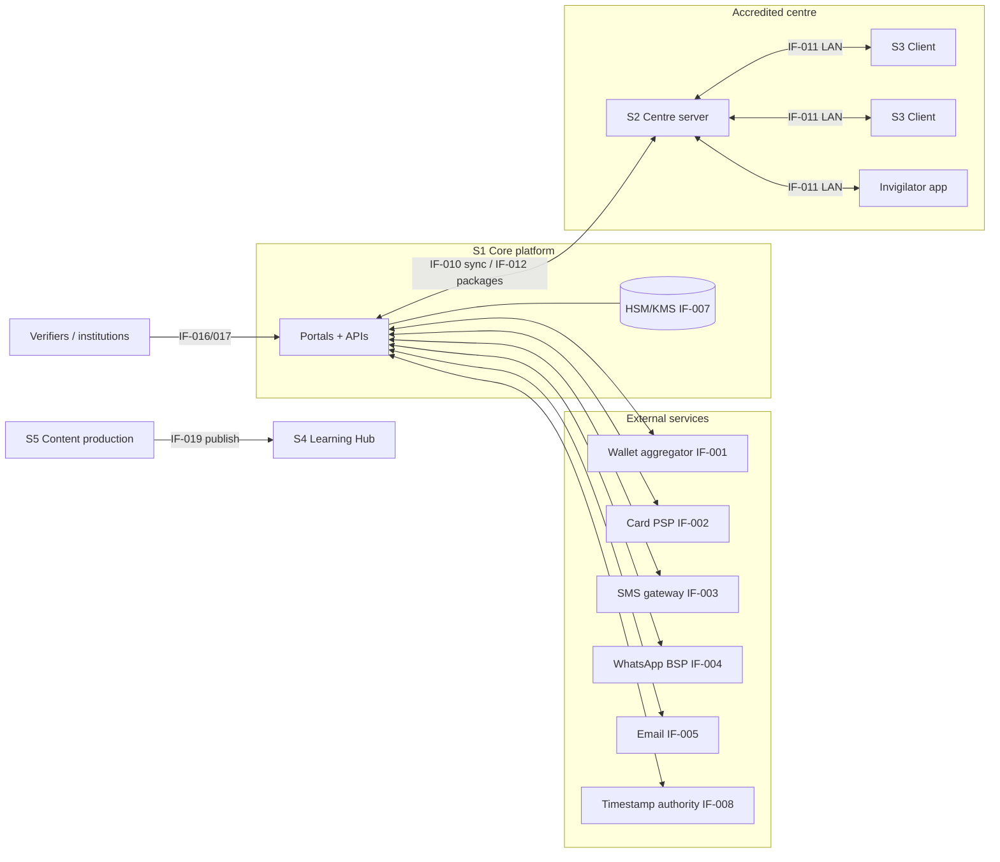

# KBS — D4 · System Requirements (SRD)

> **Covers:** `KLB_v3.md` §18 D4 — interfaces, constraints, data, NFR targets
> **Depends on:** D2 (AD-001…AD-018), D3 (FR-*, NFR-*, AD-019…AD-022, ADR-011/012)
> **Feeds:** D5 (SDD: C4, ADRs, ERD, OpenAPI), D7 (security & privacy), D13 (traceability)
> This document is **implementation-neutral**. Technology choices are made in D5. All examples use synthetic values.

**ID prefixes added in D4:** `IF-###` interface · `CON-###` constraint · `DR-###` data requirement · `ENV-###` environment. They trace into the D13 matrix like FR/NFR IDs.

---

## 1. System scope and context

KBS consists of five runtime systems. D5 refines them into C4 containers.

| System | Runs where | Users | Connectivity assumption |
|---|---|---|---|
| **S1 Core platform** | Primary hosting (ADR-009: EU-jurisdiction region by default) | Candidates, staff, verifiers, institutions | Always online (NFR-AVAIL-001) |
| **S2 Centre server** | One appliance per accredited centre | Invigilators, centre manager; serves S3 | **Offline-capable**; syncs when the WAN is available |
| **S3 Delivery client** | Kiosk laptops at the centre (ADR-011) | Candidates on test day | LAN to S2 only; no internet |
| **S4 Learning Hub** | Same hosting as S1, logically separate (ADR-012), with a CDN/edge cache for audio | Learners, teachers | Online plus offline packs |
| **S5 Content production** | S1 hosting (Series authoring, publishing pipeline) | Series authors, editors, designers, audio producers | Online |



---

## 2. Constraints

| ID | Constraint | Source | Consequence for design |
|---|---|---|---|
| CON-001 | **Portable deployment.** Runs on any conformant container platform, on-premises in the KRI or in a cloud region. No proprietary managed service is mandatory. | §0 `HOSTING_CONSTRAINT`, NFR-PORT-001 | Open-source database, queue and object storage, or S3-compatible equivalents |
| CON-002 | **Open-source-first** for platform components. Proprietary components need an ADR that shows an exit path. | §5 Openness | — |
| CON-003 | **Data residency is conditional.** The default is EU-jurisdiction hosting (ADR-009). If KRI/Iraqi law requires in-country residency `[VERIFY current law]`, the design must switch to dual-region (KRI residents in-region, diaspora in the EU) **without code changes**. | DN-12 | Region is a tenant/partition attribute from day 1 (DR-004) |
| CON-004 | **Centre sessions run fully offline** | §3.4, NFR-AVAIL-002 | S2 holds everything a session needs; S1 is not on the critical path during a session |
| CON-005 | **Laptops as workstations** (ADR-011), kiosk OS image, full-disk encryption | D3 §2.2 | S3 targets a single, centrally built OS image |
| CON-006 | **RTL-native, mixed-direction UI** in `ckb`, `kmr-Arab`, plus LTR `kmr-Latn` and `en` | §11 | Logical CSS properties; bidi isolation; RTL-first design reviews |
| CON-007 | **No ethnicity, religion, nationality or political fields** anywhere in the data model | §3.3 | Schema linting rule; DPIA gate |
| CON-008 | **No third-party trackers** on public, candidate or Hub surfaces | FR-PUB-007 | Self-hosted analytics; content-security policy allow-list |
| CON-009 | **No live, pretest or anchor content (C4) and no candidate responses** sent to external AI services | D2 §5.9 | Egress controls on the item-bank network zone |
| CON-010 | **Fonts must be openly licensed** (e.g., OFL) with full Kurdish coverage, embeddable in PDF/A | FR-L10N-005 | Font selection in D5/D16 |
| CON-011 | Kurdish TTS, ASR and screen readers are immature `[VERIFY]` | §7, D2 §4.9 | No feature in Phase 1 depends on Kurdish TTS or ASR |
| CON-012 | **Low local hiring depth** for psychometrics and security. Phase 1 relies on partners (A-05). | §17 | Prefer mainstream, well-documented technologies (decided in D5) |
| CON-013 | Payment rails in Iraq are fragmented; cash remains common | §3.4 | Payment abstraction with pluggable providers (IF-001/002) and cash flows |
| CON-014 | **Licensing of item and Series assets**: every asset carries licence metadata, and publishing is blocked without it | FR-ITEM-003, §16.7 | DR-011 |
| CON-015 | **Firewall** between the item bank and Series content (DN-22) | §16.1 | Separate network zones, roles and datastores for item bank and S5 |

---

## 3. Interface requirements

| ID | Interface | Direction | Protocol / format | Requirements | Phase |
|---|---|---|---|---|---|
| IF-001 | **Local wallet / bank-app aggregator** (FIB, FastPay, ZainCash, Qi Card `[VERIFY]`) | S1 ↔ provider | HTTPS REST + signed webhooks | Idempotency key per payment intent; webhook signature check; replay window ≤ 5 min; amounts in IQD minor units; reconciliation file at least daily | 1 |
| IF-002 | **International card PSP** | S1 ↔ PSP | Hosted payment page or hosted fields; 3-D Secure 2 | **No PAN touches KBS** (PCI DSS SAQ-A scope); tokens only; refunds via API | 1 |
| IF-003 | **SMS gateway** (KRI and international) | S1 → gateway | HTTPS API; delivery reports (DLR) | Registered sender ID `[VERIFY KRI operator rules]`; Unicode SMS (UCS-2) for Kurdish; templates contain no sensitive data (FR-NOTIF-002) | 1 |
| IF-004 | **WhatsApp Business Platform** via a business solution provider | S1 → BSP | HTTPS API; pre-approved templates | Recorded opt-in; template per locale; fallback to SMS (FR-NOTIF-001) | 1 (S) |
| IF-005 | **Email** | S1 → MTA | SMTP or API | SPF, DKIM, DMARC `p=quarantine` or stricter; bounce webhooks | 1 |
| IF-006 | **Video link for remote interlocutor** (S3 speaking part) | Interlocutor hub ↔ S2 | WebRTC (self-hosted media server) | End-to-end encrypted where supported; no recording by the video service; **the authoritative recording is local on S3/S2**; works at ≥ 512 kbps symmetric | 1 (S) |
| IF-007 | **HSM / KMS** | S1 → HSM | PKCS#11 or KMIP | Certificate-signing keys and the package master key never leave the HSM; dual control for key ceremonies | 1 |
| IF-008 | **Timestamp authority** | S1 → TSA | RFC 3161 | Used for PAdES-B-LT/LTA certificate signatures; qualified TSA preferred for EU recognition `[VERIFY]` | 1 |
| IF-009 | **Time sources** | S1/S2 → NTP | NTP (authenticated where possible) | S1 drift ≤ 100 ms. S2 drift ≤ 2 s when online. **Exam timers never depend on wall-clock time** (see DR-020). | 1 |
| IF-010 | **Centre ↔ core sync** | S2 ↔ S1 | HTTPS + mTLS (device certificate per S2); signed batches (DR-021) | Resumable; idempotent by `batch_id`; at-least-once delivery with exactly-once effect; works over ≥ 256 kbps uplink | 1 |
| IF-011 | **Client ↔ centre server** | S3/invigilator app ↔ S2 | HTTPS + mTLS on an isolated LAN; local service discovery | Device enrolment at image build; heartbeat every 1 s; response events per DR-020 | 1 |
| IF-012 | **Package distribution** | S1 → S2 | Signed, encrypted bundle (DR-022); resumable download | Delivered ≥ 7 days before the session; integrity verified by signature; decryption key separate (IF-013) | 1 |
| IF-013 | **Key release** | S1 → S2 (online) or officers → S2 (offline) | Online: mTLS key fetch inside the start window. Offline: two Shamir shares (2-of-2) read to two officers over separate channels. | FR-ASM-004; every release is logged and synced | 1 |
| IF-014 | **Paper scanning ingestion** | Scanner → S2 → S1 | PDF or TIFF at ≥ 300 dpi; QR on every page | Each page auto-matched by QR (FR-DEL-016); unmatched pages go to a manual queue with dual sign-off | 1 |
| IF-015 | **Psychometrics exports and imports** | S1 ↔ analysts | CSV and Parquet; Winsteps/Facets control files; JSON for calibrations | Pseudonymised (DR-016); exports are logged and watermarked | 1 |
| IF-016 | **Verification API** | Institutions → S1 | REST; OAuth 2.0 client credentials | Share-code verification only; rate-limited; scoped responses (FR-VER-001) | 1 (S) |
| IF-017 | **Institution webhooks** | S1 → institutions | HTTPS POST; HMAC-SHA-256 signature; retries with backoff | Only for consented candidates | P2 (C) |
| IF-018 | **Hub audio delivery** | S4 → learners | HTTPS; CDN or edge cache with no tracking; ZIP offline packs | Range requests; resumable pack downloads; checksum per file | 1 |
| IF-019 | **Series publishing pipeline** | S5 → print, PDF, EPUB, S4 | Structured content (DR-030) → renderers | Same source produces print PDF, EPUB 3 and Hub content (ADR-010 in D5) | 1 |
| IF-020 | **Staff identity provider** | Staff → S1 | OIDC; WebAuthn and TOTP | MFA enforced (FR-IAM-002); SCIM or manual provisioning | 1 |
| IF-021 | **Backups** | S1 → backup target | Encrypted (keys under KBS control); immutable or object-lock storage | Same legal-jurisdiction class as primary (CON-003); restore tested quarterly | 1 |
| IF-022 | **Observability** | S1/S2 → monitoring stack | OpenTelemetry-compatible | No personal data in telemetry (NFR-OBS-001); S2 buffers telemetry while offline | 1 |
| IF-023 | **Physical sync fallback** | S2 → courier → S1 | Encrypted, signed export on removable media | Used if the WAN is down for more than 72 h after a session; same batch format as IF-010 | 1 |

---

## 4. Data requirements

### 4.1 Classification scheme

| Level | Name | Examples | Minimum controls |
|---|---|---|---|
| C0 | Public | Handbook, sample tests, published descriptors | Integrity only |
| C1 | Internal | Ops schedules, aggregate statistics | Authentication |
| C2 | Confidential | Candidate contact data, bookings, payments, results before release | Encryption at rest, RBAC, audit |
| C3 | **Restricted personal** | ID document images and numbers, photos (biometric when used for face match), accommodation evidence (health), guardian data, alternative-pathway evidence | Field-level encryption, need-to-know access, short retention, access logged per read |
| C4 | **Secret assessment** | Live, pretest and anchor items, keys, unreleased forms, package keys, signing keys | Isolated zone, HSM, no AI egress (CON-009), dual control |

### 4.2 Data requirements

| ID | Requirement |
|---|---|
| DR-001 | Every stored field is listed in the **data inventory** with: purpose, lawful basis, classification, retention, residency and owner. Fields not in the inventory fail the schema lint in CI (NFR-PRIV-001). |
| DR-002 | **Prohibited fields** (CON-007): ethnicity, religion, nationality, political affiliation, tribe or clan, place of birth. The ID **issuing country** is stored encrypted for check-in only. It is never shown on certificates or to verifiers, and is deleted with the document image (NFR-PRIV-002). |
| DR-003 | **Fairness variables** (D2 §5.8) are optional and stored in a **separate pseudonymised store**. They are joined only inside the psychometrics zone, for aggregate analysis. |
| DR-004 | Every candidate-linked record carries a `data_region` attribute (`eu` or `kri`) so CON-003 dual-region partitioning needs no schema change. |
| DR-005 | **Identifiers:** internal IDs are ULIDs (sortable, non-guessable). Candidate-facing IDs never encode personal data or a sequence. |
| DR-006 | **Timestamps** are stored as RFC 3339 UTC (`2027-03-14T08:05:12.345Z`). They are displayed in the user's locale and time zone. Exam timing uses monotonic durations (DR-020), not timestamps. |
| DR-007 | **Names:** `legal_name_latin` (exactly as on the ID, no normalisation on storage), `name_native` (as entered, NFC only), and optional `name_order` hints. Matching uses NORM-v1 `match` mode. |
| DR-008 | **Text storage:** all text is stored as Unicode NFC, without other normalisation (raw is preserved). Normalised forms are stored *alongside* the raw form where matching is needed (FR-DEL-018). |
| DR-009 | **Digits:** stored in Western digits for numeric fields (phone, ID number, amounts). Free text keeps the digits as typed. |
| DR-010 | **Item records** conform to the Item JSON Schema (§4.5). Item content is C4 from `PretestReady` onward. |
| DR-011 | **Assets** (images, audio, text sources) carry: `asset_id`, licence type, licensor, licence evidence reference, expiry, permitted uses (item bank / Series / Hub), and checksum (SHA-256). |
| DR-012 | **Responses** are stored as an **append-only event log** per session and seat (DR-020). The scored response is the last valid event per item at section close. |
| DR-013 | **Recordings:** master in FLAC (16 kHz, 16-bit mono minimum; 48 kHz preferred `[DECISION in D5]`). Rater streaming copy in Opus 32–48 kbps. SHA-256 checksum stored at capture. |
| DR-014 | **Ratings** store rater ID, criterion scores, timestamps and annotations. The rater ID is **pseudonymised** in candidate-facing contexts and visible only to rating supervision and audit. |
| DR-015 | **Results** are versioned. Each version references the conversion table version, the equating record and the ratings used (FR-RES-001). |
| DR-016 | **Psychometric exports** contain `response_id`, item version, score, rater pseudonym and (optionally) pseudonymised fairness variables. They never contain names, contact details, ID data or photos. |
| DR-017 | **Certificate ID** format: see §4.4. Certificates are versioned (reissue = new version; the old one is marked `superseded`). |
| DR-018 | **Credential status** uses a status-list model (bitstring per issuance batch). Revocation reason codes are internal; verifiers see only `valid` / `revoked` / `superseded`. |
| DR-019 | **Audit events** form an append-only, hash-chained log (FR-IAM-004). Each event holds: event ID, actor, role, action, object, before/after hashes, timestamp and source. Personal data in audit events is referenced by ID, not copied. |
| DR-020 | **Response events and timer model:** see §4.3. |
| DR-021 | **Sync batch envelope:** see §4.3. |
| DR-022 | **Content package format:** see §4.3. |
| DR-023 | **Hub data** (S4) lives in a separate datastore. Learner accounts are optional and hold only a nickname plus email or phone (FR-HUB-005). |
| DR-024 | **Retention** follows NFR-PRIV-002 (finalised in D7). Deletion is automatic, logged, and propagates to backups by expiry of the backup retention period (≤ 35 days). |
| DR-030 | **Series content model:** see §4.6. |

### 4.3 Exam-day data contracts (S2/S3)

**Response event (DR-020).** One event per answer change. Values are synthetic.

```json
{
  "event_id": "01J8Z3K7Q2M4X9V6T1B5N0C8RD",
  "session_id": "SES-01J8YF2…",
  "seat_id": "ERB-R1-S14",
  "attempt_ref": "ATT-01J8Z0…",
  "section": "R",
  "item_version_id": "KBS-I-ckb-R-000412@3",
  "seq": 187,
  "type": "answer",
  "raw": "کوردی",
  "normalised": "کوردی",
  "norm_version": "NORM-v1",
  "active_elapsed_ms": 1263400,
  "client_wallclock": "2027-03-14T08:26:15.102Z",
  "device_id": "DEV-ERB-0231",
  "prev_hash": "b3f1…",
  "hash": "9ac0…"
}
```

**Timer model:**
- Each section has `allowed_ms`, which already includes any accommodation (FR-DEL-012).
- The client adds to `active_elapsed_ms` using the OS **monotonic clock**, and only while the section is in the `active` state.
- The client persists elapsed time with a heartbeat event every 1 s, written locally and to S2.
- **On resume:** `remaining_ms = allowed_ms − max(client_last_elapsed, s2_last_elapsed)`. Time with no heartbeat is never counted against the candidate. This meets the ± 2 s accuracy of NFR-RES-002, because heartbeats are 1 s apart.
- Pauses ordered by the invigilator (I-2/I-3) are separate `pause`/`resume` events, signed by the invigilator device.

**Sync batch envelope (DR-021):**

```json
{
  "batch_id": "01J8Z9…",
  "centre_id": "CEN-ERB-01",
  "s2_device_id": "S2-ERB-01",
  "streams": [{"stream": "responses", "from_seq": 1, "to_seq": 4210}],
  "payload_sha256": "…",
  "created_at": "2027-03-14T12:01:00Z",
  "signature": {"alg": "Ed25519", "key_id": "S2-ERB-01-2027", "value": "…"}
}
```
S1 rules: (1) verify the signature and device certificate; (2) if `batch_id` has been seen before, return the stored result; (3) apply events in order, ignoring duplicate `event_id`s; (4) check that each stream's hash chain is continuous, and raise an I-4 incident if it is broken.

**Content package (DR-022):**
- **Manifest:** package ID, session IDs, form IDs and watermark variants, item versions, asset list with SHA-256, NORM version, play-count rules, timer settings, signer and signature.
- **Payload:** encrypted with a per-package data key (AES-256-GCM). The data key is wrapped by the HSM master key and released per IF-013.
- **Size budget:** ≤ 300 MB per session package, with listening audio at Opus 64 kbps (see §5.2).

### 4.4 Identifier formats

| Identifier | Format | Rules |
|---|---|---|
| Certificate ID | `KBS-XXXX-XXXX-XC` (Crockford Base32: 9 random symbols = 45 bits, + Crockford's mod-37 check symbol as the final character) | Non-sequential; case-insensitive; excludes ambiguous characters (I, L, O, U); the check character catches single-character typos and transpositions |
| Share code | 10 characters Crockford Base32 (50 bits), displayed as `XXXXX-XXXXX` | Expiry 1–90 days; scope flag; rate limits per FR-VER-003 |
| Admit QR | Signed token (Ed25519): booking ID, session, seat-allocation hash, expiry | Verified offline by S2 against the roster |
| Item ID | `KBS-I-<track>-<skill>-<6-digit>@<version>` | Sequence inside the item bank only (C4 zone); never shown to candidates |
| Exercise ID (Series) | `<level>-U<nn>-E<nn>` (e.g., `L1-U07-E03`) with edition suffix `.<ckb|kmr-Latn|kmr-Arab>` | Stable across reprints; audio file name = exercise ID (§16.7) |

### 4.5 Item JSON Schema (excerpt; promised in D2 §5.1)

```json
{
  "$schema": "https://json-schema.org/draft/2020-12/schema",
  "$id": "https://schemas.kbs.example/item/v1.json",
  "type": "object",
  "required": ["id","version","product","skill","target_cefr","descriptors","variety","script",
               "item_type","status","provenance","stimulus_assets","author","reviews"],
  "properties": {
    "id":          {"type": "string", "pattern": "^KBS-I-(ckb|kmr)-(L|R|W|S)-[0-9]{6}$"},
    "version":     {"type": "integer", "minimum": 1},
    "product":     {"type": "array", "items": {"enum": ["GEN-F","GEN-A","ACAD","PROF","JUN"]}, "minItems": 1},
    "skill":       {"enum": ["L","R","W","S"]},
    "target_cefr": {"enum": ["PreA1","A1","A1+","A2","A2+","B1","B1+","B2","B2+","C1","C2"]},
    "descriptors": {"type": "array", "items": {"type": "string", "pattern": "^DESC-(L|R|W|S)-(PreA1|A1|A2|B1|B2|C1|C2)-[0-9]{2}(-(ckb|kmr))?$"}, "minItems": 1},
    "variety":     {"enum": ["ckb","kmr-Latn","kmr-Arab"]},
    "script":      {"enum": ["Arab","Latn"]},
    "item_type":   {"enum": ["mcq3","mcq4","picture_mcq","matching","gapfill","cloze_bank","ordering",
                             "drag_drop","short_answer","extended_writing","picture_description",
                             "monologue","interaction"]},
    "key":         {"type": "object", "properties": {
                      "correct":  {"type": "array", "items": {"type": "string"}},
                      "accepted_variants": {"type": "array", "items": {"type": "string"}},
                      "norm_version": {"const": "NORM-v1"}}},
    "status":      {"enum": ["Commissioned","Draft","ContentReview","LinguisticReview","ScriptAdaptation",
                             "BiasSensitivityReview","PretestReady","Pretested","Calibrated","Live",
                             "Monitoring","Suspended","Retired","Rejected"]},
    "provenance":  {"enum": ["human","ai-assisted"]},
    "linked_items": {"type": "object", "properties": {"kmr_script_twin": {"type": ["string","null"]}}}
  },
  "allOf": [
    {"if": {"properties": {"variety": {"const": "ckb"}}}, "then": {"properties": {"script": {"const": "Arab"}}}},
    {"if": {"properties": {"variety": {"const": "kmr-Latn"}}}, "then": {"properties": {"script": {"const": "Latn"}}}},
    {"if": {"properties": {"variety": {"const": "kmr-Arab"}}}, "then": {"properties": {"script": {"const": "Arab"}}}}
  ]
}
```
The full schema (all fields from D2 §5.1, plus statistics and review sub-schemas) is maintained in the repository and versioned with the bank.

### 4.6 Series content model (DR-030, outline; detailed in D16)

`Series → Title → Edition (ckb | kmr-Latn | kmr-Arab) → Unit (L1-U07) → Block (presentation | language_panel | formation_diagram | vocab_set | exercise | culture_note | contrast_box) → Exercise (L1-U07-E03) → Items + AudioRef + ImageRef`. Each block carries descriptor IDs (D14 traceability), RLD references and asset references with licence (DR-011). There is **no reference to item-bank IDs** (CON-015). A CI check rejects any Series text that has ≥ 0.8 n-gram similarity to C4 item text. The check runs inside the C4 zone, and only the result leaves it.

### 4.7 NORM-v1 specification (shared normalisation layer; AD-018)

Three modes. Storage is always raw NFC (DR-008).

| Step | `match` (keys, names, IDs) | `search` (site/portal search) | `similarity` (writing integrity) |
|---|---|---|---|
| 1 Unicode | NFC | NFKC | NFKC |
| 2 Remove | Tatweel U+0640; bidi controls (U+200E/F, U+202A–E, U+2066–9); Arabic harakat U+064B–U+0652 | Same | Same |
| 3 ZWNJ U+200C | Remove | Remove | Remove |
| 4 Arabic-script letters | ك U+0643 → ک U+06A9; ي U+064A and ى U+0649 → ی U+06CC; ھ U+06BE → ه U+0647; ڒ U+0692 → ڕ U+0695 `[VERIFY SC]` | Same | Same |
| 5 ه / ە ambiguity | **Dual-candidate matching:** compare with word-final ه and ة both as-is and mapped to ە U+06D5; a match on either counts | Map word-final ه/ة → ە | Map word-final ه/ة → ە |
| 6 Digits | U+0660–0669 and U+06F0–06F9 → 0–9 | Same | Same |
| 7 Latin case | Case-fold. Turkish dotless ı U+0131 → i; İ U+0130 → i (Kurmanji has no dotless i) | Same | Same |
| 8 Latin diacritics | **Keep** (ê î û ç ş are phonemic); omission accepted only via `accepted_variants` | Strip for recall (e→ê etc. treated as equal) | Keep |
| 9 Punctuation | ، → , ; ؛ → ; ; ؟ → ? ; ’ ‘ ʼ → ' ; NBSP → space | Strip punctuation | Strip punctuation |
| 10 Whitespace | Trim; collapse runs to a single space | Same | Same |

- **Test corpus:** ≥ 500 golden pairs per track, maintained by the Standards Committees. Every NORM change is a new version (`NORM-v2`). Old responses keep the version they were scored with.
- **Ownership:** Assessment (rules), Technology (implementation), SC (approval of the letter mappings).

### 4.8 TRANSLIT-kmr-v1 (outline)
A rule-based Latin → Arabic-script (Badînî convention) transliterator for item production (FR-ITEM-007):
- A deterministic grapheme map (e.g., ê → ێ, o → ۆ, î → ی, û → وو, e → ە, x → خ, q → ق, w → و, v → ڤ, ç → چ, ş → ش, j → ژ) `[VERIFY SC — Badînî conventions vary]`.
- A rule for word-initial vowels (ئ), with an exceptions dictionary.
- **Human review is always required.**

Output quality is measured as the reviewer edit rate per 100 words. The target is < 3 edits per 100 words before the transliterator is used at scale.

---

## 5. Capacity and sizing model

### 5.1 Volumes (from A-01, NFR-SCAL-001)

| Quantity | Year 1 | Design headroom (×10) |
|---|---|---|
| Candidates | 2,500 | 25,000 |
| Peak concurrent seats (all centres) | 88 | 900 |
| Peak web users (results release) | 500 | 5,000 |
| Response events per candidate | ~1,500 (answers + changes + 1 s heartbeats ≈ 10,000 incl. heartbeats) | — |
| Ratings per candidate | 2 skills × 2 raters × (3–4 tasks) ≈ 14–16 (+ 3rd ratings ~10 %) | — |

### 5.2 Storage and bandwidth

| Item | Unit size | Year 1 | Notes |
|---|---|---|---|
| Speaking master (FLAC, 16 kHz mono) | ~1.2 MB/min × ~15 min ≈ 18 MB/candidate | ≈ 45 GB | 48 kHz roughly ×3 (D5 decision) |
| Rater stream copy (Opus 32 kbps) | ~0.24 MB/min × 15 ≈ 3.6 MB | ≈ 9 GB | — |
| Paper scans | ~3 MB/candidate | small | Only for paper candidates |
| Photos (check-in, profile) | ~200 KB each | ≈ 1 GB | C3 |
| Item bank assets (incl. listening audio) | — | ≈ 20–50 GB | C4 |
| Session package (download to S2) | ≤ 300 MB | — | At 2 Mbps ≈ 20 min; delivered T-7 days, resumable |
| **Post-session upload from S2** | ~20 MB/candidate × 24 seats ≈ 480 MB | — | At 2 Mbps uplink ≈ 35 min. Target: complete within 24 h of reconnect (NFR-RES-004); IF-023 fallback after 72 h. |
| Hub audio (5 MVP titles × ~2.5 h × 3 editions) | Opus 64 kbps ≈ 29 MB/h | ≈ 1.1 GB catalogue | CDN egress depends on adoption |

### 5.3 Reference hardware

| Device | Minimum spec | Notes |
|---|---|---|
| S3 candidate laptop | 4-core x86-64, 8 GB RAM, 256 GB SSD, 13–15″ ≥ 1366×768, ≥ 3 h battery under test load, TPM 2.0 | Full-disk encryption; secure boot; locked BIOS (ADR-011) |
| Headset | USB, closed-back, noise-cancelling boom mic | Tested model list maintained by Ops |
| Keyboard | Built-in + Kurdish keycap stickers per track | On-screen keyboard always available |
| S2 centre server | 4-core, 16 GB RAM, 2× 1 TB SSD (RAID 1), TPM 2.0, dual NIC | UPS ≥ 60 min with network switch |
| Invigilator device | Tablet or laptop with camera | Runs the invigilator app against S2 |
| Scanner | ADF, 300 dpi, duplex | Paper fallback (IF-014) |
| Network | Isolated LAN or Wi-Fi (WPA3-Enterprise); WAN ≥ 2 Mbps down / 1 Mbps up recommended | WAN not needed during a session |

---

## 6. NFR targets with measurement methods

The targets come from D3 §6. D4 adds how each one is measured and when it must pass.

| NFR | Target | Measurement method | Environment | Frequency | Gate |
|---|---|---|---|---|---|
| NFR-SCAL-001 | ×10 headroom | Synthetic load: 900 seats replaying recorded event streams; 5,000 web users | Staging (prod-like) | Before each release window | Go-live and annual |
| NFR-PERF-001 | Local save p95 ≤ 200 ms | Client benchmark harness on reference laptop; 10,000 answer events | Centre lab | Each client build | CI (hardware-in-the-loop nightly) |
| NFR-PERF-002 | Replication p95 ≤ 5 s | 24-seat lab session, packet capture timestamps | Centre lab | Each S2/S3 release | Release |
| NFR-PERF-003 | LCP ≤ 2.5 s p75 at 1.6 Mbps / 150 ms | Throttled Lighthouse CI on top 10 pages × 4 locales; real-user monitoring (self-hosted, cookieless) | CI + production | Every PR; weekly RUM review | PR blocks on regression > 10 % |
| NFR-PERF-004 | Booking API p95 ≤ 500 ms @ 500 users | Load test script covering search → hold → pay (mock providers) | Staging | Each release | Release |
| NFR-PERF-005 | 3,000 notifications ≤ 30 min | Queue drain test with provider sandboxes | Staging | Before each results window | Window |
| NFR-AVAIL-001 | 99.5 % / 99.9 % on key days | External synthetic probes (≥ 2 locations, one in KRI) every 60 s | Production | Continuous; monthly report | SLO review |
| NFR-AVAIL-002 | Session with 0 % WAN | **Dry run** with WAN physically disconnected for a full session (check-in → submit → incidents) | Every centre | Before each window (FR-OPS-008) | Centre cannot go "ready" |
| NFR-RES-001 | 0 responses lost (> 1 s old) | **Power-pull test:** 50 random hard power cuts per build across seats; compare client action log with recovered events | Centre lab | Each S3/S2 release; quarterly at a live centre | Release |
| NFR-RES-002 | Time ± 2 s | Same rig; compare expected vs restored `remaining_ms` | Centre lab | Each release | Release |
| NFR-RES-003 | Idempotent sync | Fault injection: duplicate, reorder, truncate and replay batches; corrupt one hash link | Staging | Each release | Release |
| NFR-RES-004 | 100 % recordings verified; 99.9 % at core ≤ 24 h | Session close report (S2); sync lag dashboard | Production | Every session | Results hold if unmet |
| NFR-RES-005 | RPO ≤ 15 min; RTO ≤ 4 h | Restore drill into a clean environment from backups | DR environment | Quarterly | Audit evidence |
| NFR-SEC-001 | ASVS L2 / L3 | ASVS checklist per module; SAST/DAST in CI; external pen test | CI + staging | Pen test before go-live and annually; checklist per release | Go-live |
| NFR-SEC-002 | TLS 1.3, AES-256, HSM keys | Config scanning; key inventory review; TLS scanner | Production | Monthly | — |
| NFR-SEC-003 | 100 % staff MFA | IdP report | Production | Monthly | Access review |
| NFR-PRIV-001 | Inventory coverage 100 % | Schema lint: every column must map to the inventory (DR-001) | CI | Every migration | PR blocks |
| NFR-PRIV-002 | Retention executed | Retention job reports; sample audit of 20 records past retention | Production | Monthly | DPO sign-off |
| NFR-PRIV-003 | DSAR ≤ 30 days | DSAR log | Production | Monthly | — |
| NFR-A11Y-001 | WCAG 2.2 AA | Automated checks (CI) + manual audit with screen reader, keyboard-only and zoom 200 % in each locale | CI + staging | CI per PR; manual before release | Release |
| NFR-L10N-001 | 100 % strings | String-catalogue completeness check per locale | CI | Every PR | PR blocks for M locales |
| NFR-L10N-002 | Bidi correct | Visual regression on a bidi fixture set (names, numbers, URLs, mixed scripts) in RTL locales | CI | Every PR | PR blocks |
| NFR-OBS-001 | No personal data in logs | Log scanner (regex + dictionary for names, phones, ID numbers) on sampled logs | Staging + production | Weekly | Incident if found |
| NFR-PORT-001 | Two environments | Full deployment to (a) EU cloud and (b) an on-prem test cluster from the same artefacts | Staging | Each major release | Release |

**New NFRs introduced in D4**

| ID | Requirement | Target | Measurement |
|---|---|---|---|
| NFR-SEC-004 | Key lifecycle | Package keys unique per package; signing keys rotated ≤ 2 years; S2 device certificates ≤ 1 year | Key inventory audit, quarterly |
| NFR-SEC-005 | Content confidentiality at centres | C4 content on S2 and S3 only in encrypted form at rest; decrypted only in memory during the session window; purged within 1 h of sync confirmation | Forensic check on a sampled S2/S3 after a session, twice a year |
| NFR-PRIV-004 | Residency | 100 % of candidate-linked records stored in the region of their `data_region` | Storage location query, monthly |
| NFR-L10N-003 | Normalisation correctness | NORM-v1 passes 100 % of the golden test corpus | CI per change |

---

## 7. Remaining acceptance criteria (deferred from D3)

| FR | Acceptance criteria |
|---|---|
| FR-RATE-003 | **Given** a `kmr-Latn` Writing task, **When** a rater opens the rubric, **Then** benchmark scripts for every band of each criterion are available for that track, including at least two sub-varieties. |
| FR-RATE-006 | **Given** a rater's queue of 50 scripts, **When** allocation runs, **Then** 2–5 are seeded scripts, not visibly marked. **And when** a rater's seeded accuracy (exact + adjacent) falls below 90 % over 20 seeds, **Then** their allocation pauses and the supervisor is alerted. |
| FR-RES-004 | **Given** a results date, **When** all release gates (key check, rating complete, psychometric sign-off, no unresolved holds) are met by 09:00 local time, **Then** results are released that day and notifications start. **If** a gate is unmet, **Then** release is blocked and candidates receive a delay notice within 24 h. |
| FR-RES-007 | **Given** an appeal lodged within 20 working days of the enquiry outcome, **When** it is registered, **Then** a panel of 3 (≥ 1 external) with no prior involvement is formed within 10 working days and a decision is issued within 30 working days. |
| FR-PUB-008 | **Given** the centre finder, **When** loaded, **Then** no third-party map or geolocation request is made, and the address is shown in all M locales. |
| FR-CAND-010 / FR-NOTIF-003 | **Given** a candidate who chose WhatsApp then SMS, **When** WhatsApp delivery fails, **Then** SMS is sent within 5 min, and the delivery receipt for each attempt is logged. |
| FR-CAND-014 | **Given** a guardian completes consent, **When** they verify by OTP and confirm the relationship, **Then** the minor's booking is unblocked, and the consent record is retained per D7. |
| FR-CAND-015 | **Given** the portal prep page, **When** a candidate clicks a Hub link, **Then** the Hub opens with no candidate identifier in the URL or referrer. |
| FR-PAY-005 | **Given** an approved waiver, **When** the candidate books, **Then** the price is zero and the waiver is counted against the window quota. |
| FR-PUB-005 | **Given** the practice test, **When** completed, **Then** receptive items are scored locally, and productive tasks show model answers with no data sent to the server. |
| FR-DEL-014 | **Given** a candidate pastes text into a Writing response, **When** the paste comes from outside the response box, **Then** it is blocked (FR-DEL-001); internal cut-and-paste moves are logged as events. |
| FR-DEL-015 (video) | **Given** a remote interlocutor link at < 512 kbps for > 30 s, **When** detected, **Then** S3 is paused, an I-2 is logged and the interlocutor is offered an audio-only fallback. |
| FR-RATE-007 (S) | **Given** a live window, **When** a supervisor opens the dashboard, **Then** per-rater agreement and seeded accuracy update at least every 15 min. |
| FR-RATE-010 | **Given** bandwidth < 256 kbps, **When** audio plays, **Then** the stream switches to the 32 kbps copy without restarting playback. |
| FR-OPS-007 | **Given** an S2 that has not sent a heartbeat for 10 min while online, **When** the dashboard refreshes, **Then** the centre shows as amber and the duty officer is notified. |
| FR-VER-004 | **Given** an institution client, **When** it calls the verification API with a valid share code, **Then** it receives the scoped result in ≤ 1 s p95 and the call is logged to the candidate's verification history. |
| FR-INST-002 | **Given** a candidate who consented to share results with an institution, **When** results are released, **Then** the institution sees them in the portal; without consent, it sees nothing. |
| FR-INST-003 | **Given** the recognition page, **When** published, **Then** the recognition dossier PDF is downloadable in `en` and at least one Kurdish locale. |
| FR-PSY-003/004 | **Given** a closed window, **When** the analysis job runs, **Then** item statistics and DIF flags per AD-016 are available within 2 working days. |
| FR-SUP-001/003 | **Given** a ticket in `kmr-Arab`, **When** opened, **Then** it routes to a Kurmanji-capable agent queue, with first response within the D3 SLA. |
| FR-IAM-005 | **Given** a quarter end, **When** the access review runs, **Then** every privileged role has a named attestation, and unattested accounts are disabled after 10 working days. |
| FR-HUB-006 | **Given** a learner with an account, **When** they complete an exercise online or offline, **Then** progress syncs when online, with no data shared with S1. |
| FR-L10N-003 | **Given** Kurdish-calendar display enabled, **When** a date renders, **Then** it shows the Gregorian date plus the Kurdish month name in the user's variety. |

---

## 8. Environments and test data

| ID | Environment | Purpose | Data rules |
|---|---|---|---|
| ENV-001 | Dev | Developer work | **Synthetic data only.** No C3/C4 data. |
| ENV-002 | CI | Automated tests (unit, contract, a11y, bidi, NORM golden set) | Synthetic; golden corpora (no real candidate data) |
| ENV-003 | Staging | Prod-like integration, load tests, pen tests | Synthetic candidates. C4 placeholder items only (lorem-style Kurdish generated for testing, marked `TEST`). |
| ENV-004 | **Centre lab** | Reference laptops + S2 + UPS + scanner; power-pull and offline drills | Synthetic; test packages signed with test keys |
| ENV-005 | Item-bank zone (prod) | Live item work (C4) | Isolated network zone; no AI egress; dual-control exports |
| ENV-006 | Production | Live operations | Real data under D7 |
| ENV-007 | DR | Restore drills | Restored production data, access-restricted and destroyed after the drill |

Production data is **never** copied to lower environments. Synthetic data generators must produce names and text in all four scripts, including bidi edge cases.

---

## 9. Traceability additions (for D13)

| D4 ID | Satisfies |
|---|---|
| IF-010, IF-011, DR-020/021, IF-023 | FR-DEL-003/004/019/020, NFR-RES-001…004 |
| IF-012, IF-013, DR-022, NFR-SEC-005 | FR-ASM-003/004, FR-DEL-002 |
| DR-002, DR-003, DR-016, CON-007 | §3.3 candidate safety, FR-CAND-002, FR-PSY-001 |
| §4.7 NORM-v1, NFR-L10N-003 | AD-018, FR-DEL-018, FR-ITEM-006, FR-L10N-002 |
| §4.8 TRANSLIT-kmr-v1 | AD-002, FR-ITEM-007 |
| DR-030, CON-015 | DN-22 firewall, FR-ITEM-011, §16.7 content model |
| CON-003, DR-004, NFR-PRIV-004 | DN-12 / ADR-009 |

---

## Changes to prior deliverables
- **D2 §4.8 (NORM-v1):** the word-final ه → ە rule is implemented as **dual-candidate matching** (§4.7 step 5) rather than a destructive mapping. Same behaviour for candidates; safer for words that genuinely end in consonant ه.
- **D2 §5.1:** the full Item JSON Schema now lives here (§4.5).
- **D3:** acceptance criteria added for the FRs deferred in its self-check (§7). New NFRs: NFR-SEC-004/005, NFR-PRIV-004, NFR-L10N-003.
- New IDs: IF-001…IF-023, CON-001…CON-015, DR-001…DR-024, DR-030, ENV-001…ENV-007.

## §19 self-check
- ✅ Varieties and scripts: NORM-v1 covers both scripts; TRANSLIT-kmr-v1; item schema enforces variety ↔ script; synthetic data in all four scripts. Offline: timer model, event log, signed sync, offline key release, courier fallback, capacity for slow uplinks.
- ✅ Every NFR now has a measurement method and a gate. Deferred FR acceptance criteria are filled in.
- ✅ Candidate safety and minimisation: prohibited-field list, separate fairness store, pseudonymised exports, `data_region` partitioning, no personal data in logs.
- ✅ Data-hungry features are unchanged and still gated (D2 §5.6). No dependency on Kurdish TTS or ASR (CON-011).
- ⚠️ `[VERIFY]`: wallet and SMS provider rules, TSA choice, KRI residency law, NORM letter mappings (ڒ→ڕ, ھ→ه) and Badînî transliteration conventions (Standards Committees). `[DECISION in D5]`: recording sample rate (16 vs 48 kHz).

**Next deliverable: D5 — System design: C4, ADRs, ERD, API & event surface, deployment, DR (§14).**
