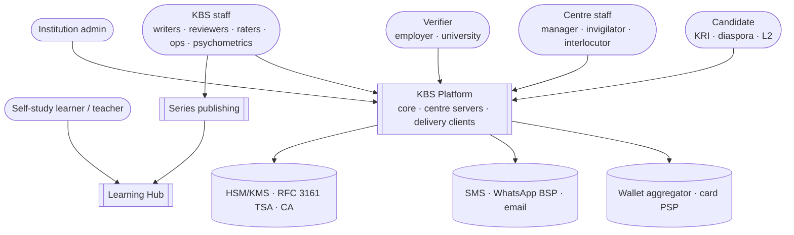
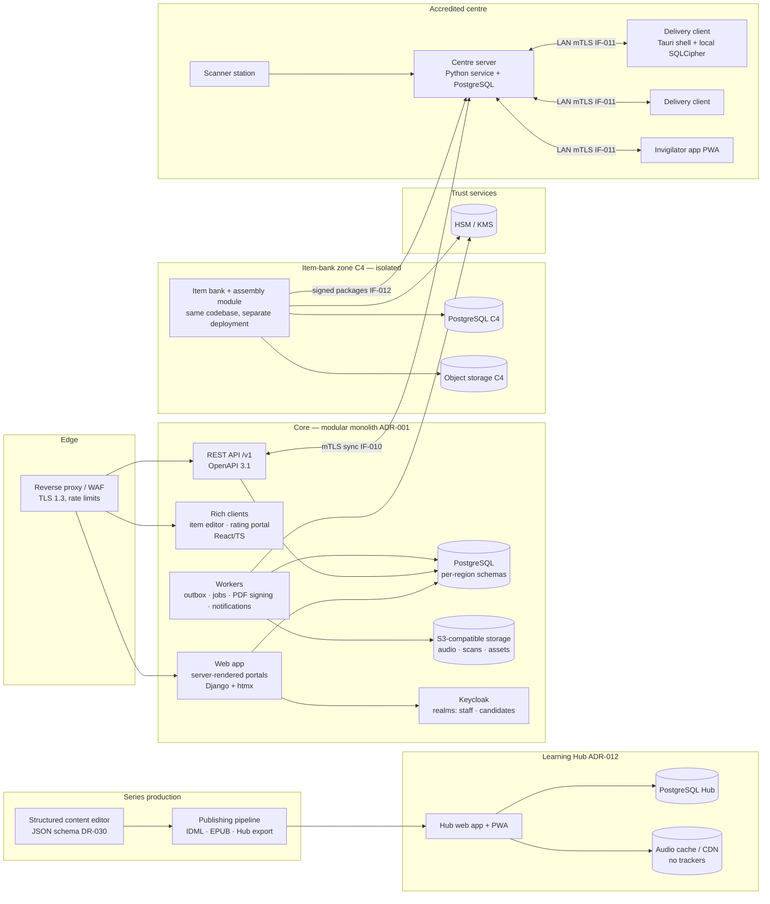
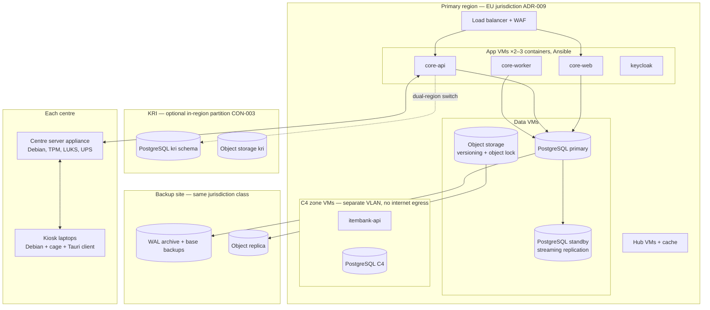
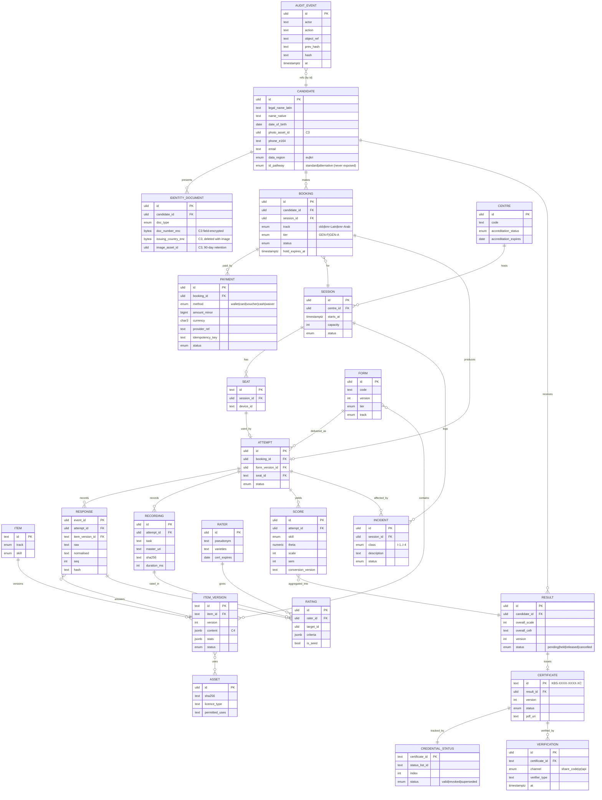

# KBS — D5 · System Design (SDD)

> **Covers:** `KLB_v3.md` §14 · **Depends on:** D3 (FR/NFR), D4 (IF/CON/DR)
> **Feeds:** D7 (security architecture), D10 (build cost and staffing), D13
> Diagrams are Mermaid. API excerpts are OpenAPI 3.1 and AsyncAPI 3.0 YAML. All example values are synthetic.

---

## 1. Architecture at a glance

| Principle | Design choice |
|---|---|
| Simplest thing that meets the requirement | **One modular monolith** for the core (ADR-001), plus three deployables that are separate because they run in different places: centre server, delivery client, and Learning Hub |
| Offline is a first-class mode | The centre server can run a whole session alone. Exam data is an append-only, signed event log (ADR-004). |
| Portable, open-source-first | PostgreSQL, S3-compatible object storage, Keycloak, containers on VMs managed by Ansible (ADR-002/003/006/017) |
| Candidate safety | Region partitioning (`data_region`), an isolated C4 zone, field-level encryption for C3 data, and a Hub with separate identity |
| Kurdish by design | NORM-v1 library shared by every component; RTL-first UI kit; one Kurdish font stack (§9) |

---

## 2. C4 — System context



## 3. C4 — Containers



## 4. Deployment view



**Hosting tiers:**
- Year 1 fits on **3 app VMs, 2 database VMs and 2 C4-zone VMs**, plus the Hub VMs.
- Kubernetes is **not** used at MVP (ADR-017).

---

## 5. Bounded contexts (modules of the monolith)

| # | Context | Owns (data) | Publishes events | Consumes | Deployable |
|---|---|---|---|---|---|
| BC1 | Identity & Candidates | Candidate, IdentityDocument, Guardian, Consent | `candidate.registered`, `identity.verified` | — | core |
| BC2 | Booking & Payments | Booking, Payment, Voucher, Waiver, Refund | `booking.confirmed`, `booking.cancelled`, `payment.settled` | `session.capacity_changed` | core |
| BC3 | Item Bank | Item, ItemVersion, Asset, Review | `item.calibrated`, `item.suspended` | `calibration.imported` | **C4 zone** |
| BC4 | Test Assembly & Publishing | Form, FormVersion, Package, KeyRelease | `package.published`, `key.released` | `item.suspended` | **C4 zone** |
| BC5 | Delivery | Session, Seat, Attempt, Response events, Recording | `attempt.submitted`, `session.closed`, `recording.verified` | `package.published` | centre server + client; ingest in core |
| BC6 | Proctoring & Incidents | Incident, CheckIn, Photo | `incident.raised` | `attempt.submitted` | core + centre |
| BC7 | Scoring & Rating | Rating, Rater, Allocation, Seed, ScoreRaw | `rating.completed`, `rating.discrepant` | `session.closed` | core |
| BC8 | Results & Certification | Score, Result, Certificate, CredentialStatus, Hold, Enquiry, Appeal | `result.released`, `certificate.issued`, `certificate.revoked` | `rating.completed`, `incident.raised` | core |
| BC9 | Verification | ShareCode, Verification | `verification.performed` | `certificate.*` | core |
| BC10 | Analytics & Psychometrics | Exports, Calibration, EquatingRecord, DIFRun | `calibration.imported` | `session.closed`, `rating.completed` | core + C4 zone |
| BC11 | Notifications | Template, Message, DeliveryReceipt | — | most events | core |
| BC12 | Admin & Audit | Role, Policy, AuditEvent | — | all privileged actions | core |
| BC13 | Learning Content & Hub | Title, Edition, Unit, Exercise, AudioAsset, Entitlement | `edition.published` | — | **Hub + production** (separate) |

**Module rules** (enforced by architecture tests in CI):
- Contexts never touch another context's tables.
- Contexts communicate through in-process interfaces, or through events via the outbox (ADR-007).
- BC3/BC4 code ships in the same repository but is **deployed only in the C4 zone**.
- Core reaches BC3/BC4 only through a narrow, audited API (calibration import, package metadata).

---

## 6. Architecture decision records

Each ADR follows: context → options → decision → consequences → what would change it.

### ADR-001 Modular monolith vs microservices
- **Context:** a team of about 6–10 engineers, 2,500 candidates in Year 1, and a need for strong consistency (bookings, results).
- **Options:** (a) microservices per context; (b) **modular monolith** + separate deployables only where the runtime location differs; (c) a classic monolith.
- **Decision:** (b). One core codebase with enforced module boundaries. Separate deployables: C4-zone instance, centre server, delivery client, Hub.
- **Consequences:** simple operations and transactions. Boundaries depend on CI architecture tests.
- **Would change it:** sustained volume > ~50,000 candidates/year or a team > 25 engineers. Extract the noisiest context (likely Rating or Notifications) first.

### ADR-002 Primary database and search
- **Options:** PostgreSQL alone; PostgreSQL + OpenSearch; a document database.
- **Decision:** **PostgreSQL 16+** for all transactional data. **Search uses PostgreSQL**: generated columns holding NORM-v1 `search` forms, plus `pg_trgm` trigram indexes and `unaccent`-style custom dictionaries for `kmr-Latn` search mode. No separate search cluster at MVP.
- **Rationale:** search needs are small (CMS pages, item-bank lookups, support). There are no good Kurdish stemmers anyway `[VERIFY]`, so trigram + normalisation beats untuned analysers.
- **Would change it:** Hub full-text search over thousands of pages with relevance tuning → add OpenSearch with an ICU tokenizer + NORM-v1 char filter.

### ADR-003 Object storage and speaking-audio pipeline
- **Decision:** S3-compatible storage (MinIO-class on-prem or a provider's S3 API), with versioning and object lock on the recordings bucket.
- **Recording format (resolves D4 open decision):** capture **48 kHz mono FLAC** (the native rate of USB headsets; avoids resampling artefacts). Store the master. Derive:
  - **Opus 32 kbps** for raters;
  - **16 kHz WAV** on demand for ASR research (consented subset only).
  - Year-1 storage ≈ 135 GB; trivial.
- **Pipeline:**
  1. Client capture writes to local SQLCipher store plus a file with SHA-256.
  2. The file goes to S2, where the checksum is verified (FR-DEL-008).
  3. S2 syncs it to core object storage.
  4. A worker transcodes it, checks loudness and silence, and flags any recording with > 60 % silence for an integrity review.
  5. Raters get the transcoded copy through a short-lived signed URL (FR-RATE-004).

### ADR-004 Offline delivery and sync protocol
- **Options:** (a) bidirectional database replication; (b) CRDT-based sync; (c) **single-writer append-only event streams with hash chains, signed batches, idempotent apply**.
- **Decision:** (c).
  - Each stream (seat × attempt, incidents, check-ins) has exactly one writer, so no merge conflicts are possible.
  - S1 applies batches idempotently by `batch_id` and `event_id` (DR-021).
  - Gaps or a broken chain raise an I-4 incident.
- **Consequences:** simple and auditable. It also serves as forensic evidence for appeals.
- **Would change it:** a future requirement for multi-writer editing at the centre (not foreseen).

### ADR-005 Delivery client technology
- **Options:**

| Option | Strengths | Weaknesses |
|---|---|---|
| Safe Exam Browser + web app | Widely used | Durability depends on browser storage (IndexedDB); the fsync guarantees needed for NFR-RES-001 are weak; Windows/macOS-centred |
| Electron kiosk app | Chromium rendering (strong Arabic-script shaping) | Heavy (~150 MB); larger attack surface |
| **Tauri (Rust) app on a locked Linux kiosk image** | Small; native local store with fsync (SQLite WAL + SQLCipher); monotonic clock access; one UI codebase shared with the practice-test PWA | Linux WebView is WebKitGTK; Kurdish shaping must be proven |

- **Decision:** Tauri on a Debian-based kiosk image (Wayland `cage` compositor, no desktop, USB storage disabled, network locked to S2).
- **Gate:** a **2-week spike** proves (a) Sorani/Kurmanji shaping and bidi in WebKitGTK against the glyph and bidi fixture set (NFR-L10N-002), (b) the power-pull durability test (NFR-RES-001), (c) audio latency and recording quality.
- **Would change it:** a spike failure on rendering → switch to Electron, keeping the same Rust local-store sidecar.

### ADR-006 Identity provider
- **Decision:** **Keycloak** (open source; OIDC; WebAuthn; TOTP).
  - Separate realms: `staff` (MFA required, WebAuthn for privileged roles), `candidates` (phone OTP via a custom SMS/WhatsApp authenticator; email magic link) and `verifiers` (client credentials).
  - **The Hub has its own realm and database** (ADR-012). There are no cross-realm links.
- **Would change it:** a government ID federation becoming available and wanted (e.g., a KRG e-ID) → add as an optional identity provider, never a requirement.

### ADR-007 Event backbone
- **Options:** Kafka; RabbitMQ or NATS; **transactional outbox in PostgreSQL + a PostgreSQL-backed job queue**.
- **Decision:** outbox + PostgreSQL job queue. Events are documented in AsyncAPI (§8). At-least-once delivery; consumers are idempotent.
- **Would change it:** > 200 events/s sustained, or external event consumers at scale → NATS JetStream.

### ADR-008 Credential signing
- **Decision:**
  - **Phase 1:** PDF/A-3 with **PAdES-B-LTA** signatures, made with an organisation signing certificate whose key lives in the HSM, plus RFC 3161 timestamps (IF-008).
  - The QR code carries a compact **signed token** (Ed25519, key in the HSM) with certificate ID and version; the verification page checks it against the status list.
  - **Phase 2:** W3C Verifiable Credentials 2.0 / Open Badges 3.0, with Data Integrity `eddsa-rdfc-2022` proofs and a **Bitstring Status List**. Europass Digital Credentials alignment for EU recognition `[VERIFY EDC profile requirements]`.
- **Blockchain or ledger anchoring: rejected.** Signed credentials + timestamps + status lists already give integrity and revocation. A ledger adds cost and a permanent record that can be correlated, which cuts against candidate safety.
- **Would change it:** a recognition partner formally requires ledger anchoring. Even then, anchor only batch hashes and never personal data.

### ADR-009 Hosting and data residency (formalises DN-12)
- **Decision:** primary hosting in an EU-jurisdiction region; institute-held keys; backups in the same jurisdiction class. Centre servers in the KRI hold only session-scoped encrypted data and purge after sync confirmation (NFR-SEC-005).
- **Dual-region readiness:** `data_region` on all candidate-linked rows (DR-004); per-region schemas and buckets; routing by region at booking.
- **Would change it:** KRI/Iraqi law requires in-country residency `[VERIFY]` → enable the `kri` partition in KRI hosting for KRI residents' data.

### ADR-010 Structured content model and single-source publishing (Learning Series)
- **Options:**

| Option | Strengths | Weaknesses |
|---|---|---|
| (a) Designers work directly in InDesign; content extracted later | Best design control | No single source; Hub and EPUB drift |
| (b) Fully automated typesetting (CSS Paged Media, Typst, LuaTeX) from structured content | Open source; deterministic | Hard to reach EFE-level spread design with complex RTL formation diagrams |
| (c) **Structured JSON content as the single source** → automated IDML generation → designer finishing in InDesign → print PDF and fixed-layout EPUB exported from the final layout; Hub rendered directly from JSON | Single source, plus a design finish close to EFE | One proprietary tool (InDesign) |

- **Decision:** (c). The proprietary tool is allowed under CON-002 because there is an exit path: IDML is an open XML format, and Scribus or Typst can serve as a fallback renderer for lower-design titles (Grammar Guide, Teacher's Guides; reflowable EPUB per DN-19).
- **Rules:**
  - Text edits **must** be made in the JSON source, never in the layout.
  - A round-trip check compares IDML text with source text and blocks print on any difference.
- **Would change it:** a pilot shows automated typesetting can meet the house style (D16) → drop InDesign.

### ADR-013 Backend language and framework (stack)
- **Options:** Python/Django; PHP/Laravel; Java/Spring; .NET; TypeScript/Node.
- **Criteria:** open source, portability, i18n and RTL maturity, the hiring market in the KRI `[VERIFY with local recruiters]`, and overlap with psychometrics tooling.
- **Decision:** **Python 3.12+ / Django 5.x** for core, C4 zone and centre server.
  - Mature i18n (gettext, per-locale formats), an admin for back-office screens, strong security defaults.
  - The psychometrics team works in Python and R, so data tooling is shared.
  - The KRI hiring pool for Python and PHP is reasonable `[VERIFY]`.
- **Would change it:** a strong local team in another stack. Laravel is the closest alternative.

### ADR-014 Frontend approach
- **Decision:**
  - **Server-rendered HTML + htmx** for public site, candidate portal, ops console, verification and Hub. This keeps the low-bandwidth budget (NFR-PERF-003: initial JS ≤ 200 KB).
  - **React + TypeScript** only for rich clients: item editor, rating portal and the delivery-client UI (shared with the practice-test PWA).
  - **Shared RTL-first design-system tokens** using CSS logical properties.
- **Would change it:** offline needs for the candidate portal beyond the admit card → PWA shell.

### ADR-015 Remote interlocutor video
- **Decision:** a **self-hosted WebRTC media server** (Jitsi-class) at an interlocutor hub. No cloud video SaaS: candidate faces and voices must not go to third parties. **The authoritative recording is made locally at the centre** (FR-DEL-015).
- **Would change it:** the bandwidth at diaspora centres proves inadequate (< 512 kbps) → travel examiners instead.

### ADR-016 Centre server appliance
- **Decision:** a small-form-factor server with TPM 2.0. Debian stable, LUKS full-disk encryption unlocked by TPM + PIN at boot, immutable configuration via Ansible, automatic A/B updates only **outside** exam windows. Services: Django centre app, PostgreSQL, local CA for client mTLS, scanner ingestion, and an NTP client.
- **Would change it:** none foreseen.

### ADR-017 Runtime platform
- **Options:** managed Kubernetes; k3s; **containers on VMs (Docker Compose/Podman) managed by Ansible**.
- **Decision:** containers on VMs for MVP. Portable to any EU cloud or KRI on-prem, with the least operational load for a small team.
- **Would change it:** more than ~15 services, autoscaling needs, or more than 3 environments per region → move to Kubernetes (images are already OCI-compliant).

---

## 7. API surface (REST, OpenAPI 3.1)

**Conventions:**
- Base path `/v1`; breaking changes go to `/v2`, with 12 months of overlap.
- **Idempotency:** `Idempotency-Key` header required on all POSTs that create resources or move money. Keys are retained for 24 h.
- **Pagination:** cursor-based (`?cursor=…&limit=50`, max 200).
- **Rate limits:** `RateLimit-*` headers (IETF draft); 429 with `Retry-After`.
- **Errors:** RFC 9457 `application/problem+json`, with a stable `type` URI and a localised `title`.
- **Language:** `Accept-Language` supports `ckb`, `kmr-Latn`, `kmr-Arab`, `en`.

```yaml
openapi: 3.1.0
info:
  title: KBS Core API
  version: 1.0.0
servers:
  - url: https://api.kbs.example/v1
components:
  securitySchemes:
    candidateOIDC: {type: openIdConnect, openIdConnectUrl: https://id.kbs.example/realms/candidates/.well-known/openid-configuration}
    verifierCC:   {type: oauth2, flows: {clientCredentials: {tokenUrl: https://id.kbs.example/realms/verifiers/protocol/openid-connect/token, scopes: {verify: Verify share codes}}}}
    centreMTLS:   {type: mutualTLS}
  parameters:
    IdempotencyKey: {name: Idempotency-Key, in: header, required: true, schema: {type: string, maxLength: 64}}
  schemas:
    Problem:
      type: object
      properties: {type: {type: string, format: uri}, title: {type: string}, status: {type: integer}, detail: {type: string}, instance: {type: string}}
    Track: {type: string, enum: [ckb, kmr-Latn, kmr-Arab]}
    Booking:
      type: object
      required: [id, session_id, track, tier, status]
      properties:
        id: {type: string, examples: ["01J8Y…"]}
        session_id: {type: string}
        track: {$ref: '#/components/schemas/Track'}
        tier: {type: string, enum: [GEN-F, GEN-A]}
        status: {type: string, enum: [held, confirmed, cancelled, rescheduled, completed]}
        hold_expires_at: {type: string, format: date-time}
    SyncBatch:
      type: object
      required: [batch_id, centre_id, s2_device_id, streams, payload_sha256, created_at, signature]
      properties:
        batch_id: {type: string}
        centre_id: {type: string}
        s2_device_id: {type: string}
        streams: {type: array, items: {type: object, properties: {stream: {type: string}, from_seq: {type: integer}, to_seq: {type: integer}}}}
        payload_sha256: {type: string}
        created_at: {type: string, format: date-time}
        signature: {type: object, properties: {alg: {const: Ed25519}, key_id: {type: string}, value: {type: string}}}
    VerificationResult:
      type: object
      required: [status]
      properties:
        status: {type: string, enum: [valid, revoked, superseded, not_found]}
        name_latin: {type: string}
        name_native: {type: string}
        photo_url: {type: string, format: uri, description: Short-lived signed URL}
        product: {type: string}
        track: {$ref: '#/components/schemas/Track'}
        skills:
          type: array
          items: {type: object, properties: {skill: {enum: [L, R, W, S]}, cefr: {type: string}, scale: {type: [integer, "null"], description: Null when share-code scope is levels-only}}}
        overall_cefr: {type: string}
        test_date: {type: string, format: date}
paths:
  /bookings:
    post:
      summary: Hold a seat (30 min; 24 h for cash/voucher)
      security: [{candidateOIDC: []}]
      parameters: [{$ref: '#/components/parameters/IdempotencyKey'}]
      requestBody:
        required: true
        content:
          application/json:
            schema: {type: object, required: [session_id, track, tier], properties: {session_id: {type: string}, track: {$ref: '#/components/schemas/Track'}, tier: {enum: [GEN-F, GEN-A]}, payment_method: {enum: [wallet, card, voucher, cash]}}}
      responses:
        '201': {description: Held, content: {application/json: {schema: {$ref: '#/components/schemas/Booking'}}}}
        '409': {description: No seat available; waitlist offered, content: {application/problem+json: {schema: {$ref: '#/components/schemas/Problem'}}}}
  /payments/webhooks/{provider}:
    post:
      summary: Provider callback (signature verified; idempotent on provider event id)
      parameters: [{name: provider, in: path, required: true, schema: {enum: [aggregator, psp]}}]
      responses:
        '200': {description: Accepted (also for duplicates)}
        '401': {description: Bad signature}
  /centre-sync/batches:
    post:
      summary: Ingest a signed centre batch (exactly-once effect)
      security: [{centreMTLS: []}]
      requestBody:
        content:
          application/json: {schema: {$ref: '#/components/schemas/SyncBatch'}}
      responses:
        '200': {description: Applied or previously applied; returns ingest receipt}
        '409': {description: Chain gap or hash mismatch; incident I-4 raised}
  /certificates/{certificate_id}/share-codes:
    post:
      summary: Candidate creates a share code
      security: [{candidateOIDC: []}]
      parameters:
        - {name: certificate_id, in: path, required: true, schema: {type: string, pattern: '^KBS-[0-9A-HJKMNP-TV-Z]{4}-[0-9A-HJKMNP-TV-Z]{4}-[0-9A-HJKMNP-TV-Z][0-9A-HJKMNP-TV-Z*~$=U]$'}}
        - {$ref: '#/components/parameters/IdempotencyKey'}
      requestBody:
        content:
          application/json: {schema: {type: object, required: [expires_in_days, scope], properties: {expires_in_days: {type: integer, minimum: 1, maximum: 90}, scope: {enum: [full, levels_only]}}}}
      responses:
        '201': {description: Created, content: {application/json: {schema: {type: object, properties: {code: {type: string, examples: ["7KQ2M-X9V6T"]}, expires_at: {type: string, format: date-time}}}}}}
  /verifications/{share_code}:
    get:
      summary: Verify a result by share code (rate-limited; no name search exists)
      security: [{verifierCC: [verify]}, {}]
      parameters: [{name: share_code, in: path, required: true, schema: {type: string}}]
      responses:
        '200': {description: Scoped result, content: {application/json: {schema: {$ref: '#/components/schemas/VerificationResult'}}}}
        '404': {description: Code invalid, expired or revoked (indistinguishable by design)}
        '429': {description: Rate limited}
```

## 8. Event surface (AsyncAPI 3.0 excerpt)

```yaml
asyncapi: 3.0.0
info: {title: KBS Domain Events, version: 1.0.0}
defaultContentType: application/json
channels:
  booking.confirmed:      {address: booking.confirmed,      messages: {m: {$ref: '#/components/messages/BookingConfirmed'}}}
  session.closed:         {address: session.closed,         messages: {m: {$ref: '#/components/messages/SessionClosed'}}}
  rating.completed:       {address: rating.completed,       messages: {m: {$ref: '#/components/messages/RatingCompleted'}}}
  result.released:        {address: result.released,        messages: {m: {$ref: '#/components/messages/ResultReleased'}}}
  certificate.revoked:    {address: certificate.revoked,    messages: {m: {$ref: '#/components/messages/CertificateRevoked'}}}
  item.suspended:         {address: item.suspended,         messages: {m: {$ref: '#/components/messages/ItemSuspended'}}}
operations:
  onSessionClosed: {action: receive, channel: {$ref: '#/channels/session.closed'}, summary: Scoring and rating allocation start}
  onResultReleased: {action: receive, channel: {$ref: '#/channels/result.released'}, summary: Notifications; consented institution webhooks}
components:
  messages:
    EnvelopeHeaders:
      headers: {type: object, properties: {event_id: {type: string}, occurred_at: {type: string, format: date-time}, data_region: {enum: [eu, kri]}, schema_version: {type: integer}}}
    BookingConfirmed: {payload: {type: object, properties: {booking_id: {type: string}, session_id: {type: string}, track: {type: string}, tier: {type: string}}}}
    SessionClosed:    {payload: {type: object, properties: {session_id: {type: string}, centre_id: {type: string}, attempts: {type: integer}, recordings_verified: {type: boolean}}}}
    RatingCompleted:  {payload: {type: object, properties: {attempt_ref: {type: string}, skill: {enum: [W, S]}, ratings: {type: integer}, discrepant: {type: boolean}}}}
    ResultReleased:   {payload: {type: object, properties: {result_id: {type: string}, candidate_ref: {type: string}, certificate_id: {type: string}}}}
    CertificateRevoked: {payload: {type: object, properties: {certificate_id: {type: string}, version: {type: integer}, status_list_index: {type: integer}}}}
    ItemSuspended:    {payload: {type: object, properties: {item_version_id: {type: string}, reason: {enum: [dif_c, leak, key_issue]}}}}
```
Events carry **references only** (IDs), never personal data. Consumers fetch details through module interfaces under their own permissions.

---

## 9. Data model (ERD)



C3 fields use **application-level envelope encryption**: per-region data keys, wrapped by the KMS. ITEM and ITEM_VERSION live only in the C4 zone database; core holds read-only `item_version_id` references.

---

## 10. Kurdish text and rendering stack

| Concern | Design |
|---|---|
| Normalisation | `kbs-norm` library (Python + Rust ports from one spec and the golden corpus; D4 §4.7). Used by core, S2, S3, C4 zone and Hub. |
| Fonts | OFL fonts with full Kurdish Arabic-script coverage (candidates: Noto Naskh Arabic, Noto Sans Arabic, Vazirmatn `[VERIFY ڵ ڕ ێ ۆ ڤ ە coverage and shaping]`); Noto Sans/Serif for Latin with ê î û ç ş. Pinned versions, subset for the web, fully embedded in PDFs. |
| Bidi | CSS logical properties; `dir` set per element from content script; `<bdi>` around user-generated text; visual regression on the bidi fixture set |
| PDF generation | Server-side HTML → PDF with a HarfBuzz-based engine (WeasyPrint-class), then PDF/A-3 conversion and PAdES signing in the worker; glyph test on every template change |
| Keyboards (client) | OS-level XKB layouts for Sorani, Kurmanji Latin and Kurmanji Arabic `[VERIFY layout standards]`, plus a React on-screen keyboard generated from a layout JSON |

---

## 11. Disaster recovery and resilience

| Scenario | Design | RPO / RTO |
|---|---|---|
| Core DB failure | Streaming replica (manual promote, runbook); WAL archiving to the backup site with continuous PITR | RPO ≤ 1 min (replica) / ≤ 15 min (archive); RTO ≤ 4 h |
| Region loss | Restore from backup site into standby infrastructure; DNS switch | RPO ≤ 15 min; RTO ≤ 24 h (exam sessions are unaffected, CON-004) |
| Ransomware | Object lock on recordings and backups; offline key escrow; immutable audit log | Restore from last clean point |
| Centre server failure mid-session | Laptops keep encrypted local logs; a spare S2 restores from laptops (each holds its own complete stream); or paper fallback | 0 responses lost (NFR-RES-001) |
| Laptop failure | Seat swap; resume from S2 (FR-DEL-005) | ± 2 s time |
| WAN outage after session | S2 stores and retries; courier export after 72 h (IF-023) | — |
| HSM loss | HA pair, or KMS multi-AZ; key ceremony documentation; signing keys backed up in an M-of-N split | — |

DR drills are quarterly (NFR-RES-005) and centre power-pull drills run every release.

---

## 12. Stack recommendation summary

| Layer | Choice | Open-source | Portability | RTL / i18n | KRI hiring `[VERIFY]` |
|---|---|---|---|---|---|
| Core backend | Python / Django | ✔ | ✔ | Strong | Medium |
| Rich UI | React + TypeScript | ✔ | ✔ | Good with logical CSS | High |
| Public UI | Server-rendered + htmx | ✔ | ✔ | Strong | High |
| Database | PostgreSQL | ✔ | ✔ | ICU collations | Medium–high |
| Object storage | S3-compatible (MinIO-class) | ✔ | ✔ | n/a | — |
| Identity | Keycloak | ✔ | ✔ | Themeable, translatable | Medium |
| Jobs/events | PostgreSQL outbox + queue | ✔ | ✔ | n/a | — |
| Delivery client | Tauri (Rust) + WebView on Debian kiosk | ✔ | ✔ | Spike-gated | Low (Rust): **1 specialist + partner** |
| Video | Self-hosted WebRTC | ✔ | ✔ | — | Low |
| Publishing | JSON → IDML → InDesign → PDF/EPUB; Hub from JSON | Partly (ADR-010) | IDML open | Proven Arabic-script publishing tool | Designers available |
| Observability | OpenTelemetry + Prometheus/Grafana/Loki-class | ✔ | ✔ | — | Medium |

---

## Changes to prior deliverables
- **D4 open decision resolved:** recordings are mastered at **48 kHz** FLAC (ADR-003). D4 §5.2 storage estimate rises from ≈ 45 GB to ≈ 135 GB in Year 1; no other impact.
- **D3 ADR-011 (laptops):** refined by ADR-005 (Tauri kiosk image) and ADR-016 (centre appliance).
- New IDs: ADR-001…ADR-010 (reserved in D0), ADR-013…ADR-017, BC1…BC13.

## §19 self-check
- ✅ Varieties and scripts: track enum everywhere; NORM library shared across components; Kurdish font and keyboard stack; WebKitGTK shaping gated by a spike. Offline: ADR-004/005/016, DR scenarios.
- ✅ ADRs record options and "would change it". Ledger anchoring is rejected with reasons. Kubernetes, OpenSearch and Kafka are deferred with explicit triggers.
- ✅ Candidate safety: events carry IDs only; C3 envelope encryption; per-region keys; verification returns an identical 404 for invalid, expired and revoked codes; no cloud video SaaS.
- ✅ Data-hungry features are unchanged and gated. ASR data is a consented subset only.
- ⚠️ `[VERIFY]`: WebKitGTK Kurdish shaping (spike), font coverage, XKB layout standards, EDC profile, KRI hiring market.

**Next deliverable: D6 — Scoring, results and certificate rules.**
