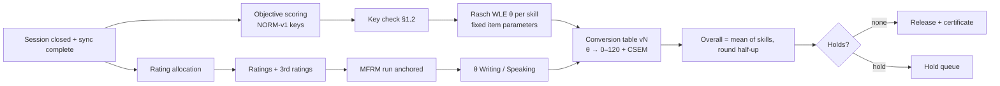
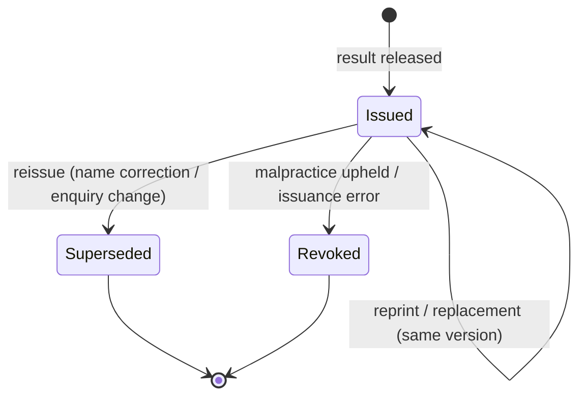

# KBS — D6 · Scoring, Results and Certificate Rules

> **Covers:** `KLB_v3.md` §9 and §12 · **Depends on:** D2 (AD-005, AD-007, AD-008, AD-010), D3 (FR-RATE, FR-RES, FR-VER), D5 (ADR-008)
> **Doc sets:** ADD (scoring rules) and SDD (certificate implementation)

**New decisions in this document**

| ID | Decision |
|---|---|
| AD-023 | Reported Writing and Speaking scores use **MFRM fair measures** (adjusted for rater severity and task difficulty). The fallback is the mean of the two closest ratings. |
| AD-024 | Special consideration **never adjusts scores**. Remedies are a void result plus a free retake, or a result annotation for internal use. |
| AD-025 | An enquiry on results (re-mark) can **raise or lower** a score. Candidates are told this before they apply. |
| AD-026 | Double rating is 100 % in Phase 1. It drops to 30 % + seeded monitoring only when the rater-quality gate is met for two consecutive windows. |
| AD-027 | Results release SLA: 15 working days for CBT and 20 for paper in Phase 1, tightening to 10/15 in Phase 2. |

---

## 1. Objective scoring (Listening, Reading)

### 1.1 Item scoring rules

| Item type | Rule | Score |
|---|---|---|
| MCQ (3/4-option), picture MCQ | Exact key | 0/1 |
| Multiple matching | Each match scored separately | 0/1 per match |
| Gap-fill / sentence completion / note completion | Response after NORM-v1 `match` equals any key or accepted variant (D4 §4.7). Word limit enforced: over the limit = 0. | 0/1 |
| Cloze with word bank, drag-and-drop | Exact placement | 0/1 per gap |
| Sentence ordering (Foundation R4) | Partial credit: 2 = full order correct; 1 = all but one element in correct relative position (≥ n−2 correct adjacent pairs); 0 = otherwise | 0–2 (PCM) |
| Pretest items | Recorded, never scored | — |

Blank responses score 0. There is no negative marking.

### 1.2 Post-administration key check (FR-RES-002)

Run after each window closes and before release:

1. **Statistical flags** per scored item:
   - facility p < 0.20 or > 0.95;
   - point-biserial < 0.10;
   - any distractor with a higher mean ability than the key;
   - Rasch displacement > 0.5 logits from bank value (anchors);
   - infit outside 0.7–1.3.
2. **Near-miss responses:** responses that fail matching but sit within edit distance ≤ 1 of a key after normalisation (D2 §4.8).
3. **Review panel:** Head of Assessment + one variety reviewer + one psychometrician. They decide for each flag: *keep* · *add accepted variant* (rescore everyone) · *double-key* · *drop from scoring* (rescale with the remaining anchors).
4. Decisions are logged with rationale. A changed key creates a new key version, and **all** candidates on the form are rescored identically.

**Release gate:** no unresolved flags (FR-RES-004).

---

## 2. Human rating (Writing, Speaking)

### 2.1 Rater recruitment and eligibility

| Criterion | Requirement |
|---|---|
| Language | Native or C2 competence in the variety rated. For `kmr-Arab`, also literate in Badînî Arabic-script orthography. |
| Background | University degree; ≥ 2 years teaching Kurdish or language-related professional work |
| Diversity | The rater pool for each variety spans at least 3 sub-varieties and both genders, with a target of ≥ 40 % women |
| Conflicts | Annual declaration: tutoring, relatives sitting the test, centre employment, item writing or Series authoring (D9 conflict-of-interest register) |
| Location | Raters work remotely through the rating portal (M8). No scripts or recordings leave the portal (FR-RATE-004). |

### 2.2 Training and certification

| Stage | Content | Duration | Pass criteria |
|---|---|---|---|
| Induction | Construct, rubrics, acceptable-variation policy (AVP), security, bias awareness, MFRM feedback reports | 8 h | Attendance + quiz ≥ 80 % |
| Benchmark training | Annotated benchmark scripts and recordings per band, per sub-variety | 8 h | — |
| **Certification test** | Rate 20 scripts (Writing) or 20 recordings (Speaking) per tier, unseen, with expert-panel consensus scores | 4 h | Per criterion: exact ≥ 60 %, exact + adjacent ≥ 95 %. No systematic bias > 0.5 band on any criterion. No sub-variety bias (a mean difference > 0.5 band between sub-variety groups). |
| Recertification | Annual; shortened certification test (10 items) | 3 h | Same thresholds |
| **Standardisation** | Before each window: 10 recent benchmark items, discussion, re-rate | 3 h | Exact + adjacent ≥ 90 % on the post-discussion set, or no allocation |

### 2.3 Allocation (FR-RATE-001/002)
- Blind: raters see no candidate identity, centre or test date. They see only track, tier, task and the response.
- Allocation is random within the variety-certified pool. A rater never gets a candidate from their own centre or on their conflict list, and never rates the same attempt twice.
- Speaking interlocutors never rate the sessions they conducted (AD-004).
- Maximum load is 4 h per day of rating, with breaks enforced by the portal after 90 minutes.

### 2.4 Double rating and discrepancy (AD-026)

| Rule | Phase 1 |
|---|---|
| Double-rating rate | **100 %** of Writing and Speaking tasks |
| Discrepancy (per task) | A third rating is triggered when **any criterion differs by ≥ 2 bands** (0–5 scale), **or** the task total differs by ≥ 4 points |
| Third rating | A senior rater, who does not see the first two ratings |
| Resolution | MFRM uses all ratings (AD-023). If MFRM is unavailable: the mean of the two closest ratings per criterion. |
| Reduction gate (AD-026) | Move to 30 % double rating + 5 % seeds only when, for **two consecutive windows**: QWK ≥ 0.80 on every criterion, MFRM rater infit within 0.7–1.3 for ≥ 90 % of raters, and the discrepancy rate is < 8 %. Revert to 100 % if any of these is breached. |

### 2.5 Seeded monitoring (FR-RATE-006)
- 5 % of each rater's allocation (2–5 per 50) are seed scripts with expert consensus scores. They are not visibly marked.
- If a rater's seed accuracy over the last 20 seeds falls below 90 % (exact + adjacent), allocation is paused. The supervisor reviews, and the rater is retrained or removed.
- Ratings made since the last passing seed are **re-allocated** to other raters if the failure is severe (exact + adjacent < 80 %).

### 2.6 Severity monitoring and feedback
- After each window, an MFRM run (candidate × task × rater × criterion), anchored to the benchmark set (D2 §5.4.1), estimates each rater's severity and fit.
- Each rater receives a personal feedback report: severity relative to the pool, fit, criterion-level bias, and a sub-variety bias check.
- Thresholds (D2 §5.7):
  - severity beyond ± 1.0 logit → retraining;
  - infit > 1.5 or < 0.5 → suspension pending review.

### 2.7 AD-023: reported productive scores

| Option | Strengths | Weaknesses |
|---|---|---|
| Raw mean of two raters | Simple, transparent | Rater severity directly affects candidates |
| **MFRM fair measure (decision)** | Adjusts for rater severity and task difficulty; supports linking across windows | Harder to explain; needs connected rating design and enough data |
| Third-rater adjudication only | Common | Ignores systematic severity |

**Decision:** the reported Writing and Speaking θ is the MFRM measure, with rater severities **anchored** from benchmark data and task difficulties anchored from the bank.
- **Connectivity:** guaranteed by seeds and overlapping rater pairs; checked each window.
- **Fallback:** if a window's MFRM run does not converge or connectivity fails, use the mean of the two closest ratings. The technical report records this.
- **Transparency:** the handbook explains in plain language that scores are adjusted so that harsh or lenient raters don't affect candidates.

**What would change it:** recognition bodies that require raw-score transparency. Then report the raw mean, keeping MFRM for monitoring only.

---

## 3. Score computation (FR-RES-001)

### 3.1 Pipeline



### 3.2 Rules
- **Ability estimate:** Rasch **WLE** (weighted likelihood) per skill, using bank item parameters fixed after equating (D2 §5.4). WLE gives finite estimates for perfect and zero scores.
- **Conversion:** piecewise-linear θ → scale (D2 §4.7). Each segment runs between adjacent standard-set cuts, mapped to its band boundaries. Scores are clamped to the tier's reportable range.
- **CSEM:** taken from the test information at the candidate's θ, converted to scale points with the local segment slope and rounded to an integer, with a minimum of 1.
- **Tier boundaries:** Foundation is capped at 79. Advanced reports from 40; below 40 is shown as "below A2".
- **Listening exemption:** the overall is the mean of three skills, annotated (D2 §4.9).
- **Reproducibility:** each result stores the conversion table version, item parameter set, MFRM run ID and key versions (DR-015).

### 3.3 Worked example (synthetic)

| Skill | θ (logits) | Segment (cuts) | Scale | CEFR | CSEM |
|---|---|---|---|---|---|
| Listening | 0.42 | B1 cut 0.10 → B2 cut 1.30 maps to 60 → 80 | 60 + (0.42−0.10)/(1.20) × 20 = **65.3 → 65** | B1 | ± 4 |
| Reading | 1.55 | B2 1.30 → C1 2.40 maps to 80 → 100 | 80 + (0.25/1.10) × 20 = **84.5 → 85** | B2 | ± 4 |
| Writing (MFRM) | 0.05 | A2 −1.00 → B1 0.10 maps to 40 → 60 | 40 + (1.05/1.10) × 20 = **59.1 → 59** | A2 | ± 5 |
| Speaking (MFRM) | 0.95 | B1 → B2 | 60 + (0.85/1.20) × 20 = **74.2 → 74** | B1 | ± 5 |
| **Overall** | — | — | (65+85+59+74)/4 = 70.75 → **71** | **B1** | — |

Cut values are illustrative. The real cuts come from standard setting (D2 §5.5).

---

## 4. Results release, holds, enquiries and appeals

### 4.1 Release SLA (AD-027)

| Mode | Phase 1 | Phase 2 target |
|---|---|---|
| CBT | ≤ 15 working days after the session | ≤ 10 |
| Paper | ≤ 20 working days | ≤ 15 |
| First live window per track | ≤ 25 working days (allows the first operational key check and MFRM linking) | — |

Release happens at 09:00 local time on the release day, and candidates are notified with "results ready" and a link only (FR-NOTIF-002). If a gate is missed, candidates are told about the delay within 24 h (D4 §7).

### 4.2 Holds (FR-RES-003)

| Hold type | Trigger | Max duration before update to candidate | Outcome |
|---|---|---|---|
| H-PSY psychometric | Key issue, equating failure, quality target missed (D2 §5.7) | 10 working days | Release, rescore or re-administer free |
| H-INC incident | I-3 session incident under review | 10 working days | Release, void + free retake, or special consideration |
| H-MAL malpractice | I-4 / integrity evidence (D7 §5) | 30 working days (procedure timelines) | Release, cancel, or sanction |
| H-ID identity | Check-in mismatch, alternative-pathway query | 15 working days | Release or cancel |
| H-PAY payment | Chargeback or unpaid cash booking | Until resolved | Release on settlement |

The candidate sees "Result under review" and the hold type in general terms (e.g., "administrative review"). Evidence details are shared only within the malpractice procedure.

### 4.3 Special consideration (AD-024)
- **Eligible:** illness or bereavement on the test day, a centre incident (I-2/I-3), or disruption beyond the candidate's control. Evidence is due within 5 working days.
- **Remedies:** (a) the result stands, with an *internal* note; (b) the result is voided and a free retake offered; (c) a disrupted section only is re-sat in the next window, if feasible for that section.
- **Never:** score uplift, estimated scores or pro-rata scores. This preserves the score meaning for everyone.

### 4.4 Enquiry on results (FR-RES-006; AD-025)

| Type | Scope | Fee | Deadline to apply | Turnaround | Fee refund |
|---|---|---|---|---|---|
| E1 Clerical check | Recount, data-entry check, key version check | Low `[ASSUMPTION]` | 20 working days after release | 5 working days | If the result changes |
| E2 Re-mark | Writing and/or Speaking, blind re-rating by a senior rater with no prior involvement | Medium `[ASSUMPTION]` | 20 working days | 15 working days | If any skill's CEFR level changes |

The re-mark score **replaces** the original, up or down (AD-025). The candidate must acknowledge this before paying. Receptive items are not re-marked individually; E1 covers them. A changed result reissues the certificate as a new version, and the old one becomes `superseded`.

### 4.5 Appeals (FR-RES-007)
- **Grounds:** procedural error in an enquiry; a malpractice decision; a special consideration decision; an accommodation refusal. **Not** a disagreement with academic judgement.
- **Panel:** 3 members, at least 1 external (not KBS staff), none involved before. Panel members are trained, and their conflicts are declared.
- **Timelines:** lodge within 20 working days of the decision; panel formed within 10; decision within 30 (D4 §7). The panel's decision is final within KBS. The candidate keeps any rights under external law.

---

## 5. Certificates and credentials (§12)

### 5.1 Data schema

| Field | Source | Shown on PDF | In share-code view (`full` / `levels_only`) |
|---|---|---|---|
| Certificate ID (`KBS-XXXX-XXXX-XC`) + version | DR-017 | ✔ | ✔ / ✔ |
| Legal name (Latin, exactly as on ID) | DR-007 | ✔ | ✔ / ✔ |
| Native-script name | DR-007 | ✔ | ✔ / ✔ |
| Date of birth | Candidate | ✔ | ✔ / ✔ (used as a second check) |
| Photo | Check-in capture (C3) | ✔ | ✔ / ✔ |
| Product + tier | Booking | ✔ | ✔ / ✔ |
| **Variety + script** (e.g., "Kurmanji — Latin script") | Track | ✔ | ✔ / ✔ |
| Per-skill CEFR + scale score + CSEM | Result | ✔ (CEFR + scale; CSEM on the reverse) | ✔ / CEFR only |
| Overall scale + CEFR | Result | ✔ (secondary) | ✔ / CEFR only |
| Annotations: "Listening not assessed" | Accommodation | ✔ | ✔ / ✔ |
| Test date, centre city | Session | ✔ (city only) | ✔ / ✔ |
| Issue date | Result | ✔ | ✔ / ✔ |
| Recency statement: "KBS recommends results be considered valid for 2 years from the test date; receiving institutions set their own policy." | AD-007 | ✔ | ✔ / ✔ |
| Signatory (Executive Director) + PAdES signature | ADR-008 | ✔ | — |
| QR + verification URL | ADR-008 | ✔ | — |

**Never on certificates or in verification:**
- ID document number or issuing country;
- identity pathway (AD-022);
- accommodations other than the listening-exemption annotation;
- incident history;
- ethnicity, nationality or any other prohibited field (DR-002).

### 5.2 Validity (AD-007)
The certificate is **permanent**. The recency statement above is printed on it and shown on the verification page.

### 5.3 Formats (ADR-008)
- **Phase 1:**
  - PDF/A-3 with a PAdES-B-LTA organisation signature.
  - A compact signed token in the QR, containing the certificate ID, version and an Ed25519 signature.
  - Verification URL `https://verify.kbs.example/c/<id>`. The page requires DOB or a share code before it shows any personal data. This prevents QR scraping from exposing data.
- **Phase 2:**
  - W3C VC 2.0 / Open Badges 3.0 credential in the candidate wallet (JSON-LD, `eddsa-rdfc-2022`), plus a Bitstring Status List.
  - Europass Digital Credentials compatible profile `[VERIFY]`.
  - Selective disclosure (levels-only) using SD-JWT VC or derived proofs, decided in a Phase 2 ADR.

### 5.4 Lifecycle



| Event | Who | Evidence | Audit | Candidate notice |
|---|---|---|---|---|
| Reprint (same data) | Candidate self-service | — | Logged | — |
| Replacement (lost printed copy) | Candidate Services | Request + fee | Logged | Email |
| **Reissue** (name correction) | Results officer + approver (SoD) | Official document showing the correct name | Old version → `superseded`, linked | Email + SMS |
| **Revocation** | Head of Assessment, after the procedure (D7 §5) or an error finding | Case file | Status list updated within 1 h; reason code internal | Written decision with appeal route |

Revocation reason codes (internal): `MAL-IMP` impersonation · `MAL-COL` collusion · `MAL-AID` unauthorised aid · `MAL-LEAK` content leak · `ERR-ISS` issuance error · `ERR-SCO` scoring error (followed by a corrected reissue).

### 5.5 Verification privacy (FR-VER)
- **Default minimal disclosure:** a QR scan shows only status, certificate ID and "enter DOB or share code to see details". Name and result appear only after DOB entry (rate-limited) or with a share code.
- **Share codes:** created by the candidate, scoped and expiring (1–90 days), revocable (FR-CAND-012).
- **No search by name**, ever (FR-VER-003). Invalid, expired and revoked codes return the same response (D5 §7).
- **Every verification is logged** and visible to the candidate (FR-VER-006).

### 5.6 Layout

```
┌────────────────────────────────────────────────────────────────────────────┐
│  [KBS mark]            بڕوانامەی زمانی کوردی · Kurdish Language Certificate │
│                                                                            │
│  ناو / Name:  ئاراس کەریم   ·   ARAS KARIM          [photo]                │
│  لەدایکبوون / Date of birth: 1994-05-12                                    │
│  تاقیکردنەوە / Test: KBS General — Advanced                                │
│  شێوەزار و ڕێنووس / Variety & script:  Sorani — Arabic script              │
│                                                                            │
│   ┌──────────────┬──────────────┬──────────────┬──────────────┐            │
│   │ گوێگرتن       │ خوێندنەوە     │ نووسین        │ قسەکردن       │           │
│   │ Listening    │ Reading      │ Writing      │ Speaking     │            │
│   │   B2  · 86   │   C1 · 101   │   B2  · 83   │   B1  · 77   │            │
│   └──────────────┴──────────────┴──────────────┴──────────────┘            │
│   ئەنجامی گشتی / Overall:  B2 · 87                                         │
│                                                                            │
│  Test date 2027-03-14 · Erbil   Issued 2027-04-02   ID KBS-7K2Q-X9V6-TR    │
│  "KBS recommends results be considered valid for 2 years…"   [QR]          │
│  Signed: Executive Director (digital signature)                            │
└────────────────────────────────────────────────────────────────────────────┘
```
Values are synthetic.
- **Layout rules:** the primary language follows the candidate's variety and script, laid out RTL for `ckb` and `kmr-Arab`. English mirrors it. Bidi isolation is applied to names and IDs. The per-skill profile comes first; the overall is secondary.
- **Arabic page (AD-008):** issued on request as page 2, carrying the same data and the same signature.
- **Printed copies** (on request): security paper with guilloche background, microtext border and a UV-reactive mark `[ASSUMPTION — supplier in D10]`. **The digital PDF signature and verification page are authoritative.** Printed security features are secondary.

---

## 6. Score reporting to candidates (diagnostic feedback)

For each skill, the results page shows:
- the CEFR level, scale score and CSEM band, as a bar with the band;
- 2–3 **"what you can do"** statements from the level's descriptors (D2 §3.3);
- 1–2 **"next steps"** statements linked to the Series level (D15) and the Hub (no tracking; FR-CAND-015).

Productive skills also show the criterion-level band for each task (e.g., "Organisation: 3/5"). Raw item responses are not shown, for security.

---

## 7. Automated scoring (research track, gates only)

| Gate | Threshold |
|---|---|
| Data | ≥ 2,000 double-rated responses per task type per track, across ≥ 3 windows, with consent for research use |
| Agreement | Human–machine QWK ≥ human–human QWK, per criterion, on held-out data |
| Subgroup fairness | Standardised mean difference (machine − human) ≤ 0.10 for variety, script, sub-variety, gender, schooling language and heritage status |
| Robustness | Adversarial tests (off-topic, memorised, code-switched, script-mixed responses) flagged ≥ 95 % |
| Deployment mode | **Second rater only**, replacing one human in double rating. Discrepancies always go to a human third rater. Never the sole scorer for General or higher stakes. |
| Governance | ADR + Psychometric Review Board approval + candidate notice in the handbook |

---

## Changes to prior deliverables
- **D2 §5.7:** discrepancy thresholds and the double-rating reduction gate are now defined (AD-026).
- **D3 FR-RES-004:** release SLA set (AD-027).
- **D5 ADR-008:** the QR verification page needs DOB or a share code before it shows personal data. This tightens FR-VER-002 (status is still shown without them).
- New IDs: AD-023…AD-027.

## §19 self-check
- ✅ Variety and script: raters certified per variety and script; sub-variety bias checks; certificate names variety and script; bilingual RTL layout. Offline: results depend on completed sync. Holds cover sync-integrity incidents.
- ✅ Decisions recorded with alternatives (AD-023…AD-027). Automated scoring is gated numerically.
- ✅ Candidate safety: minimal disclosure; no ID numbers, pathway or nationality on certificates; QR page requires DOB or a share code; name search prohibited.
- ⚠️ Enquiry fees and printed-certificate security supplier are `[ASSUMPTION]`, to be set in D10. EDC profile and selective-disclosure method are `[VERIFY]` (Phase 2).

**Next deliverable: D7 — Security, privacy & compliance matrix + threat model.**
