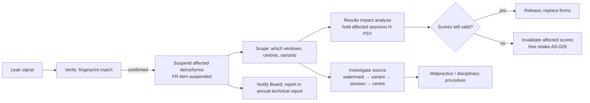

# KBS — D7 · Security, Integrity, Privacy & Candidate Safety

> **Covers:** `KLB_v3.md` §13 · **Depends on:** D3 (FR/NFR), D4 (CON/DR/IF), D5 (architecture), D6 (results and holds)
> **Outputs:** threat model, controls, malpractice procedure, privacy programme, retention schedule, **compliance matrix**
> Legal references are tagged `[VERIFY]` where current law could not be confirmed. Nothing here is legal advice; counsel must review it before launch.

**New decisions in this document**

| ID | Decision |
|---|---|
| AD-028 | **No KBS centres, processors or data storage** in jurisdictions the Ethics & Privacy Committee rates as high compelled-access risk for Kurdish-language candidates. The list is reviewed annually. |
| AD-029 | **Statistical evidence alone never supports a misconduct finding.** It can only support *score invalidation* ("the score cannot be confirmed as valid"), which carries a free retake and no sanction. |
| AD-030 | **Face matching is human-only in Phase 1.** No automated biometric templates are created. Automated matching may be considered from Phase 3, only with explicit consent and an alternative. |
| AD-031 | A **transparency report** on government data requests is published annually. Requests are challenged where lawful, and minimisation limits what could be disclosed. |

---

## 1. Assets and data classes

| Asset | Class (D4 §4.1) | Why it matters |
|---|---|---|
| Live, pretest and anchor items; keys; unreleased forms | C4 | Leak = test invalid; costly rebuild |
| Package keys, signing keys, S2 device keys | C4 | Compromise = forged certificates or content exposure |
| ID document images and numbers; photos; guardian data; accommodation evidence; alternative-pathway evidence | C3 | Harm to candidates (identity theft; **exposure to hostile states**) |
| Contact data, bookings, payments, results before release | C2 | Privacy, fraud |
| Recordings and scripts | C2 (contain voice and personal content) | Privacy; rating integrity |
| Certificates, status list | C2 / integrity-critical | Forgery and false revocation |
| Audit log | Integrity-critical | Evidence for appeals and investigations |

---

## 2. Threat model

### 2.1 Attacker profiles

| ID | Attacker | Motivation | Capability | Main targets |
|---|---|---|---|---|
| TA-1 | Impersonator | Pass on someone's behalf | Low–medium; fake or borrowed ID | Check-in |
| TA-2 | Cheating ring | Profit from selling answers or proxies | Medium; hidden devices, live relay, collusion with centre staff | Test room, centre staff, Telegram distribution |
| TA-3 | Item harvester / leaker | Sell or publish content (Telegram, social channels, test-prep) | Medium; memorisation, hidden cameras | Live items, recurring forms |
| TA-4 | Insider (item writer, reviewer, centre staff, IT admin, rater) | Money, coercion, ideology | High privilege | C4 content, results, candidate data |
| TA-5 | Credential forger | Sell fake certificates | Low–medium; PDF editing | Certificates, verification |
| TA-6 | Criminal / ransomware | Extortion | Medium–high | Core availability, backups |
| TA-7 | **State or hostile actor** | Identify Kurdish-language candidates and diaspora activists; surveillance | High; legal compulsion, intrusion, pressure on staff | Candidate data, recordings, verification logs |
| TA-8 | Political pressure actor | Influence standards, results or the variety/orthography policy | Social and institutional | Governance (D9), Standards Committees |
| TA-9 | Account takeover | Resell bookings, alter contact data | Low–medium; SIM swap, phishing | Candidate accounts, support desk |

### 2.2 STRIDE by component

| Component | S Spoofing | T Tampering | R Repudiation | I Information disclosure | D Denial of service | E Elevation of privilege |
|---|---|---|---|---|---|---|
| **S1 core portals/API** | Credential stuffing, SIM swap (TA-9) → OTP rate limits, WebAuthn for staff, number-change re-verification (FR-SUP-002) | Booking or payment manipulation → idempotency, signed webhooks | Disputed bookings → audit log | Bulk scraping of verification → no name search, rate limits, identical errors | DDoS on booking-close day → WAF, queueing, capacity ×10 | IDOR → object-level authorisation tests (ASVS V4) |
| **C4 item-bank zone** | Stolen staff session → WebAuthn, short sessions, IP allow-list | Item alteration → versioning, dual sign-off | Writer denies edit → hash-chained audit | **Bulk exfiltration (TA-3/4)** → no internet egress, export dual control, watermarking, DLP on exports | — | Role escalation → SoD rules, quarterly access review |
| **S2 centre server** | Rogue S2 → mTLS device certificates, enrolment ceremony | Edit responses after the session → hash-chained streams, signatures (ADR-004) | Centre denies incident → signed invigilator events | Theft of server → LUKS + TPM + PIN; content encrypted until the window; purge after sync (NFR-SEC-005) | Power or network loss → offline design | Local admin abuse → no root for centre staff; Ansible-managed; tamper logs |
| **S3 delivery client** | Candidate swaps seat → check-in photo vs live camera check at the speaking part (human) | Memory or packet tampering → kiosk image, secure boot, mTLS | — | Screenshots or recording → kiosk lockdown (FR-DEL-001), watermarks, room controls | Battery drain → laptop battery spec | Escape from kiosk → hardened Wayland kiosk, no shell, USB disabled |
| **Rating portal** | Rater account sharing → WebAuthn, session-device binding | Rating manipulation → blind allocation, seeds, MFRM | Rater denies a rating → audit | Script or audio download → no download, tokenised streams, watermark overlay with rater ID | — | — |
| **Results & certificates** | Forged certificate (TA-5) → PAdES + signed QR + verification | Altered PDF → signature validation, QR shows the genuine data | Disputed revocation → procedure records | Over-disclosure via QR → DOB or share code gate | Status list unavailable → cached status list + CDN | Insider issuing results → SoD, dual approval for overrides |
| **Hub** | — | Content defacement → CMS workflow | — | Learner tracking → no KYC, no third-party trackers | Audio CDN abuse → rate limits | — |
| **Staff (all)** | Phishing → WebAuthn | — | — | **Coercion by TA-7** → minimisation, no bulk exports without dual control, transparency report (AD-031), staff security support | — | — |

### 2.3 Key abuse scenarios and responses

| Scenario | Primary controls | Detection | Response |
|---|---|---|---|
| Live items appear on a Telegram channel | Exposure caps; ≥ 2 forms per window; watermark variants; short live life | Leak monitoring (§3.4); score-pattern anomalies (sudden facility rise on specific items) | Breach playbook §3.5 |
| Proxy test-taker | ID check, check-in photo, human comparison at the speaking part (AD-030) | Invigilator; photo comparison during rating QA (a sample) | I-4; result hold; procedure §5 |
| Centre staff assisting candidates | Two invigilators per room; CCTV where lawful; random KBS inspectors; seat randomisation | Statistical: similarity of responses within a session; score jumps by centre | Centre suspension; investigation |
| State request for candidate data (TA-7) | Minimisation; EU hosting (ADR-009); AD-028 jurisdiction policy; legal review of every request | — | Challenge where lawful; disclose the minimum; record in the transparency report (AD-031) |

---

## 3. Content security

### 3.1 Protection layers

| Layer | Control |
|---|---|
| At rest | C4 database and object storage encrypted (AES-256). Envelope keys in the HSM. Items are decrypted only inside the C4 zone. |
| In transit | TLS 1.3 everywhere. mTLS for S2 ↔ S1 and S3 ↔ S2. |
| In packages | Per-package data key (AES-256-GCM). Key released only in the session window (IF-013). Content is decrypted in memory on S3 and never written in plaintext to disk. |
| In use | Kiosk lockdown; no external clipboard; no screenshots; no network except S2; watermark variants per form and session (FR-ASM-003) |
| On paper | Sealed packs, numbered and counted at opening and return; printed watermark; shredding of spares within 24 h with a certificate |

### 3.2 Exposure control
- Each live receptive form is used for **at most 3 windows** or **600 candidates**, whichever comes first. After that, it is retired or rotated, with its anchors reused only when drift checks pass.
- **Item exposure cap:** 1,000 administrations per item. Anchors are capped at 1,500 and then replaced.
- **Writing and Speaking prompts:** ≥ 3 per task per window, randomly assigned. A prompt is retired after 2 windows.

### 3.3 Watermarking
- Invisible per-variant text watermarks: deliberate, meaning-neutral variation in distractor order and in spacing or punctuation. Each variant carries a recorded fingerprint. Variants are reviewed so that they never change difficulty.
- Visible on-screen overlay with a session code (faint, non-distracting) to deter photos.

### 3.4 Leak monitoring
- Search public Telegram channels, social media and test-prep sites for **fingerprint phrases** from live stimuli. Use automated alerts plus a monthly manual sweep.
- **Ethics constraints:** public sources only; no infiltration of private groups; no collection of personal data about channel members beyond what is needed to report content. Takedown requests go to platforms.

### 3.5 Content breach playbook

---

## 4. Identity assurance

| Stage | Control | Notes |
|---|---|---|
| Registration | Phone OTP or email; profile photo upload (optional) | No KYC vendor in Phase 1, to keep data local |
| Before test day | Optional document photo upload, checked by Candidate Services for name match | C3; deleted 90 days after release |
| **Check-in** | Invigilator compares the original document (or alternative-pathway record, AD-022) with the person; captures a live photo; seat assigned at random | FR-OPS-004 |
| Speaking part | The interlocutor confirms the person matches the check-in photo on screen (**human comparison**, AD-030) | Recorded as a check event |
| Rating QA | A 5 % sample of speaking-check photos is compared with registration photos by a second staff member | Detects proxies |
| Retakes | The new check-in photo is compared with previous photos for the same account (human, on flag) | — |

**AD-030 rationale:**
- *Options:* automated face matching (efficient) vs human comparison (slower).
- Automated matching creates biometric templates (special-category data) whose exposure would be severe for candidates at risk. Error rates also vary by demographic group.
- *Decision:* **human comparison only** in Phase 1.
- *What would change it:* volumes > 10,000/year, with explicit consent, local template processing on S2, immediate template deletion, and an opt-out alternative.

---

## 5. Integrity: writing, statistics, malpractice procedure

### 5.1 Writing integrity
- **Similarity detection:** NORM-v1 `similarity` mode (D4 §4.7). Character 5-gram shingling compares responses within the same window and prompt, across windows for the same prompt, and against a corpus of web text and known model essays from test-prep sources. Flags above threshold go to a human reviewer.
- **Process data:** the keystroke log (FR-DEL-014) shows paste events, burst typing and long pauses followed by complete text.
- **AI-generated text detectors:** **weak signal only**. They are unreliable, especially for low-resource languages, and are **never** sole or primary evidence. They can be used to prioritise human review, nothing more. In a centre-controlled environment, the main defence is that no outside tools are available.

### 5.2 Statistical indicators (AD-029)
- **Indicators:** answer-similarity indices within a session (e.g., shared incorrect responses); unusual score gains between attempts; person-fit (outfit > 2.0 across sections); response times inconsistent with reading.
- **Use:** statistical evidence alone → **score invalidation** at most: no misconduct finding, no sanction, free retake. A **misconduct** finding needs independent non-statistical evidence (an invigilator report, a device found, a confession, watermark tracing, a witness).

### 5.3 Malpractice procedure

| Step | Rule | Timeline |
|---|---|---|
| 1 Report | Invigilator I-4 report, rater flag, similarity flag, leak trace or tip-off | — |
| 2 Hold | Result held (H-MAL) | Immediately |
| 3 Investigation | Integrity officer (not involved in the case) gathers evidence. Evidence standard: **balance of probabilities**. | ≤ 15 working days |
| 4 Notice to candidate | Allegation, evidence summary, possible outcomes, right to respond in writing in their preferred language, right to a representative | — |
| 5 Response | Candidate's written response | 15 working days |
| 6 Decision | Malpractice panel (2 staff + 1 external) | ≤ 10 working days after the response |
| 7 Appeal | To the independent appeals panel (D6 §4.5) | 20 working days to lodge |

**Sanction tariff** (guideline; the panel may depart from it with reasons):

| Category | Examples | Typical sanction |
|---|---|---|
| M1 Minor breach | Phone switched off but in a pocket; no evidence of use | Warning; result stands |
| M2 Unauthorised material or aid | Notes, a phone in use, communicating with others | Result cancelled; ban of 6–12 months |
| M3 Collusion / content harvesting | Copying, recording items, relaying answers | Result cancelled; ban of 2 years; report to the receiving institution if a certificate was used |
| M4 Impersonation / forgery | Proxy test-taker; forged certificate | All results cancelled; ban of 3–5 years; referral to authorities **only** where the Ethics & Privacy Committee confirms referral is safe and lawful (candidate-safety screen) |
| Staff or centre malpractice | Assisting candidates, leaking content | Termination or centre de-accreditation; legal action; affected candidates offered free retakes |

---

## 6. Privacy programme

### 6.1 Jurisdictions `[VERIFY all with counsel]`

| Jurisdiction | Instrument | Relevance |
|---|---|---|
| KRI / Iraq | Iraq has no comprehensive data protection law in force as of this writing; sectoral and constitutional provisions; draft legislation reported `[VERIFY current status]` | KRI candidates, centres, staff |
| EU | GDPR (Reg. 2016/679) | Primary hosting (ADR-009); EU candidates and diaspora centre |
| UK | UK GDPR + Data Protection Act 2018 | UK diaspora candidates |
| Canada | PIPEDA | Canadian diaspora candidates (if served) |
| Other diaspora markets | National laws (e.g., Sweden and Germany under GDPR; US state laws if relevant) | As markets open |

**Design baseline: apply GDPR-level protection to all candidates everywhere**, whatever the local minimum.

### 6.2 Lawful basis per purpose (GDPR terms)

| Purpose | Data | Lawful basis | Notes |
|---|---|---|---|
| Account and booking | Identity, contact, booking | Contract (Art. 6(1)(b)) | — |
| Payment | Payment tokens, receipts | Contract; legal obligation (accounting) | No card data stored |
| Identity verification | ID document, photos | Contract + legitimate interest (test integrity) | Photo comparison is **not** biometric processing under AD-030 (no templates) `[VERIFY with counsel]` |
| Accommodations | Health or disability evidence | **Explicit consent** (Art. 9(2)(a)) | Minimal evidence; restricted access; short retention |
| Testing, scoring, certification | Responses, recordings, results | Contract | — |
| Verification of certificates | Result data shown to verifiers | Consent per share (candidate-generated codes) + legitimate interest for QR status | — |
| Fairness research (DIF) | Optional fairness variables | **Consent** (optional, separate) | Pseudonymised store (DR-003) |
| Research and ASR corpus | Recordings and scripts beyond operational use | **Separate, optional consent** | Withdrawable; never a condition of testing |
| Malpractice investigation | Evidence | Legitimate interest; legal claims | Proportionality assessment per case |
| Minors (16–17) | Guardian data, consent | Consent of the guardian | AD-019 |
| Learning Hub | Optional account data | Consent / contract | No KYC (FR-HUB-005) |

### 6.3 DPIA (outline, required before launch)
1. Description of processing (D3 journeys, D4 data, D5 architecture).
2. Necessity and proportionality: field-by-field justification from the data inventory (DR-001).
3. **Risks to candidates**, with **candidate safety** as a named risk class: identification of Kurdish-language candidates by hostile states, compelled disclosure, insider coercion, breach.
4. Measures: minimisation, AD-028, ADR-009, encryption, access control, retention, transparency report.
5. Residual risk and DPO opinion; Board sign-off; review annually and on any major change (new country, remote proctoring, automated scoring, VC wallet).

### 6.4 Data inventory (personal data, summary)

| Field | Class | Purpose | Retention | Residency |
|---|---|---|---|---|
| Legal name (Latin), native name | C2 | Booking, certificate | Life of certificate + 10 years `[ASSUMPTION]` | `data_region` |
| Date of birth | C2 | Identity, certificate | As above | `data_region` |
| Phone, email | C2 | Notifications, account | Account life + 2 years inactivity | `data_region` |
| Profile / check-in photo | C3 | Identity; verification | Life of certificate | `data_region` |
| ID document number, type, issuing country | C3 | Check-in | **90 days after release** (unless a case is open) | `data_region` |
| ID document image | C3 | Pre-check | **90 days after release** | `data_region` |
| Alternative-pathway evidence and referee | C3 | Identity | 90 days after decision; decision record kept with no evidence detail | `data_region` |
| Guardian name, contact, consent | C3 | Minor consent | Until candidate turns 18 + 1 year | `data_region` |
| Accommodation evidence | C3 (health) | Accommodation | 1 year after the test; decision kept without evidence | `data_region` |
| Responses, scripts | C2 | Scoring, appeals | 3 years | `data_region` |
| Speaking recordings | C2 | Scoring, appeals | 3 years (research subset: per consent) | `data_region` |
| Keystroke logs | C2 | Integrity | 1 year | `data_region` |
| Results, certificates | C2 | Certification | Permanent (AD-007) | `data_region` |
| Verification logs | C2 | Candidate transparency | 3 years | `data_region` |
| Fairness variables | C2 (pseudonymised) | DIF | 5 years, pseudonymised | Psychometrics zone |
| Payment records | C2 | Accounting | Per accounting law (e.g., 7–10 years) `[VERIFY]` | `data_region` |
| Incident and malpractice files | C3 | Integrity | 5 years after closure | `data_region` |

### 6.5 Data subject rights
- Access, export and rectification are self-service (FR-CAND-013).
- Erasure is available, but certificates and results stay for verification integrity under legitimate interest and legal obligation. The candidate is told this at registration.
- Objection and restriction requests are handled by the DPO within 30 days (NFR-PRIV-003).

### 6.6 Cross-border transfers
- **KRI centre → EU core:** the candidate is informed at booking where data is hosted and why (candidate safety).
- **EU → anywhere else:** no routine transfers. Sub-processors (SMS, WhatsApp, PSP, wallet aggregator) are listed publicly and covered by DPAs. Transfers outside the EU/EEA use SCCs + a transfer impact assessment.
- **Data minimisation to sub-processors:** for example, SMS text contains no score or track (FR-NOTIF-002).

### 6.7 Breach response
- Severity triage within 4 h.
- Notification to supervisory authorities **within 72 h** where GDPR applies.
- Candidate notification without undue delay when risk is high. Messages are written to be safe for candidates (e.g., no sensitive details in SMS).
- Post-incident review published in summary.

---

## 7. Security controls and assurance

| Area | Control |
|---|---|
| Secure SDLC | Threat modelling per epic; SAST, dependency scanning, SBOM per release; secrets scanning; code review mandatory; signed builds and images |
| Application security | OWASP ASVS: **L3** for C4 zone, results, certificates, signing and rating; **L2** for portals, Hub, ops console |
| Identity | WebAuthn for privileged staff; TOTP minimum for others; session lifetime 8 h staff, 30 min idle for C4 |
| Authorisation | RBAC + attribute rules (variety, centre, product) (FR-IAM-001); SoD rules (FR-IAM-003); quarterly access reviews (FR-IAM-005) |
| Keys | HSM/KMS (IF-007); key ceremonies with dual control; rotation per NFR-SEC-004; offline M-of-N backup of root keys |
| Logging | Hash-chained audit log (FR-IAM-004); security event monitoring; no personal data in application logs (NFR-OBS-001) |
| Network | Separate VLAN for the C4 zone, no egress (CON-009); WAF; centre LAN isolated; S2 outbound only to S1 |
| Endpoints | Kiosk image (ADR-005); full-disk encryption; secure boot; MDM-like Ansible config for S2; staff devices with disk encryption and EDR |
| Backups | Encrypted, object-locked, restore-tested quarterly (NFR-RES-005) |
| Assurance | External pen test before go-live and annually; red-team exercise on the centre model (physical + technical) before the first live window; **vulnerability disclosure programme** (security.txt, safe harbour) |
| Standards | ISO/IEC 27001 alignment from Phase 1, certification target Phase 3; ISO/IEC 27701 alignment for privacy |
| People | Background checks proportionate to role (C4 and centre staff); confidentiality agreements; security training annually; **coercion-reporting channel** for staff under pressure (TA-7/TA-8) |

---

## 8. Compliance matrix

| Control ID | Threat / obligation | Requirement IDs | Standard / law reference | Phase | Owner | Verification method |
|---|---|---|---|---|---|---|
| CTL-001 | Data minimisation; no prohibited fields | FR-CAND-002, DR-001, DR-002, CON-007 | GDPR Art. 5(1)(c); §3.3 | 1 | DPO | Schema lint in CI; DPIA review |
| CTL-002 | Candidate safety: jurisdiction policy | AD-028, ADR-009 | GDPR Art. 44–49; ITC guidelines (fairness) | 0 | Ethics & Privacy Committee | Annual review minutes |
| CTL-003 | Region partitioning and residency | DR-004, NFR-PRIV-004 | GDPR Ch. V; KRI law `[VERIFY]` | 1 | CTO | Monthly residency query |
| CTL-004 | Retention schedule executed | NFR-PRIV-002, DR-024 | GDPR Art. 5(1)(e) | 1 | DPO | Retention job reports; sample audit |
| CTL-005 | DPIA before launch | NFR-PRIV-001 | GDPR Art. 35 | 0–1 | DPO | Signed DPIA |
| CTL-006 | Explicit consent for health data (accommodations) | FR-CAND-006 | GDPR Art. 9(2)(a) | 1 | Candidate Services | Consent records audit |
| CTL-007 | Separate research consent | DR-003, ADR-003 | GDPR Art. 6(1)(a), 89 | 1 | Head of Research | Consent log; withdrawal test |
| CTL-008 | Guardian consent for minors | FR-CAND-014, AD-019 | GDPR Art. 8 (analogous) `[VERIFY]` | 1 | Candidate Services | Booking-block test |
| CTL-009 | Breach notification within 72 h | §6.7 | GDPR Art. 33–34 | 1 | DPO | Tabletop exercise annually |
| CTL-010 | Sub-processor DPAs and SCCs | IF-001…005 | GDPR Art. 28, 46 | 1 | Legal | Contract register |
| CTL-011 | No sensitive content in notifications | FR-NOTIF-002 | Privacy by design (GDPR Art. 25) | 1 | Product owner | Template lint in CI |
| CTL-012 | MFA for all staff; WebAuthn for privileged | FR-IAM-002, NFR-SEC-003 | ASVS V2; ISO 27001 A.5.17, A.8.5 | 1 | Security lead | IdP report |
| CTL-013 | Segregation of duties | FR-IAM-003, FR-ITEM-004 | ISO 27001 A.5.3 | 1 | Security lead | Access review; automated rule tests |
| CTL-014 | Immutable audit log | FR-IAM-004, DR-019 | ISO 27001 A.8.15 | 1 | CTO | Chain verification job daily |
| CTL-015 | C4 zone isolation; no AI egress | CON-009, FR-ITEM-008 | AERA/APA/NCME Standards (test security) | 1 | Security lead | Egress firewall test; config audit |
| CTL-016 | Package encryption + key release window | FR-ASM-003/004, FR-DEL-002, IF-013 | ITC Guidelines on Technology-Based Testing (security) | 1 | Head of Assessment + CTO | Centre lab test each release |
| CTL-017 | Content purge on S2/S3 after sync | NFR-SEC-005 | ISO 27001 A.8.10 | 1 | CTO | Forensic sample twice a year |
| CTL-018 | Kiosk lockdown | FR-DEL-001, ADR-005 | Test security good practice | 1 | CTO | Red-team test before first window |
| CTL-019 | Exposure control and form rotation | §3.2 | AERA/APA/NCME Standards Ch. 6 (test administration) | 1 | Head of Psychometrics | Exposure report per window |
| CTL-020 | Leak monitoring and breach playbook | §3.4–3.5 | — | 1 | Integrity officer | Monthly sweep log; annual drill |
| CTL-021 | Identity check at check-in + speaking part | FR-OPS-004, AD-030 | ITC guidelines (test administration) | 1 | Head of Operations | Check-in audit sample |
| CTL-022 | Human-only face comparison | AD-030 | GDPR Art. 9 (biometrics avoided) | 1 | DPO | Architecture review: no template storage |
| CTL-023 | Malpractice due process | §5.3, AD-029 | ILTA Code of Ethics; EALTA Guidelines | 1 | Integrity officer | Case file audit annually |
| CTL-024 | Appeals independence | FR-RES-007 | AERA/APA/NCME Standards Ch. 8 (test-takers' rights) | 1 | Board secretary | Panel composition records |
| CTL-025 | Certificate signing keys in HSM | ADR-008, IF-007 | eIDAS (if qualified seal used) `[VERIFY]` | 1 | CTO | Key ceremony records |
| CTL-026 | Verification minimal disclosure + rate limits | FR-VER-001…006 | GDPR Art. 5(1)(c), 25 | 1 | Product owner | Pen test; rate-limit tests |
| CTL-027 | Card data out of scope | FR-PAY-002, IF-002 | PCI DSS v4.0 SAQ-A | 1 | Finance + CTO | SAQ-A annually |
| CTL-028 | Application security verification | NFR-SEC-001 | OWASP ASVS 4.0.3 (L2/L3) | 1 | Security lead | Checklist per release; pen test |
| CTL-029 | Encrypted, tested backups | IF-021, NFR-RES-005 | ISO 27001 A.8.13 | 1 | CTO | Quarterly restore drill |
| CTL-030 | Vulnerability disclosure programme | §7 | ISO/IEC 29147 | 1 | Security lead | Published policy; triage log |
| CTL-031 | Transparency report on government requests | AD-031 | — (institutional commitment) | 2 | Director + Legal | Annual publication |
| CTL-032 | Staff coercion-reporting channel | §7 People | — | 1 | Director | Annual staff survey; channel test |
| CTL-033 | Accessibility of all candidate surfaces | NFR-A11Y-001 | WCAG 2.2 AA; EN 301 549 (EU procurement) | 1 | Product owner | Audit before release |
| CTL-034 | ISMS alignment → certification | §7 | ISO/IEC 27001:2022; 27701 | 1 → 3 | Security lead | Internal audit annually; certification Phase 3 |
| CTL-035 | Remote proctoring safeguards | FR-PROC-*, D3 §2.5 | GDPR Art. 22, 35 | 3 | DPO | DPIA update before pilot |

---

## Changes to prior deliverables
- **D3 NFR-PRIV-002:** retention defaults confirmed and extended in §6.4. Guardian data, alternative-pathway evidence and accommodation evidence get specific periods.
- **D6 §5.4:** revocation reason codes align with the malpractice categories here.
- New IDs: AD-028…AD-031, TA-1…TA-9, CTL-001…CTL-035.

## §19 self-check
- ✅ Variety and script are not security-relevant in themselves. They appear in leak monitoring (fingerprints per track) and similarity detection (NORM per script). Offline: S2/S3 controls, purge, offline key release.
- ✅ Candidate safety is a named risk class: TA-7, AD-028, AD-030, AD-031, minimisation, region partitioning.
- ✅ Data-hungry or risky features are gated: automated face matching (AD-030), AI-text detection (weak signal only), remote proctoring (CTL-035).
- ⚠️ `[VERIFY]` with counsel: Iraqi/KRI data law status, eIDAS seal choice, minor-consent rules per market, accounting retention periods, and whether human photo comparison counts as biometric processing.

**Next deliverable: D8 — Psychometric & QA plan.**
