# KBS — D8 · Psychometric & Quality-Assurance Plan

> **Covers:** `KLB_v3.md` §8 (operationalised) · **Depends on:** D2 (AD-010…AD-016, quality targets §5.7), D6 (scoring rules), D7 (integrity)
> **Purpose:** turn the D2 assessment design into a schedule of studies, routine analyses, QA checks and decision gates.

**New decisions in this document**

| ID | Decision |
|---|---|
| AD-032 | **R is the primary analysis environment** (TAM, mirt, eRm, difR). Winsteps/Facets are used for cross-validation. Every operational number is computed twice, by two analysts or two tools. |
| AD-033 | A **Psychometric Review Board (PRB)** holds release authority on psychometric grounds and approves every conversion table. |
| AD-034 | The **cognitive-lab trial** runs before the large pilot (n ≈ 12 per tier per track). No item enters the pilot without passing it. |

---

## 1. Governance

| Body | Members | Decides | Meets |
|---|---|---|---|
| **PRB** (AD-033) | Head of Psychometrics (chair), Head of Assessment, external psychometrician (partner, A-05), one Standards Committee member per variety (non-voting on statistics) | Conversion tables; key-check outcomes; release or hold on psychometric grounds; DIF outcomes (with the bias panel); gate reviews (MST, CAT, automated scoring) | After each window; ad hoc for holds |
| Bias & sensitivity panel | 3+ members (regional, religious and gender balance) | Substantive review of DIF-flagged items | After each window |
| Standard-setting panels | ≥ 12–15 per variety (D2 §5.5) | Recommend cuts; the Board ratifies them | Phase 1, replication in Phase 2 |

**Quorum and conflicts:** PRB decisions need the chair plus 2 members, one of them external. Members declare conflicts per D9.

---

## 2. Phase 0–1 study programme

```mermaid
gantt
    title Psychometric studies Phase 0–1 (months from start, indicative)
    dateFormat  X
    axisFormat  M%s
    section Foundations
    Needs analysis survey (n≥300)          :a1, 0, 4
    Descriptor adaptation + validation     :a2, 1, 7
    RLD v0.5 (A1–B1)                       :a3, 0, 10
    section Instrument trial
    Item writing wave 1                    :b1, 5, 10
    Cognitive labs (AD-034)                :b2, 9, 11
    Item revision                          :b3, 10, 12
    section Pilot
    Pilot administration (1,200 participants) :c1, 12, 15
    Calibration + linking                  :c2, 15, 16
    G-study, mode effect, script invariance :c3, 15, 17
    section Standard setting
    Standard setting ckb                   :d1, 17, 18
    Standard setting kmr                   :d2, 18, 19
    Cross-variety benchmark exercise       :d3, 19, 20
    section Go-live
    Operational forms + conversion tables  :e1, 19, 21
    First live window                      :milestone, e2, 22, 22
```

| Study | Design | Sample | Output | Gate it feeds |
|---|---|---|---|---|
| S-01 Needs analysis | Survey of employers, ministries, universities, candidates (KRI, diaspora, L2); domain and task inventory | n ≥ 300 (≥ 50 per population) | Target-language-use domain specification | Domain-description inference (D2 §1.5) |
| S-02 Descriptor validation | Teachers sort adapted descriptors into levels (blind); Rasch scaling of sorting judgements | ≥ 30 teachers per variety | Validated descriptor set v1 | Blueprint finalisation |
| S-03 **Cognitive labs** (AD-034) | Think-alouds + retrospective interviews on draft items; observe processes, misreadings, script problems | ~12 participants per tier per track (≈ 72 total), across L1, heritage and L2 profiles | Item revisions; evidence for response processes | Pilot entry |
| S-04 **Pilot / calibration** | Linked pilot forms (≥ 25 % common items) per tier and track; full test incl. W/S | `ckb` 600 · `kmr-Arab` 300 · `kmr-Latn` 300 (D2 §5.3) | Rasch item parameters; first MFRM; item revision list | Operational form assembly |
| S-05 **G-study** (productive) | Persons × tasks × raters, fully crossed on a subsample | 100 candidates per track × 4 raters | Variance components; decisions on number of tasks and raters (D-study) | AD-026 double-rating rules |
| S-06 **Mode effect** | Random assignment of a subsample to paper vs CBT (Reading, Writing); counterbalanced | ≥ 150 per arm (`ckb`); 75 per arm (`kmr`) | Mean differences, DIF by mode | Paper-equivalence decision |
| S-07 **Script invariance** (AD-011) | Kurmanji twin items in Latin vs Arabic script; DIF on twins | All `kmr` pilot participants | Single-bank decision per task type | AD-011 |
| S-08 Dimensionality and local dependence | Rasch PCA of residuals (first contrast eigenvalue < 2.0); Yen's Q3 (flag > 0.2 above the mean) within testlets | Pilot data | Model-fit evidence; testlet handling | Explanation inference |
| S-09 Heritage-profile analysis | Profile analysis by self-declared background; expected spiky profiles (strong L/S, weak R/W) | Pilot data | Evidence for per-skill reporting | Explanation inference |
| S-10 Standard setting | D2 §5.5 (Bookmark; Body-of-Work) | Panels per variety | Cut scores + SEs | Conversion tables |
| S-11 Cross-variety benchmark | Bilingual judges place Sorani and Kurmanji productive performances on the CEFR | ≥ 8 bilingual judges; 40 performances per variety | Comparability evidence (D2 §3.5c) | Comparability claim |
| S-12 Bilingual-candidate study | Bilingual speakers take both tracks, counterbalanced | ≥ 100 (Phase 2) | Cross-variety classification agreement | Comparability claim (Phase 2) |
| S-13 External validation | Teacher CEFR judgements and can-do self-assessments vs scores (contrasting groups) | Pilot + first 2 windows | Extrapolation evidence | Standard-setting validation |

---

## 3. Per-window operational cycle

| When | Activity | Responsible | Output | Gate |
|---|---|---|---|---|
| T-8 weeks | Form assembly (FR-ASM-001) + psychometric review: target test information curve, anchor spread, expected reliability (simulated from bank parameters) | Psychometrician | Form review memo | Two sign-offs (FR-ASM-002) |
| T-6 weeks | Audio and visual QA of forms (§5) | Item production | QA checklist | — |
| T-4 weeks | Package build and test-load in the centre lab | Ops + Tech | Package QA record | NFR-RES/PERF tests |
| T-2 weeks | Rater standardisation scheduled (D6 §2.2) | Rating quality | Rater roster | — |
| Window | Live monitoring: sync completeness, recording verification, incident log | Ops | Daily status | — |
| W+3 days | Data freeze after sync complete; data-integrity checks (hash chains, counts per seat vs roster) | Psychometrics + Tech | Integrity report | Missing data → hold (H-INC) |
| W+5 days | **Key check** (D6 §1.2) | Panel | Key decisions | No open flags |
| W+5–8 days | Calibration of pretest items; anchor drift; equating (D2 §5.4); conversion table vN | Psychometricians (×2, AD-032) | Equating record (FR-PSY-005) | Linking SE ≤ 0.10 |
| W+8–10 days | Ratings complete; MFRM run; rater feedback reports | Rating quality + psychometrics | MFRM report | Connectivity ✓; fit ✓ |
| W+10 days | DIF (AD-016); script-DIF (AD-011); quality targets check (D2 §5.7) | Psychometrics + bias panel | DIF log; quality report | Targets met or PRB decision |
| W+11 days | **PRB meeting** → approve conversion tables and release | PRB | Minutes | Release authorisation |
| W+12–15 days | Results QA (§5.6) → release (AD-027) | Results officer | Release record | — |
| W+20 days | Technical memo for the window (internal) | Head of Psychometrics | Memo | Feeds the annual report |

---

## 4. Analysis toolkit and reproducibility (AD-032)

| Task | Primary | Cross-check |
|---|---|---|
| Rasch dichotomous / PCM calibration, WLE scoring | R `TAM` | Winsteps |
| MFRM | R `TAM` (multifaceted design matrices) | Facets |
| DIF (Mantel–Haenszel, Rasch contrast) | R `difR`, `TAM` | Winsteps DIF table |
| G-theory | R `gtheory` or variance components via `lme4` | Manual ANOVA check |
| Classification accuracy and consistency | Rudner method (custom R), Livingston–Lewis (`cacIRT` or custom) | Second analyst |
| Equating / linking | Fixed-parameter calibration in `TAM`; mean–mean check | Winsteps anchor file |
| Data pipeline | Python (pandas/polars) from FR-PSY-001 exports | Row-count reconciliation |

**Reproducibility rules:**
- All scripts live in a version-controlled repository with locked package versions (`renv`, `uv`).
- Every operational dataset is versioned (hash recorded in the equating record).
- Operational outputs (θ, conversion tables, flags) are computed **twice**, independently. Any difference > 0.01 logit or 1 scale point blocks release until it is resolved.
- Analysis happens only on pseudonymised data in the psychometrics zone (DR-016). Joins to identity happen only inside the results module.

---

## 5. Quality-assurance checklists

### 5.1 Item QA (before pretest)
- Spec match: descriptor, level, item type, word count within ± 10 % of the target.
- Key: exactly one defensible key, or a complete accepted-variant list (NORM-v1 tested).
- Linguistic review by two reviewers, one from a different sub-variety.
- Bias and sensitivity sign-off.
- Script twin reviewed (`kmr`).
- Assets licensed (DR-011).
- Provenance flag set; AI-assisted items fully re-reviewed.

### 5.2 Form QA
- Blueprint counts ✓; anchors ≥ 25 % ✓; enemy items ✓; topic and sub-variety balance ✓.
- Speaker policy (D2 §4.2): ≥ 3 sub-varieties, ≥ 40 % female, age spread ✓.
- Simulated reliability ≥ target (D2 §5.7).
- Test information peaks at the tier's key cuts (Foundation: A2/B1; Advanced: B2/C1).
- Two independent proof-reads of every screen in the delivery client (RTL/LTR rendering, glyph test).

### 5.3 Audio QA
- Recorded at 48 kHz/24-bit in a treated booth.
- Delivered at an integrated loudness of **−18 LUFS ± 1**, true peak ≤ −1 dBTP `[ASSUMPTION]`.
- No background noise above −60 dBFS between utterances.
- Speech rate within the level target (D2 §4.2) ± 10 %.
- Script-to-audio check by a second native listener (word-for-word).
- File names follow the asset ID rules; checksums recorded.

### 5.4 Package QA
- Signature valid; manifest checksums match.
- A test session runs end to end in the centre lab, including power pull, resume, audio play-count enforcement and recording upload.
- Accommodation settings verified on a test seat.

### 5.5 Scoring QA
- Dual computation (AD-032).
- 30 synthetic "known answer" response sets scored and compared with expected scale scores.
- Boundary cases: perfect, zero and exactly-at-cut scores.
- Listening-exemption overall checked.

### 5.6 Results QA (before release)
- A random sample of **50 results** per track, plus **all** results within ± 2 points of a CEFR boundary, traced by hand from responses → θ → scale → certificate fields.
- Certificate rendering check: names in both scripts, bidi, RTL layout, signature valid (FR-RES-005).
- Holds correctly applied (FR-RES-003).

### 5.7 Nonconformance handling
Every QA failure is logged as a nonconformance with root cause, correction and preventive action. Repeated nonconformances in one area trigger a process review by the PRB, and the annual report includes a summary.

---

## 6. Variety comparability protocol (D2 §3.5)

1. **Shared framework:** both varieties use the same descriptor IDs (variety-specific suffixes only where content differs).
2. **Parallel blueprints:** identical task types, counts, timings and rubric structure.
3. **Independent standard setting** (S-10), with 2 bilingual cross-moderators on both panels. Their role is to flag interpretive drift between panels, and they do not vote twice.
4. **Cross-variety benchmark exercise** (S-11): bilingual judges rate a balanced set of Sorani and Kurmanji performances. Agreement with the cut-score placements is reported.
5. **Bilingual-candidate study** (S-12, Phase 2): classification agreement across tracks. Target ≥ 70 % exact CEFR agreement per skill, accepting that true proficiency can differ across varieties for bilingual candidates.
6. **Reporting:** results go in the annual technical report. The claim is limited to "comparable CEFR interpretations". It is never "equal scores".

**DIF is not used as evidence of variety comparability** (D2 §5.4.3).

---

## 7. Annual technical report (outline, public)

1. Purposes, products, intended and unsupported uses.
2. Candidate population (aggregate; no small cells < 10).
3. Test development: specifications, item writing, reviews, AI-assisted share.
4. Administration: windows, centres, incidents (by class), accommodations granted.
5. Scoring: key-check outcomes, rating quality (agreement, MFRM summaries), double-rating rate.
6. Reliability and precision: per skill, per tier, per track; CSEM curves; classification accuracy at cuts.
7. Equating and linking: anchor drift, linking error, conversion table versions.
8. Fairness: DIF summary, script invariance, mode effect, heritage profiles.
9. Standard setting and comparability: methods, cuts and SEs, replication, cross-variety studies.
10. Validity evidence by inference (D2 §1.5), with updates and gaps.
11. Security: leaks detected, items retired, malpractice outcomes (aggregate).
12. Research agenda and readiness-gate status (D2 §5.6).

---

## 8. Readiness reviews and research agenda

| Review | Earliest | Evidence needed | Decision body |
|---|---|---|---|
| Double-rating reduction (AD-026) | After window 2 | Rater quality gate × 2 windows | PRB |
| Standard-setting replication | Phase 2 | 2 live windows of data | PRB → Board |
| Kurmanji single bank confirmation (AD-011) | Each window | Script-DIF report | PRB |
| **MST** (D2 §5.6) | Phase 3 | Bank depth; simulation study; volume | PRB → Board |
| **Automated scoring as second rater** (D6 §7) | Phase 3 research; deployment ≥ Phase 3 | D6 §7 gates | PRB + Ethics → Board |
| **CAT** | Phase 4 | D2 §5.6 gates | PRB → Board |
| Remote proctoring pilot | Phase 3 | DPIA update; comparability study in centre vs remote | PRB + Ethics → Board |
| Mediation scale (Academic) | Phase 3 | Descriptor validation, task trials | PRB |

**Research agenda (open topics):**
- Kurdish readability and lexical-frequency indices for text levelling (with RLD).
- Speech-rate norms per sub-variety.
- Automated similarity thresholds for Kurdish.
- ASR feasibility on the consented corpus.
- Washback of the Series on test preparation (Phase 2–3).

---

## Changes to prior deliverables
- **D2 §5.3:** the pilot programme is refined by the cognitive-lab trial (AD-034). Sample sizes are unchanged.
- **D6 §1.2 / §2.6:** analysis tools and dual computation added (AD-032).
- New IDs: AD-032…AD-034, S-01…S-13.

## §19 self-check
- ✅ Varieties and scripts: separate calibrations, a script-invariance study, a cross-variety comparability protocol, per-track QA. Offline: the data-integrity check before analysis (hash chains, roster counts).
- ✅ All gates have evidence lists and a named decision body. Data-hungry features stay gated.
- ✅ Candidate safety: pseudonymised analysis zone; no small cells in public reports.
- ⚠️ Audio loudness target and specific R packages are `[ASSUMPTION]`, to be confirmed by the partner psychometrician. Software licences for Winsteps/Facets are budgeted in D10.

**Next deliverable: D9 — Institute governance, recognition & training.**
