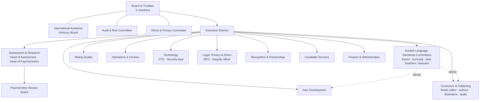

# KBS — D9 · Institute Governance, Recognition & Training

> **Covers:** `KLB_v3.md` §15 · **Depends on:** D0 (DN-01…DN-03), D2, D6, D7, D8
> Working name: **Kurdish Language Assessment Institute (KLAI)** `[TBD]`. Legal routes in the KRI are tagged `[VERIFY]`.

**New decisions in this document**

| ID | Decision |
|---|---|
| AD-035 | **Funding independence:** no single funder (including any government body) provides > 40 % of annual operating income after Phase 2. Phases 0–1 are exempt but disclosed. |
| AD-036 | **Political neutrality rule:** serving holders of party office, elected office or ministerial office cannot sit on the Board, Standards Committees, PRB or appeals panels. They must also wait 2 years after leaving office. |
| AD-037 | **ALTE path:** apply for affiliate membership in Phase 1 and full membership after 2 years of operation. Target the Q-mark audit in Phase 3 `[VERIFY current ALTE membership categories and audit prerequisites]`. |

---

## 1. Legal form and charter (DN-03 accepted)

**Form:** an independent **non-profit foundation** registered in the KRI `[VERIFY: KRI NGO/foundation registration route and whether such an entity can issue certificates recognised by KRG ministries]`. It works with:
- a **hosting MoU** with one KRI university: premises, academic legitimacy, access to research ethics review;
- **recognition MoUs** with the KRG Ministry of Education and the Ministry of Higher Education & Scientific Research (§4).

**Charter: binding provisions**
1. **Mission and unsupported uses** (D2 §1.2) are written into the charter.
2. **Independence of standards:** decisions on constructs, cut scores, results and acceptable variation are made by the expert bodies (Standards Committees, PRB). The Board can approve or refer them back, but **cannot substitute its own judgement**. The International Academic Advisory Board has a **suspensive veto** on standards decisions (it can require reconsideration once).
3. **Neutrality:** AD-036. The Institute takes no position on political questions, including the status of varieties or scripts, beyond the assessment policy.
4. **Variety parity:** each Standards Committee has equal standing. Neither variety is designated "standard Kurdish" (AD-001).
5. **Funding independence:** AD-035. All funders are disclosed publicly.
6. **Candidate safety:** AD-028 (jurisdiction policy) and AD-031 (transparency report) are charter obligations.
7. **Transparency:** handbook, specifications, rubrics, technical report and Board minutes (redacted only for personal and security matters) are published.
8. **Dissolution:** if the Institute is wound up, the item bank, RLD and data pass to a successor body with equal safeguards. Candidate data is deleted if no such body exists, apart from certificate verification records. Those go to an escrow arrangement so that certificates stay verifiable.

---

## 2. Organisation

**Firewall (DN-22):** Item Development and Curriculum & Publishing report to the Executive Director separately. They have separate systems (CON-015), and staff moves between them follow the 12-month cooling-off rule (FR-ITEM-011).

### 2.1 Bodies and terms of reference

| Body | Composition | Key powers | Term / quorum |
|---|---|---|---|
| **Board of Trustees** | 9 members: 2 from KRI universities, 1 from KRG education (non-political civil servant, subject to AD-036), 2 assessment/psychometrics experts (≥ 1 international), 1 diaspora education representative, 1 legal/governance expert, 1 civil-society representative, 1 finance expert. **Balance:** both varieties represented; ≥ 3 women; ≥ 2 members from outside the KRI. | Strategy, budget, appointments of the ED and committee chairs, ratification of cut scores and policies | 3-year terms, max 2 consecutive; quorum 5 incl. ≥ 1 assessment expert |
| International Academic Advisory Board | 5 international experts (language testing, Kurdish linguistics, minority-language certification) | Advice; **suspensive veto** on standards decisions (charter §1.2) | 3 years |
| Audit & Risk Committee | 3 trustees (incl. finance expert) + 1 external auditor observer | Internal audit, risk register (D11), financial controls | Quarterly |
| Ethics & Privacy Committee | DPO, 1 trustee, 1 external ethicist, 1 candidate-community representative (diaspora), 1 legal expert | DPIA sign-off, AD-028 jurisdiction list, research ethics, malpractice referral safety screen, misuse response | Quarterly + ad hoc |
| **Standards Committee — Sorani** | 7 members across sub-varieties (Hewlêrî, Silêmanî, Mukriyanî, Garmiyanî …), linguists, teachers, ≥ 1 Iranian-Kurdistan background | Acceptable-variation policy (D2 §3.7), orthography standard for the Series (D16), RLD approval, glossary | 3 years; decisions by 2/3 majority |
| **Standards Committee — Kurmanji** | 7 members (Badînî, Botanî, Serhedî, diaspora Latin-script users), incl. Arabic-script (Badînî) and Latin-script experts | Same, for both scripts; TRANSLIT-kmr rules | As above |
| PRB | D8 §1 | Psychometric release decisions | Per window |
| Appeals panel pool | ≥ 9 trained members, ≥ 3 external | Appeals (D6 §4.5) | 3 years |
| Malpractice panel pool | ≥ 6 trained members incl. 2 external | Malpractice decisions (D7 §5.3) | 3 years |

### 2.2 Conflict-of-interest and anti-politicisation safeguards
- **Public conflict-of-interest register** for trustees, committee members, item writers, raters and Series authors. Declarations are annual and on change.
- **Recusal:** any declared interest in a decision (test-prep business, relatives taking the test, a publisher competing with the Series) means recusal from that decision.
- **AD-036** neutrality rule; **AD-035** funding cap.
- **Appointments:** open calls, published criteria, selection panels with external members.
- **Language-policy neutrality:** the Institute's public communications use all M languages (`ckb`, `kmr-Latn`, `kmr-Arab`, `en`) at equal prominence.
- **Pressure reporting:** a staff and committee channel for reporting political or commercial pressure (CTL-032), reviewed by the Audit & Risk Committee.

---

## 3. Standards and quality path

| Standard / body | Use at KBS | Milestone |
|---|---|---|
| AERA/APA/NCME *Standards for Educational and Psychological Testing* (2014) | Master reference for validity, fairness, reliability, documentation | Self-audit against each chapter in Phase 1; gaps tracked |
| ITC Guidelines: test adaptation (2nd ed.); technology-based assessment; diverse linguistic and cultural populations | Script twins and adaptation (AD-002); CBT delivery; fairness policy | Self-audit Phase 1 |
| ILTA Code of Ethics and Guidelines for Practice | Ethics policy; candidate rights | Adopted Phase 0 |
| EALTA Guidelines for Good Practice | Teacher and test-developer practices; Series washback | Adopted Phase 0 |
| Council of Europe Manual (2009) | CEFR linking (D2 §5.5) | Linking reports Phase 1 |
| **ALTE** (AD-037) | Membership → Quality Management System → Q-mark audit against ALTE minimum standards `[VERIFY current standards list]` | Affiliate P1 → full member P2/P3 → Q-mark P3 |
| ISO/IEC 27001 / 27701 | ISMS / PIMS (D7) | Alignment P1 → certification P3 |

---

## 4. Recognition strategy

**Principle:** win early **anchor users** who need a Kurdish credential now, then grow recognition with evidence (D2 §1.3 score-use statements).

| Target (priority order) | Evidence they need | Sequencing | Instrument |
|---|---|---|---|
| **1 KRG Ministry of Education** | Construct and descriptor alignment with the school curriculum; standard-setting reports; security model; equity (fees, waivers) | Phase 0: MoU on cooperation and observer seats on Standards Committees (non-voting, subject to AD-036). Phase 1: recognition for teacher-recruitment language screening (U-02). Phase 2: use in mother-tongue programme placement. | MoU → ministerial instruction/decision `[VERIFY legal instrument]` |
| **2 KRG Ministry of Higher Education & Scientific Research** | Same, plus predictive-validity plan (U-03); university partner endorsements | Phase 0: MoU via the host university. Phase 1: recognition of General Advanced for Kurdish-medium staff and student requirements. Phase 3: KBS Academic. | MoU → ministry recognition |
| **3 KRI universities** | Technical documentation; local pilot results; cut-score impact data | Phase 1: 2–3 universities accept KBS General Advanced for specific programmes. Phase 2: wider. | Bilateral agreements |
| **4 Diaspora universities and mother-tongue authorities** (e.g., German Länder, Swedish municipalities `[VERIFY interest]`) | CEFR linking report in English; ALTE affiliation; data protection (GDPR); Kurmanji Latin track | Phase 1: pilot partnerships for mother-tongue teacher qualification and student credit. Phase 2: formal recognition. | Letters of recognition; recognition lists |
| **5 Employers, NGOs, UN agencies** | Plain-language level descriptions; verification API; quick turnaround | Phase 1: 5–10 employer partners for U-01. Phase 2: inclusion in UN/INGO HR language frameworks `[VERIFY interest]`. | Partnership letters; verifier accounts |
| *Iraqi federal bodies* | Arabic certificate page (AD-008); legal status of the Institute | Phase 2+, opportunistic | `[DECISION NEEDED in Phase 2]` |

**Recognition dossier** (FR-INST-003), updated annually:
- purposes and uses;
- CEFR linking report per variety;
- technical report summary;
- security and privacy summary;
- governance and neutrality;
- sample certificate and verification guide.

---

## 5. Public documentation

| Document | Languages | Phase | Owner |
|---|---|---|---|
| Candidate handbook (incl. unsupported uses, accommodations, scoring explanation, privacy notice) | `ckb`, `kmr-Latn`, `kmr-Arab`, `en` (+ `ar` S) | 1 | Candidate Services |
| Public test specifications (per tier) | Same | 1 | Head of Assessment |
| Rubrics + annotated sample performances | Same | 1 | Rating Quality |
| Sample tests (practice PWA + PDF) | Same | 1 | Item Development |
| Acceptable-variation policy (public version) | Same | 1 | Standards Committees |
| Technical manual (methods) | `en` + summary in Kurdish | 1–2 | Head of Psychometrics |
| Annual technical report (D8 §7) | `en` + Kurdish summary | from 2 | Head of Psychometrics |
| Annual report (activities, finances, funders) | All M | from 1 | ED |
| Transparency report on data requests (AD-031) | All M | from 2 | Legal |
| Recognition dossier | `en` + Kurdish | 1 | Recognition & Partnerships |

---

## 6. Training programmes

| Programme | Audience | Curriculum | Hours | Pass criteria | Renewal |
|---|---|---|---|---|---|
| **Item writer** | Kurdish teachers, linguists | Construct and specifications; CEFR/descriptors; item types per D2; writing for each variety and sub-variety; AVP; bias and sensitivity; security and confidentiality; using the item editor (M5); AI-assist policy | 30 (incl. 10 h supervised writing) | 10 commissioned items with ≥ 70 % surviving content + linguistic review unchanged or with minor edits | Annual 4 h refresher; performance review on survival and pretest stats |
| **Reviewer** (content, linguistic, bias) | Senior writers, linguists, community reviewers | Review criteria per stage; AVP; bias categories; script adaptation (kmr) | 16 | Agreement ≥ 80 % with expert decisions on a 30-item review set | Annual |
| **Rater** | Per D6 §2.1 | D6 §2.2 | 20 (+ 4 h certification) | D6 §2.2 thresholds | Annual recertification + standardisation each window |
| **Interlocutor** | Teachers, trained examiners | Interlocutor frame; neutral prompting; timing; identity check (AD-030); incident logging; video-link procedure | 12 | 3 observed mock interviews meeting frame-adherence ≥ 90 % (checklist) | Annual observed session |
| **Invigilator** | Centre staff | Regulations; check-in (FR-OPS-004); alternative pathway handling; incident classes (AD-021); power-failure procedure; paper fallback; malpractice evidence; candidate dignity and safety | 8 | Scenario test ≥ 85 %; dry-run participation | Every 2 years + pre-window briefing |
| **Centre manager / technical lead** | Centre staff | Accreditation standards; S2 operation; key release (online/offline split key); sync; dry-run checklist; incident decision rights | 16 | Practical exam in the centre lab (full offline session incl. power pull) | Annual |
| **Series author** | Teachers, materials writers | Minimum curriculum (D14); house style and rubric phrasebook (D16); unit template; exercise catalogue; content model editor; **firewall and originality rules (no DK copying, no item-bank use)**; orthography standard | 24 | One draft unit approved by the series editor with ≤ 1 revision cycle | Per title kick-off briefing |
| **Series editor** | Senior editors | Author training + editorial workflow, RACI, quality gates, IP compliance checks | +12 | Editorial test on a seeded unit with planted errors (≥ 90 % found) | Annual |
| **Teacher using the series** | KRI school teachers, diaspora mother-tongue teachers, private tutors | Series architecture; unit rhythm; using the Hub; differentiation for heritage vs L2 learners; formative assessment; link to KBS levels (without test prep) | 12 (blended; 8 online + 4 workshop) | Lesson plan + observed or recorded lesson meeting the rubric | Optional CPD credits `[VERIFY with MoE]` |

All training materials are produced in Sorani and Kurmanji (Latin; Arabic-script versions for Duhok staff), with English for international participants.

---

## 7. Policy register (to be adopted by the Board)

| Policy | Phase | Owner |
|---|---|---|
| Conflict of interest and recusal | 0 | Board secretary |
| Political neutrality (AD-036) | 0 | Board |
| Funding and gift acceptance (AD-035) | 0 | Finance |
| Ethics and research ethics | 0 | Ethics & Privacy Committee |
| Data protection and candidate safety (incl. AD-028, AD-031) | 0 | DPO |
| Accommodations | 1 | Candidate Services |
| Malpractice and sanctions (D7 §5) | 1 | Integrity officer |
| Enquiries and appeals (D6 §4) | 1 | Results officer |
| Whistleblowing and pressure reporting | 0 | Audit & Risk Committee |
| Misuse of results response | 1 | Legal |
| Language and orthography (AVP, Series orthography) | 1 | Standards Committees |
| Firewall between item bank and Series (DN-22) | 0 | ED |

---

## Changes to prior deliverables
- **D0 DN-03:** charter provisions and bodies are now specified.
- **D8 §1:** PRB placement in the organisation confirmed.
- New IDs: AD-035…AD-037.

## §19 self-check
- ✅ Varieties and scripts: separate Standards Committees with equal standing; Arabic-script Kurmanji expertise required; trainings in all scripts. Offline: centre training includes power-pull and offline key release.
- ✅ Major choices recorded (AD-035…AD-037) with rationale. The legal form follows DN-03.
- ✅ Candidate safety: Ethics & Privacy Committee holds the jurisdiction policy and the malpractice referral screen; transparency report.
- ⚠️ `[VERIFY]`: KRI foundation registration and certification powers, the ministerial recognition instrument, ALTE categories, diaspora authority interest. Recognition targets have no partner commitments assumed.

**Next deliverable: D10 — Roadmap, budget & staffing.**
